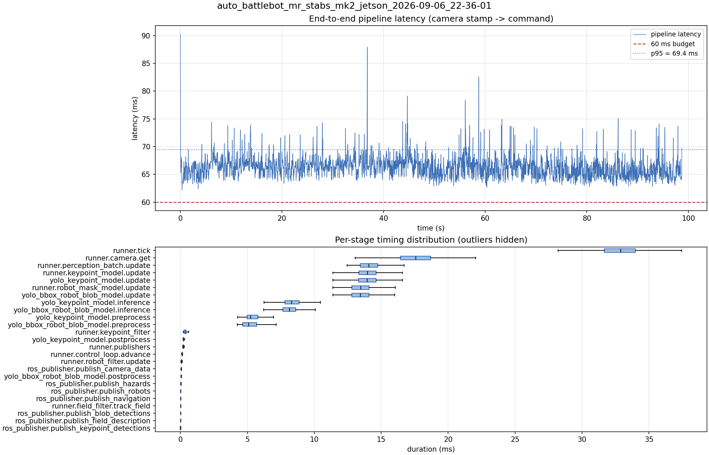

# Latency report: auto_battlebot_mr_stabs_mk2_jetson_2026-09-06_22-36-01

engine: yolo26n_nhrl_robots_bbox_2class_mixed_2026-07-31_aarch64_sm87.engine (deployed baseline)

- Source: `data/recordings/auto_battlebot_mr_stabs_mk2_jetson_2026-09-06_22-36-01.mcap`
- Generated: 2026-09-06 23:02 by `scripts/mcap_latency_report.py`
- Duration: 98.7 s
- Window: after field init (4.1 s into the recording)
- Loop rate: 30.2 Hz mean
- End-to-end latency: mean 66.4 ms / p95 69.4 ms / max 90.3 ms
- Budget: 60 ms -> p95 is OVER BUDGET

| Stage | n | mean (ms) | median (ms) | p95 (ms) | max (ms) | % of tick |
| --- | ---: | ---: | ---: | ---: | ---: | ---: |
| pipeline.latency | 2,961 | 66.35 | 66.26 | 69.44 | 90.27 | - |
| runner.tick | 2,961 | 32.68 | 32.87 | 36.09 | 54.70 | 100.0% |
| runner.camera.get | 2,961 | 17.35 | 17.58 | 20.26 | 29.00 | 53.1% |
| runner.perception_batch.update | 2,961 | 14.17 | 14.06 | 15.70 | 25.48 | 43.4% |
| runner.keypoint_model.update | 2,961 | 14.03 | 13.95 | 15.47 | 23.39 | 42.9% |
| yolo_keypoint_model.update | 2,961 | 14.02 | 13.95 | 15.47 | 23.38 | 42.9% |
| runner.robot_mask_model.update | 2,961 | 13.50 | 13.45 | 15.00 | 25.43 | 41.3% |
| yolo_bbox_robot_blob_model.update | 2,961 | 13.49 | 13.44 | 15.00 | 25.43 | 41.3% |
| yolo_keypoint_model.inference | 2,961 | 8.36 | 8.30 | 9.71 | 17.06 | 25.6% |
| yolo_bbox_robot_blob_model.inference | 2,961 | 8.18 | 8.14 | 9.45 | 19.25 | 25.0% |
| yolo_keypoint_model.preprocess | 2,961 | 5.36 | 5.23 | 6.32 | 10.29 | 16.4% |
| yolo_bbox_robot_blob_model.preprocess | 2,961 | 5.19 | 5.09 | 6.31 | 8.08 | 15.9% |
| runner.keypoint_filter | 2,961 | 0.33 | 0.39 | 0.56 | 4.69 | 1.0% |
| yolo_keypoint_model.postprocess | 2,961 | 0.26 | 0.22 | 0.32 | 5.15 | 0.8% |
| runner.publishers | 2,961 | 0.23 | 0.22 | 0.28 | 4.33 | 0.7% |
| runner.control_loop.advance | 2,961 | 0.14 | 0.14 | 0.19 | 0.83 | 0.4% |
| runner.robot_filter.update | 2,961 | 0.09 | 0.09 | 0.11 | 0.75 | 0.3% |
| ros_publisher.publish_camera_data | 2,961 | 0.07 | 0.06 | 0.08 | 1.05 | 0.2% |
| yolo_bbox_robot_blob_model.postprocess | 2,961 | 0.07 | 0.07 | 0.09 | 1.06 | 0.2% |
| ros_publisher.publish_hazards | 2,961 | 0.04 | 0.04 | 0.05 | 0.30 | 0.1% |
| ros_publisher.publish_robots | 2,961 | 0.03 | 0.03 | 0.05 | 1.06 | 0.1% |
| ros_publisher.publish_navigation | 2,961 | 0.03 | 0.02 | 0.03 | 3.36 | 0.1% |
| runner.field_filter.track_field | 2,961 | 0.02 | 0.02 | 0.06 | 0.12 | 0.1% |
| ros_publisher.publish_blob_detections | 2,961 | 0.02 | 0.02 | 0.04 | 0.85 | 0.1% |
| ros_publisher.publish_field_description | 2,961 | 0.01 | 0.01 | 0.01 | 1.06 | 0.0% |
| ros_publisher.publish_keypoint_detections | 2,961 | 0.01 | 0.01 | 0.02 | 2.39 | 0.0% |

