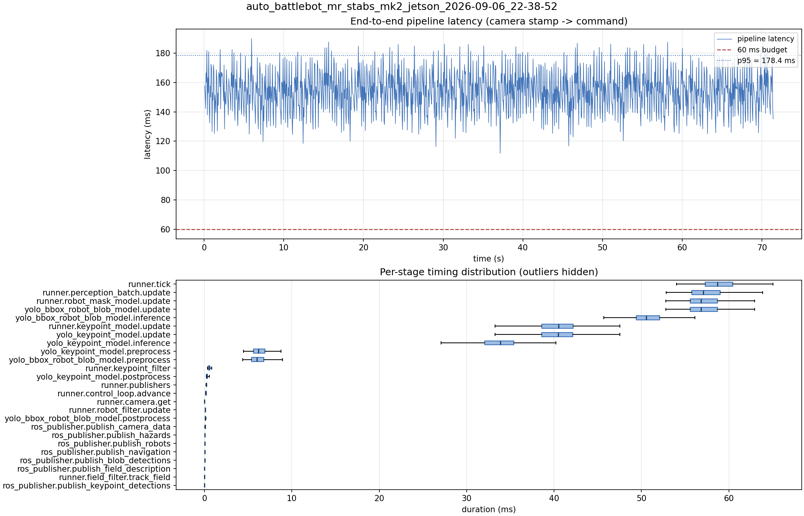

# Latency report: auto_battlebot_mr_stabs_mk2_jetson_2026-09-06_22-38-52

engine: yolo26x_nhrl_robots_bbox_2class_2026-09-04_aarch64_sm87.engine

- Source: `data/recordings/auto_battlebot_mr_stabs_mk2_jetson_2026-09-06_22-38-52.mcap`
- Generated: 2026-09-06 23:02 by `scripts/mcap_latency_report.py`
- Duration: 71.4 s
- Window: after field init (5.9 s into the recording)
- Loop rate: 16.7 Hz mean
- End-to-end latency: mean 154.1 ms / p95 178.4 ms / max 189.8 ms
- Budget: 60 ms -> p95 is OVER BUDGET

| Stage | n | mean (ms) | median (ms) | p95 (ms) | max (ms) | % of tick |
| --- | ---: | ---: | ---: | ---: | ---: | ---: |
| pipeline.latency | 1,192 | 154.14 | 154.50 | 178.45 | 189.84 | - |
| runner.tick | 1,192 | 59.08 | 58.69 | 63.75 | 68.79 | 100.0% |
| runner.perception_batch.update | 1,192 | 57.59 | 57.07 | 62.29 | 67.50 | 97.5% |
| runner.robot_mask_model.update | 1,192 | 57.28 | 56.81 | 61.68 | 66.66 | 96.9% |
| yolo_bbox_robot_blob_model.update | 1,192 | 57.27 | 56.80 | 61.68 | 66.66 | 96.9% |
| yolo_bbox_robot_blob_model.inference | 1,192 | 50.89 | 50.57 | 54.81 | 58.67 | 86.1% |
| runner.keypoint_model.update | 1,192 | 40.47 | 40.50 | 47.37 | 57.49 | 68.5% |
| yolo_keypoint_model.update | 1,192 | 40.46 | 40.49 | 47.36 | 57.48 | 68.5% |
| yolo_keypoint_model.inference | 1,192 | 33.68 | 33.85 | 39.54 | 47.08 | 57.0% |
| yolo_keypoint_model.preprocess | 1,192 | 6.42 | 6.19 | 9.13 | 12.52 | 10.9% |
| yolo_bbox_robot_blob_model.preprocess | 1,192 | 6.22 | 5.99 | 8.58 | 12.63 | 10.5% |
| runner.keypoint_filter | 1,192 | 0.55 | 0.55 | 0.76 | 3.90 | 0.9% |
| yolo_keypoint_model.postprocess | 1,192 | 0.30 | 0.25 | 0.48 | 1.60 | 0.5% |
| runner.publishers | 1,192 | 0.23 | 0.21 | 0.27 | 1.35 | 0.4% |
| runner.control_loop.advance | 1,192 | 0.16 | 0.15 | 0.29 | 0.54 | 0.3% |
| runner.camera.get | 1,192 | 0.11 | 0.01 | 0.03 | 5.33 | 0.2% |
| runner.robot_filter.update | 1,192 | 0.10 | 0.10 | 0.13 | 0.24 | 0.2% |
| yolo_bbox_robot_blob_model.postprocess | 1,192 | 0.10 | 0.07 | 0.14 | 3.98 | 0.2% |
| ros_publisher.publish_camera_data | 1,192 | 0.06 | 0.06 | 0.08 | 0.19 | 0.1% |
| ros_publisher.publish_hazards | 1,192 | 0.04 | 0.04 | 0.05 | 0.17 | 0.1% |
| ros_publisher.publish_robots | 1,192 | 0.03 | 0.03 | 0.04 | 1.10 | 0.1% |
| ros_publisher.publish_navigation | 1,192 | 0.02 | 0.02 | 0.03 | 0.88 | 0.0% |
| ros_publisher.publish_blob_detections | 1,192 | 0.02 | 0.02 | 0.04 | 0.75 | 0.0% |
| ros_publisher.publish_field_description | 1,192 | 0.01 | 0.01 | 0.01 | 0.95 | 0.0% |
| runner.field_filter.track_field | 1,192 | 0.01 | 0.01 | 0.02 | 0.80 | 0.0% |
| ros_publisher.publish_keypoint_detections | 1,192 | 0.01 | 0.01 | 0.01 | 0.70 | 0.0% |

