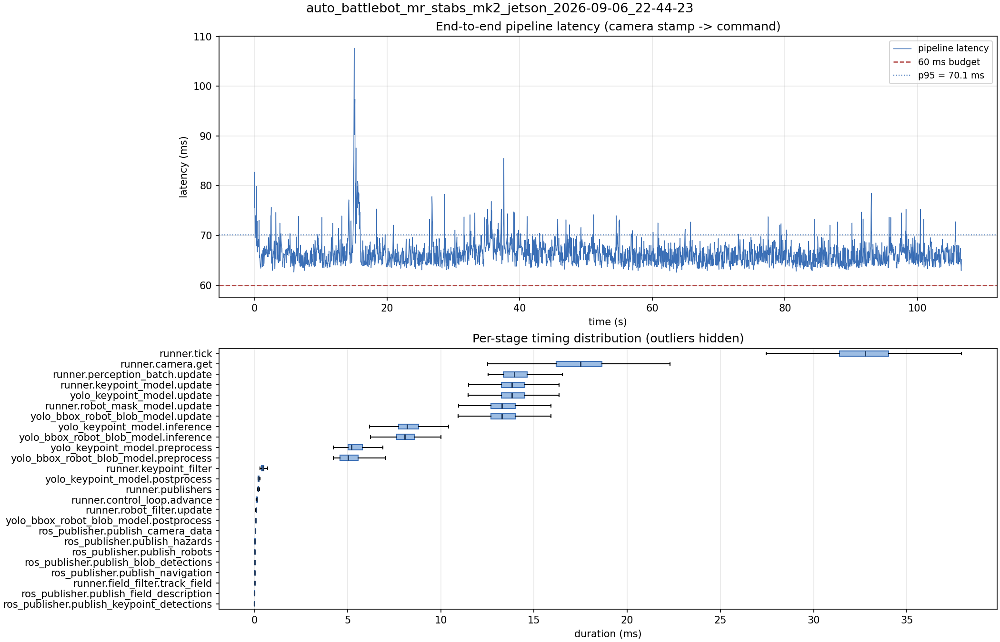

# Latency report: auto_battlebot_mr_stabs_mk2_jetson_2026-09-06_22-44-23

engine: yolo26n_nhrl_robots_bbox_2class_2026-09-04_aarch64_sm87.engine

- Source: `data/recordings/auto_battlebot_mr_stabs_mk2_jetson_2026-09-06_22-44-23.mcap`
- Generated: 2026-09-06 23:02 by `scripts/mcap_latency_report.py`
- Duration: 106.6 s
- Window: after field init (3.5 s into the recording)
- Loop rate: 30.2 Hz mean
- End-to-end latency: mean 66.4 ms / p95 70.1 ms / max 107.7 ms
- Budget: 60 ms -> p95 is OVER BUDGET

| Stage | n | mean (ms) | median (ms) | p95 (ms) | max (ms) | % of tick |
| --- | ---: | ---: | ---: | ---: | ---: | ---: |
| pipeline.latency | 3,200 | 66.40 | 66.16 | 70.13 | 107.65 | - |
| runner.tick | 3,200 | 32.65 | 32.76 | 36.34 | 55.15 | 100.0% |
| runner.camera.get | 3,200 | 17.21 | 17.49 | 20.40 | 27.24 | 52.7% |
| runner.perception_batch.update | 3,200 | 14.13 | 13.95 | 15.86 | 29.96 | 43.3% |
| runner.keypoint_model.update | 3,200 | 13.98 | 13.83 | 15.67 | 29.78 | 42.8% |
| yolo_keypoint_model.update | 3,200 | 13.98 | 13.82 | 15.66 | 29.77 | 42.8% |
| runner.robot_mask_model.update | 3,200 | 13.44 | 13.28 | 15.11 | 29.67 | 41.2% |
| yolo_bbox_robot_blob_model.update | 3,200 | 13.43 | 13.28 | 15.11 | 29.66 | 41.2% |
| yolo_keypoint_model.inference | 3,200 | 8.31 | 8.21 | 9.75 | 22.56 | 25.4% |
| yolo_bbox_robot_blob_model.inference | 3,200 | 8.19 | 8.06 | 9.48 | 24.23 | 25.1% |
| yolo_keypoint_model.preprocess | 3,200 | 5.36 | 5.20 | 6.39 | 12.27 | 16.4% |
| yolo_bbox_robot_blob_model.preprocess | 3,200 | 5.12 | 5.04 | 6.24 | 9.67 | 15.7% |
| runner.keypoint_filter | 3,200 | 0.46 | 0.45 | 0.61 | 2.67 | 1.4% |
| yolo_keypoint_model.postprocess | 3,200 | 0.25 | 0.22 | 0.31 | 4.38 | 0.8% |
| runner.publishers | 3,200 | 0.23 | 0.21 | 0.28 | 3.86 | 0.7% |
| runner.control_loop.advance | 3,200 | 0.15 | 0.14 | 0.19 | 4.28 | 0.5% |
| runner.robot_filter.update | 3,200 | 0.10 | 0.09 | 0.12 | 4.22 | 0.3% |
| yolo_bbox_robot_blob_model.postprocess | 3,200 | 0.08 | 0.07 | 0.09 | 3.96 | 0.3% |
| ros_publisher.publish_camera_data | 3,200 | 0.07 | 0.06 | 0.08 | 1.01 | 0.2% |
| ros_publisher.publish_hazards | 3,200 | 0.04 | 0.04 | 0.05 | 0.17 | 0.1% |
| ros_publisher.publish_robots | 3,200 | 0.03 | 0.03 | 0.04 | 0.85 | 0.1% |
| ros_publisher.publish_blob_detections | 3,200 | 0.03 | 0.02 | 0.04 | 3.62 | 0.1% |
| ros_publisher.publish_navigation | 3,200 | 0.03 | 0.02 | 0.04 | 1.06 | 0.1% |
| runner.field_filter.track_field | 3,200 | 0.02 | 0.02 | 0.06 | 0.17 | 0.1% |
| ros_publisher.publish_field_description | 3,200 | 0.01 | 0.01 | 0.01 | 0.41 | 0.0% |
| ros_publisher.publish_keypoint_detections | 3,200 | 0.01 | 0.01 | 0.01 | 1.73 | 0.0% |

