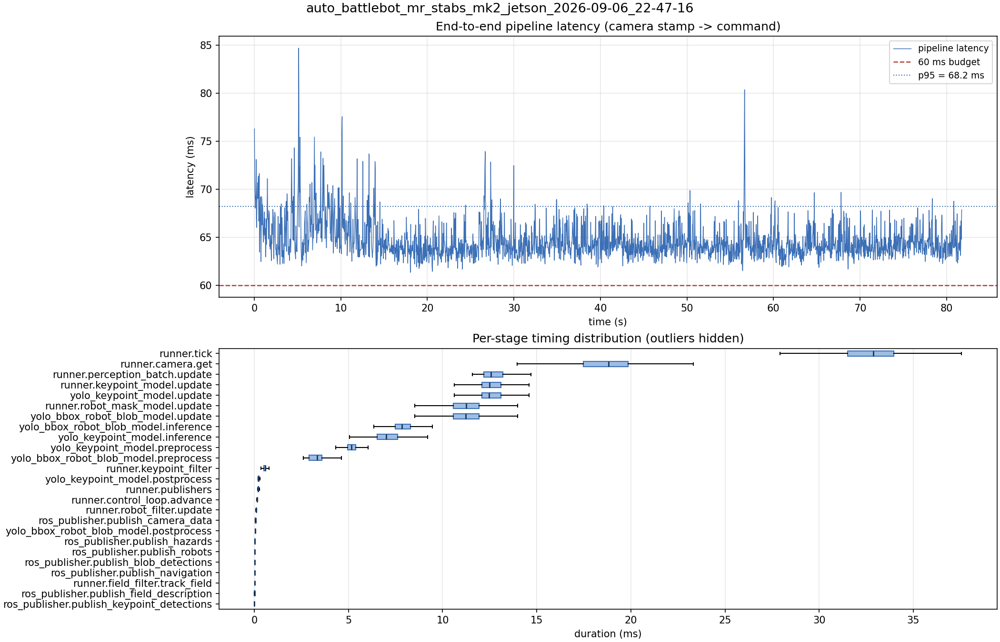

# Latency report: auto_battlebot_mr_stabs_mk2_jetson_2026-09-06_22-47-16

engine: yolo26s_nhrl_robots_bbox_2class_rect384x640_2026-09-05_aarch64_sm87.engine (arm B)

- Source: `data/recordings/auto_battlebot_mr_stabs_mk2_jetson_2026-09-06_22-47-16.mcap`
- Generated: 2026-09-06 23:02 by `scripts/mcap_latency_report.py`
- Duration: 81.7 s
- Window: after field init (3.6 s into the recording)
- Loop rate: 30.2 Hz mean
- End-to-end latency: mean 64.6 ms / p95 68.2 ms / max 84.7 ms
- Budget: 60 ms -> p95 is OVER BUDGET

| Stage | n | mean (ms) | median (ms) | p95 (ms) | max (ms) | % of tick |
| --- | ---: | ---: | ---: | ---: | ---: | ---: |
| pipeline.latency | 2,452 | 64.65 | 64.15 | 68.20 | 84.71 | - |
| runner.tick | 2,452 | 32.68 | 32.88 | 36.39 | 63.69 | 100.0% |
| runner.camera.get | 2,452 | 18.48 | 18.82 | 21.44 | 49.94 | 56.6% |
| runner.perception_batch.update | 2,452 | 12.80 | 12.58 | 14.34 | 27.54 | 39.2% |
| runner.keypoint_model.update | 2,452 | 12.69 | 12.48 | 14.20 | 27.47 | 38.8% |
| yolo_keypoint_model.update | 2,452 | 12.68 | 12.48 | 14.20 | 27.46 | 38.8% |
| runner.robot_mask_model.update | 2,452 | 11.36 | 11.24 | 13.20 | 16.90 | 34.8% |
| yolo_bbox_robot_blob_model.update | 2,452 | 11.35 | 11.24 | 13.20 | 16.89 | 34.7% |
| yolo_bbox_robot_blob_model.inference | 2,452 | 7.93 | 7.83 | 9.12 | 13.33 | 24.3% |
| yolo_keypoint_model.inference | 2,452 | 7.17 | 7.00 | 8.80 | 20.39 | 21.9% |
| yolo_keypoint_model.preprocess | 2,452 | 5.22 | 5.17 | 6.12 | 8.81 | 16.0% |
| yolo_bbox_robot_blob_model.preprocess | 2,452 | 3.32 | 3.34 | 4.27 | 6.22 | 10.2% |
| runner.keypoint_filter | 2,452 | 0.56 | 0.57 | 0.75 | 3.62 | 1.7% |
| yolo_keypoint_model.postprocess | 2,452 | 0.24 | 0.22 | 0.29 | 5.01 | 0.7% |
| runner.publishers | 2,452 | 0.23 | 0.21 | 0.26 | 1.61 | 0.7% |
| runner.control_loop.advance | 2,452 | 0.16 | 0.15 | 0.19 | 3.23 | 0.5% |
| runner.robot_filter.update | 2,452 | 0.10 | 0.10 | 0.12 | 1.00 | 0.3% |
| ros_publisher.publish_camera_data | 2,452 | 0.07 | 0.06 | 0.08 | 1.17 | 0.2% |
| yolo_bbox_robot_blob_model.postprocess | 2,452 | 0.05 | 0.05 | 0.06 | 0.85 | 0.2% |
| ros_publisher.publish_hazards | 2,452 | 0.04 | 0.04 | 0.05 | 0.86 | 0.1% |
| ros_publisher.publish_robots | 2,452 | 0.03 | 0.03 | 0.04 | 0.98 | 0.1% |
| ros_publisher.publish_blob_detections | 2,452 | 0.03 | 0.02 | 0.04 | 0.94 | 0.1% |
| ros_publisher.publish_navigation | 2,452 | 0.02 | 0.02 | 0.03 | 1.00 | 0.1% |
| runner.field_filter.track_field | 2,452 | 0.02 | 0.02 | 0.06 | 0.12 | 0.1% |
| ros_publisher.publish_field_description | 2,452 | 0.01 | 0.01 | 0.01 | 0.15 | 0.0% |
| ros_publisher.publish_keypoint_detections | 2,452 | 0.01 | 0.01 | 0.01 | 0.85 | 0.0% |

