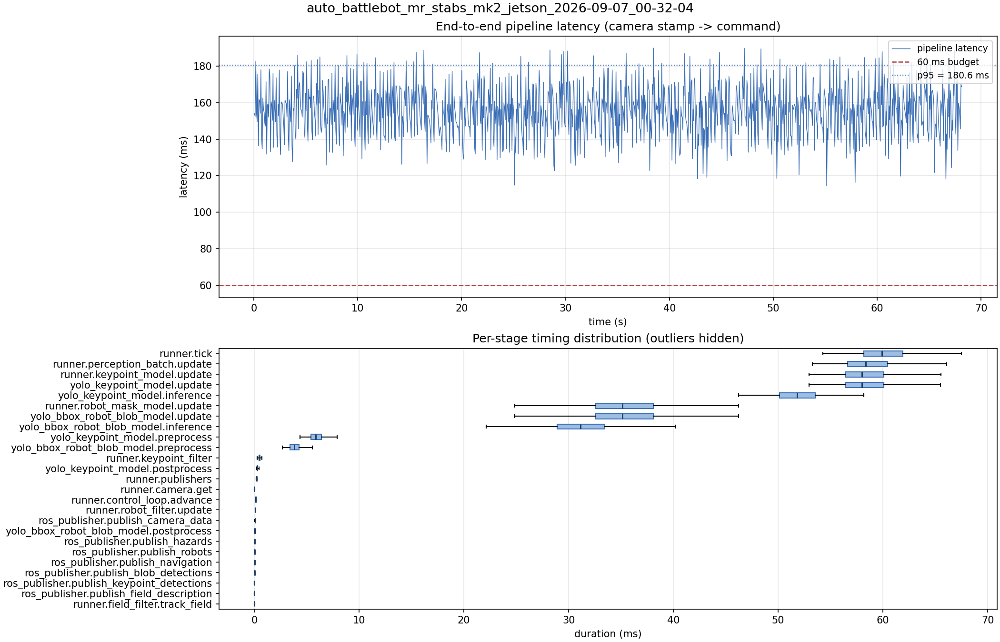

# Latency report: auto_battlebot_mr_stabs_mk2_jetson_2026-09-07_00-32-04

engine: data/models/yolo26x-pose_all_robot_keypoints_2026-09-05_aarch64_sm87.engine

- Source: `/home/ben/auto-battlebot/data/recordings/auto_battlebot_mr_stabs_mk2_jetson_2026-09-07_00-32-04.mcap`
- Generated: 2026-09-07 00:36 by `scripts/mcap_latency_report.py`
- Duration: 68.1 s
- Window: after field init (3.7 s into the recording)
- Loop rate: 16.4 Hz mean
- End-to-end latency: mean 155.5 ms / p95 180.6 ms / max 189.8 ms
- Budget: 60 ms -> p95 is OVER BUDGET

| Stage | n | mean (ms) | median (ms) | p95 (ms) | max (ms) | % of tick |
| --- | ---: | ---: | ---: | ---: | ---: | ---: |
| pipeline.latency | 1,116 | 155.48 | 155.80 | 180.60 | 189.83 | - |
| runner.tick | 1,116 | 60.23 | 59.89 | 65.19 | 71.20 | 100.0% |
| runner.perception_batch.update | 1,116 | 58.73 | 58.34 | 63.82 | 69.94 | 97.5% |
| runner.keypoint_model.update | 1,116 | 58.40 | 58.00 | 62.96 | 69.29 | 97.0% |
| yolo_keypoint_model.update | 1,116 | 58.39 | 58.00 | 62.96 | 69.28 | 96.9% |
| yolo_keypoint_model.inference | 1,116 | 51.92 | 51.79 | 56.02 | 63.39 | 86.2% |
| runner.robot_mask_model.update | 1,116 | 34.16 | 35.12 | 41.57 | 54.65 | 56.7% |
| yolo_bbox_robot_blob_model.update | 1,116 | 34.16 | 35.11 | 41.56 | 54.64 | 56.7% |
| yolo_bbox_robot_blob_model.inference | 1,116 | 30.03 | 31.13 | 36.68 | 46.50 | 49.9% |
| yolo_keypoint_model.preprocess | 1,116 | 6.10 | 5.87 | 8.43 | 11.79 | 10.1% |
| yolo_bbox_robot_blob_model.preprocess | 1,116 | 4.01 | 3.79 | 5.76 | 11.68 | 6.7% |
| runner.keypoint_filter | 1,116 | 0.51 | 0.47 | 0.70 | 1.64 | 0.8% |
| yolo_keypoint_model.postprocess | 1,116 | 0.31 | 0.26 | 0.47 | 4.29 | 0.5% |
| runner.publishers | 1,116 | 0.23 | 0.21 | 0.28 | 3.58 | 0.4% |
| runner.camera.get | 1,116 | 0.16 | 0.01 | 1.48 | 4.61 | 0.3% |
| runner.control_loop.advance | 1,116 | 0.16 | 0.15 | 0.28 | 0.47 | 0.3% |
| runner.robot_filter.update | 1,116 | 0.10 | 0.10 | 0.12 | 0.42 | 0.2% |
| ros_publisher.publish_camera_data | 1,116 | 0.07 | 0.06 | 0.09 | 0.58 | 0.1% |
| yolo_bbox_robot_blob_model.postprocess | 1,116 | 0.06 | 0.05 | 0.09 | 0.96 | 0.1% |
| ros_publisher.publish_hazards | 1,116 | 0.04 | 0.04 | 0.05 | 0.83 | 0.1% |
| ros_publisher.publish_robots | 1,116 | 0.03 | 0.03 | 0.04 | 2.21 | 0.1% |
| ros_publisher.publish_navigation | 1,116 | 0.03 | 0.02 | 0.03 | 1.05 | 0.0% |
| ros_publisher.publish_blob_detections | 1,116 | 0.02 | 0.02 | 0.04 | 0.92 | 0.0% |
| ros_publisher.publish_keypoint_detections | 1,116 | 0.01 | 0.01 | 0.01 | 3.34 | 0.0% |
| ros_publisher.publish_field_description | 1,116 | 0.01 | 0.01 | 0.01 | 0.10 | 0.0% |
| runner.field_filter.track_field | 1,116 | 0.01 | 0.01 | 0.02 | 0.11 | 0.0% |

