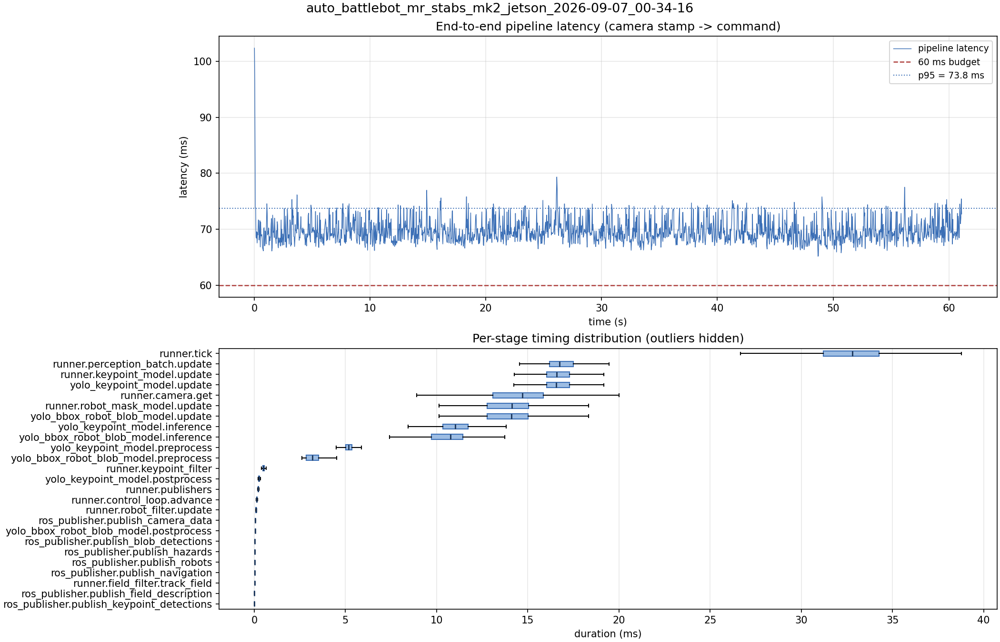

# Latency report: auto_battlebot_mr_stabs_mk2_jetson_2026-09-07_00-34-16

engine: data/models/yolo26s-pose_all_robot_keypoints_2026-09-05_aarch64_sm87.engine

- Source: `/home/ben/auto-battlebot/data/recordings/auto_battlebot_mr_stabs_mk2_jetson_2026-09-07_00-34-16.mcap`
- Generated: 2026-09-07 00:36 by `scripts/mcap_latency_report.py`
- Duration: 61.1 s
- Window: after field init (4.1 s into the recording)
- Loop rate: 30.2 Hz mean
- End-to-end latency: mean 69.7 ms / p95 73.8 ms / max 102.4 ms
- Budget: 60 ms -> p95 is OVER BUDGET

| Stage | n | mean (ms) | median (ms) | p95 (ms) | max (ms) | % of tick |
| --- | ---: | ---: | ---: | ---: | ---: | ---: |
| pipeline.latency | 1,834 | 69.72 | 69.28 | 73.77 | 102.36 | - |
| runner.tick | 1,834 | 32.68 | 32.80 | 37.24 | 40.80 | 100.0% |
| runner.perception_batch.update | 1,834 | 17.08 | 16.74 | 19.93 | 25.18 | 52.2% |
| runner.keypoint_model.update | 1,834 | 16.85 | 16.57 | 19.58 | 25.13 | 51.6% |
| yolo_keypoint_model.update | 1,834 | 16.84 | 16.57 | 19.58 | 25.12 | 51.5% |
| runner.camera.get | 1,834 | 14.24 | 14.71 | 17.33 | 20.52 | 43.6% |
| runner.robot_mask_model.update | 1,834 | 14.02 | 14.12 | 16.61 | 22.20 | 42.9% |
| yolo_bbox_robot_blob_model.update | 1,834 | 14.01 | 14.11 | 16.61 | 22.20 | 42.9% |
| yolo_keypoint_model.inference | 1,834 | 11.22 | 11.03 | 13.61 | 18.61 | 34.3% |
| yolo_bbox_robot_blob_model.inference | 1,834 | 10.65 | 10.77 | 12.51 | 18.25 | 32.6% |
| yolo_keypoint_model.preprocess | 1,834 | 5.22 | 5.17 | 6.11 | 11.68 | 16.0% |
| yolo_bbox_robot_blob_model.preprocess | 1,834 | 3.25 | 3.18 | 4.16 | 6.22 | 9.9% |
| runner.keypoint_filter | 1,834 | 0.53 | 0.51 | 0.68 | 4.00 | 1.6% |
| yolo_keypoint_model.postprocess | 1,834 | 0.35 | 0.25 | 0.46 | 4.88 | 1.1% |
| runner.publishers | 1,834 | 0.25 | 0.21 | 0.29 | 3.51 | 0.8% |
| runner.control_loop.advance | 1,834 | 0.15 | 0.14 | 0.20 | 1.06 | 0.5% |
| runner.robot_filter.update | 1,834 | 0.09 | 0.09 | 0.12 | 0.39 | 0.3% |
| ros_publisher.publish_camera_data | 1,834 | 0.06 | 0.06 | 0.09 | 1.05 | 0.2% |
| yolo_bbox_robot_blob_model.postprocess | 1,834 | 0.06 | 0.05 | 0.08 | 3.56 | 0.2% |
| ros_publisher.publish_blob_detections | 1,834 | 0.05 | 0.02 | 0.04 | 3.25 | 0.1% |
| ros_publisher.publish_hazards | 1,834 | 0.04 | 0.04 | 0.05 | 0.16 | 0.1% |
| ros_publisher.publish_robots | 1,834 | 0.03 | 0.03 | 0.04 | 1.84 | 0.1% |
| ros_publisher.publish_navigation | 1,834 | 0.02 | 0.02 | 0.03 | 1.77 | 0.1% |
| runner.field_filter.track_field | 1,834 | 0.02 | 0.02 | 0.07 | 0.17 | 0.1% |
| ros_publisher.publish_field_description | 1,834 | 0.01 | 0.01 | 0.01 | 0.93 | 0.0% |
| ros_publisher.publish_keypoint_detections | 1,834 | 0.01 | 0.01 | 0.01 | 2.29 | 0.0% |

