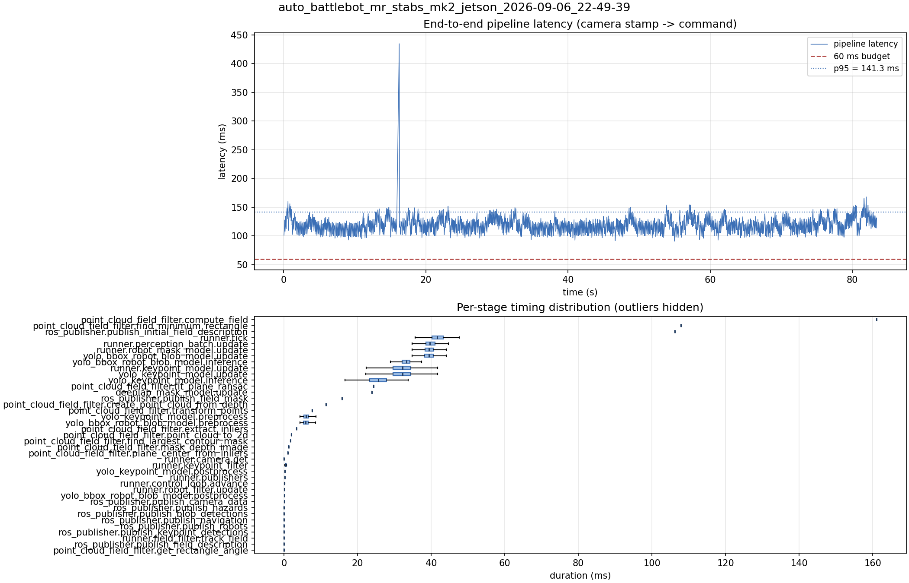

# Latency report: auto_battlebot_mr_stabs_mk2_jetson_2026-09-06_22-49-39

engine: yolo26x_nhrl_robots_bbox_2class_2026-09-04_int8_aarch64_sm87.engine (x8)

- Source: `data/recordings/auto_battlebot_mr_stabs_mk2_jetson_2026-09-06_22-49-39.mcap`
- Generated: 2026-09-06 23:02 by `scripts/mcap_latency_report.py`
- Duration: 83.4 s
- Window: after field init (3.3 s into the recording)
- Loop rate: 23.7 Hz mean
- End-to-end latency: mean 119.4 ms / p95 141.3 ms / max 434.6 ms
- Budget: 60 ms -> p95 is OVER BUDGET

| Stage | n | mean (ms) | median (ms) | p95 (ms) | max (ms) | % of tick |
| --- | ---: | ---: | ---: | ---: | ---: | ---: |
| point_cloud_field_filter.compute_field | 1 | 161.08 | 161.08 | 161.08 | 161.08 | 385.4% |
| pipeline.latency | 1,963 | 119.37 | 118.84 | 141.33 | 434.59 | - |
| point_cloud_field_filter.find_minimum_rectangle | 1 | 107.81 | 107.81 | 107.81 | 107.81 | 257.9% |
| ros_publisher.publish_initial_field_description | 1 | 106.19 | 106.19 | 106.19 | 106.19 | 254.0% |
| runner.tick | 1,963 | 41.80 | 41.57 | 45.81 | 347.34 | 100.0% |
| runner.perception_batch.update | 1,963 | 39.78 | 39.68 | 43.88 | 53.65 | 95.2% |
| runner.robot_mask_model.update | 1,963 | 39.46 | 39.41 | 43.22 | 50.61 | 94.4% |
| yolo_bbox_robot_blob_model.update | 1,963 | 39.45 | 39.41 | 43.19 | 50.60 | 94.4% |
| yolo_bbox_robot_blob_model.inference | 1,963 | 33.19 | 33.30 | 36.30 | 44.05 | 79.4% |
| runner.keypoint_model.update | 1,963 | 31.85 | 32.26 | 37.38 | 43.14 | 76.2% |
| yolo_keypoint_model.update | 1,963 | 31.84 | 32.25 | 37.37 | 43.14 | 76.2% |
| yolo_keypoint_model.inference | 1,963 | 25.29 | 25.58 | 30.00 | 35.53 | 60.5% |
| point_cloud_field_filter.fit_plane_ransac | 1 | 24.39 | 24.39 | 24.39 | 24.39 | 58.4% |
| deeplab_mask_model.update | 1 | 23.85 | 23.85 | 23.85 | 23.85 | 57.1% |
| ros_publisher.publish_field_mask | 1 | 15.80 | 15.80 | 15.80 | 15.80 | 37.8% |
| point_cloud_field_filter.create_point_cloud_from_depth | 1 | 11.41 | 11.41 | 11.41 | 11.41 | 27.3% |
| point_cloud_field_filter.transform_points | 1 | 7.58 | 7.58 | 7.58 | 7.58 | 18.1% |
| yolo_keypoint_model.preprocess | 1,963 | 6.22 | 6.00 | 8.70 | 15.42 | 14.9% |
| yolo_bbox_robot_blob_model.preprocess | 1,963 | 6.12 | 5.87 | 8.76 | 14.79 | 14.7% |
| point_cloud_field_filter.extract_inliers | 1 | 3.36 | 3.36 | 3.36 | 3.36 | 8.0% |
| point_cloud_field_filter.point_cloud_to_2d | 1 | 2.02 | 2.02 | 2.02 | 2.02 | 4.8% |
| point_cloud_field_filter.find_largest_contour_mask | 1 | 1.79 | 1.79 | 1.79 | 1.79 | 4.3% |
| point_cloud_field_filter.mask_depth_image | 1 | 1.32 | 1.32 | 1.32 | 1.32 | 3.2% |
| point_cloud_field_filter.plane_center_from_inliers | 1 | 1.05 | 1.05 | 1.05 | 1.05 | 2.5% |
| runner.camera.get | 1,963 | 0.54 | 0.01 | 3.50 | 5.64 | 1.3% |
| runner.keypoint_filter | 1,963 | 0.49 | 0.47 | 0.71 | 1.53 | 1.2% |
| yolo_keypoint_model.postprocess | 1,963 | 0.28 | 0.23 | 0.45 | 4.54 | 0.7% |
| runner.publishers | 1,963 | 0.24 | 0.21 | 0.27 | 11.65 | 0.6% |
| runner.control_loop.advance | 1,963 | 0.15 | 0.14 | 0.20 | 0.39 | 0.4% |
| runner.robot_filter.update | 1,963 | 0.09 | 0.09 | 0.11 | 0.32 | 0.2% |
| yolo_bbox_robot_blob_model.postprocess | 1,963 | 0.08 | 0.06 | 0.11 | 1.36 | 0.2% |
| ros_publisher.publish_camera_data | 1,963 | 0.07 | 0.06 | 0.08 | 11.48 | 0.2% |
| ros_publisher.publish_hazards | 1,963 | 0.04 | 0.04 | 0.05 | 0.84 | 0.1% |
| ros_publisher.publish_blob_detections | 1,963 | 0.03 | 0.02 | 0.04 | 3.57 | 0.1% |
| ros_publisher.publish_navigation | 1,963 | 0.03 | 0.03 | 0.04 | 0.91 | 0.1% |
| ros_publisher.publish_robots | 1,963 | 0.03 | 0.03 | 0.03 | 1.07 | 0.1% |
| ros_publisher.publish_keypoint_detections | 1,963 | 0.01 | 0.01 | 0.03 | 3.04 | 0.0% |
| runner.field_filter.track_field | 1,963 | 0.01 | 0.01 | 0.02 | 0.11 | 0.0% |
| ros_publisher.publish_field_description | 1,963 | 0.01 | 0.01 | 0.01 | 0.07 | 0.0% |
| point_cloud_field_filter.get_rectangle_angle | 1 | 0.00 | 0.00 | 0.00 | 0.00 | 0.0% |

