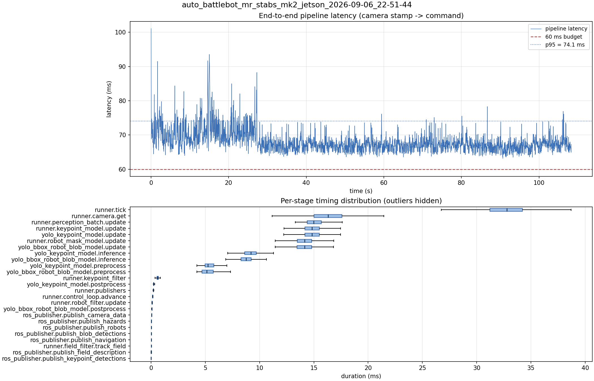

# Latency report: auto_battlebot_mr_stabs_mk2_jetson_2026-09-06_22-51-44

engine: yolo26s_nhrl_robots_bbox_2class_2026-09-04_int8_aarch64_sm87.engine (s8)

- Source: `data/recordings/auto_battlebot_mr_stabs_mk2_jetson_2026-09-06_22-51-44.mcap`
- Generated: 2026-09-06 23:02 by `scripts/mcap_latency_report.py`
- Duration: 108.3 s
- Window: after field init (3.6 s into the recording)
- Loop rate: 30.3 Hz mean
- End-to-end latency: mean 68.0 ms / p95 74.1 ms / max 101.1 ms
- Budget: 60 ms -> p95 is OVER BUDGET

| Stage | n | mean (ms) | median (ms) | p95 (ms) | max (ms) | % of tick |
| --- | ---: | ---: | ---: | ---: | ---: | ---: |
| pipeline.latency | 3,247 | 68.02 | 67.35 | 74.09 | 101.08 | - |
| runner.tick | 3,247 | 32.70 | 32.79 | 37.13 | 72.27 | 100.0% |
| runner.camera.get | 3,247 | 16.00 | 16.30 | 19.47 | 53.24 | 48.9% |
| runner.perception_batch.update | 3,247 | 15.25 | 14.99 | 18.20 | 30.69 | 46.6% |
| runner.keypoint_model.update | 3,247 | 15.03 | 14.83 | 17.29 | 29.56 | 46.0% |
| yolo_keypoint_model.update | 3,247 | 15.02 | 14.82 | 17.28 | 29.56 | 45.9% |
| runner.robot_mask_model.update | 3,247 | 14.29 | 14.14 | 16.11 | 30.64 | 43.7% |
| yolo_bbox_robot_blob_model.update | 3,247 | 14.28 | 14.14 | 16.10 | 30.64 | 43.7% |
| yolo_keypoint_model.inference | 3,247 | 9.28 | 9.21 | 10.93 | 23.35 | 28.4% |
| yolo_bbox_robot_blob_model.inference | 3,247 | 8.86 | 8.74 | 10.11 | 19.35 | 27.1% |
| yolo_keypoint_model.preprocess | 3,247 | 5.39 | 5.23 | 6.57 | 12.64 | 16.5% |
| yolo_bbox_robot_blob_model.preprocess | 3,247 | 5.28 | 5.13 | 6.55 | 14.98 | 16.2% |
| runner.keypoint_filter | 3,247 | 0.61 | 0.59 | 0.82 | 4.32 | 1.9% |
| yolo_keypoint_model.postprocess | 3,247 | 0.29 | 0.23 | 0.34 | 5.21 | 0.9% |
| runner.publishers | 3,247 | 0.24 | 0.21 | 0.28 | 4.16 | 0.7% |
| runner.control_loop.advance | 3,247 | 0.16 | 0.14 | 0.20 | 3.56 | 0.5% |
| runner.robot_filter.update | 3,247 | 0.10 | 0.10 | 0.12 | 3.50 | 0.3% |
| yolo_bbox_robot_blob_model.postprocess | 3,247 | 0.08 | 0.07 | 0.09 | 3.97 | 0.3% |
| ros_publisher.publish_camera_data | 3,247 | 0.07 | 0.06 | 0.08 | 3.59 | 0.2% |
| ros_publisher.publish_hazards | 3,247 | 0.04 | 0.04 | 0.05 | 1.47 | 0.1% |
| ros_publisher.publish_robots | 3,247 | 0.03 | 0.03 | 0.04 | 1.32 | 0.1% |
| ros_publisher.publish_blob_detections | 3,247 | 0.03 | 0.02 | 0.04 | 3.92 | 0.1% |
| ros_publisher.publish_navigation | 3,247 | 0.02 | 0.02 | 0.03 | 0.95 | 0.1% |
| runner.field_filter.track_field | 3,247 | 0.02 | 0.02 | 0.06 | 0.34 | 0.1% |
| ros_publisher.publish_field_description | 3,247 | 0.01 | 0.01 | 0.01 | 2.66 | 0.0% |
| ros_publisher.publish_keypoint_detections | 3,247 | 0.01 | 0.01 | 0.01 | 2.77 | 0.0% |

