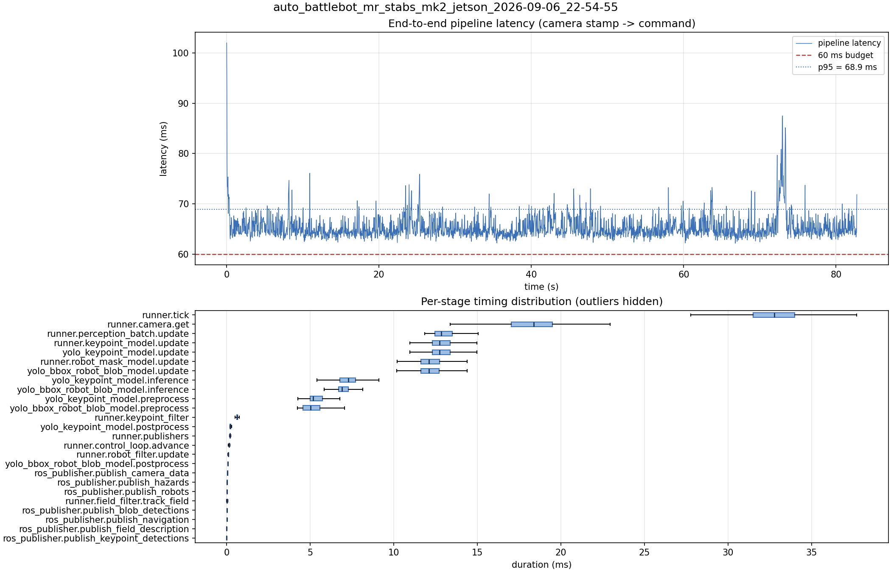

# Latency report: auto_battlebot_mr_stabs_mk2_jetson_2026-09-06_22-54-55

engine: yolo26n_nhrl_robots_bbox_2class_2026-09-04_int8_aarch64_sm87.engine (n8)

- Source: `data/recordings/auto_battlebot_mr_stabs_mk2_jetson_2026-09-06_22-54-55.mcap`
- Generated: 2026-09-06 23:02 by `scripts/mcap_latency_report.py`
- Duration: 82.7 s
- Window: after field init (3.6 s into the recording)
- Loop rate: 30.2 Hz mean
- End-to-end latency: mean 65.3 ms / p95 68.9 ms / max 102.0 ms
- Budget: 60 ms -> p95 is OVER BUDGET

| Stage | n | mean (ms) | median (ms) | p95 (ms) | max (ms) | % of tick |
| --- | ---: | ---: | ---: | ---: | ---: | ---: |
| pipeline.latency | 2,482 | 65.31 | 64.66 | 68.91 | 101.99 | - |
| runner.tick | 2,482 | 32.66 | 32.77 | 36.32 | 68.96 | 100.0% |
| runner.camera.get | 2,482 | 18.05 | 18.38 | 21.12 | 50.19 | 55.3% |
| runner.perception_batch.update | 2,482 | 13.13 | 12.85 | 14.63 | 28.56 | 40.2% |
| runner.keypoint_model.update | 2,482 | 12.99 | 12.75 | 14.50 | 28.51 | 39.8% |
| yolo_keypoint_model.update | 2,482 | 12.98 | 12.75 | 14.49 | 28.50 | 39.7% |
| runner.robot_mask_model.update | 2,482 | 12.29 | 12.10 | 13.76 | 27.06 | 37.6% |
| yolo_bbox_robot_blob_model.update | 2,482 | 12.28 | 12.10 | 13.75 | 27.06 | 37.6% |
| yolo_keypoint_model.inference | 2,482 | 7.37 | 7.28 | 8.69 | 23.12 | 22.6% |
| yolo_bbox_robot_blob_model.inference | 2,482 | 7.05 | 6.90 | 8.12 | 21.32 | 21.6% |
| yolo_keypoint_model.preprocess | 2,482 | 5.32 | 5.17 | 6.31 | 9.07 | 16.3% |
| yolo_bbox_robot_blob_model.preprocess | 2,482 | 5.11 | 5.03 | 6.21 | 9.33 | 15.6% |
| runner.keypoint_filter | 2,482 | 0.64 | 0.62 | 0.79 | 1.59 | 2.0% |
| yolo_keypoint_model.postprocess | 2,482 | 0.24 | 0.22 | 0.29 | 3.83 | 0.7% |
| runner.publishers | 2,482 | 0.23 | 0.21 | 0.26 | 3.56 | 0.7% |
| runner.control_loop.advance | 2,482 | 0.15 | 0.15 | 0.20 | 0.46 | 0.5% |
| runner.robot_filter.update | 2,482 | 0.10 | 0.10 | 0.13 | 0.22 | 0.3% |
| yolo_bbox_robot_blob_model.postprocess | 2,482 | 0.08 | 0.07 | 0.09 | 1.15 | 0.2% |
| ros_publisher.publish_camera_data | 2,482 | 0.07 | 0.06 | 0.08 | 1.01 | 0.2% |
| ros_publisher.publish_hazards | 2,482 | 0.04 | 0.04 | 0.04 | 0.96 | 0.1% |
| ros_publisher.publish_robots | 2,482 | 0.03 | 0.03 | 0.04 | 1.10 | 0.1% |
| runner.field_filter.track_field | 2,482 | 0.03 | 0.02 | 0.07 | 0.11 | 0.1% |
| ros_publisher.publish_blob_detections | 2,482 | 0.03 | 0.02 | 0.04 | 3.26 | 0.1% |
| ros_publisher.publish_navigation | 2,482 | 0.02 | 0.02 | 0.03 | 1.00 | 0.1% |
| ros_publisher.publish_field_description | 2,482 | 0.01 | 0.01 | 0.01 | 1.00 | 0.0% |
| ros_publisher.publish_keypoint_detections | 2,482 | 0.01 | 0.01 | 0.01 | 3.33 | 0.0% |

