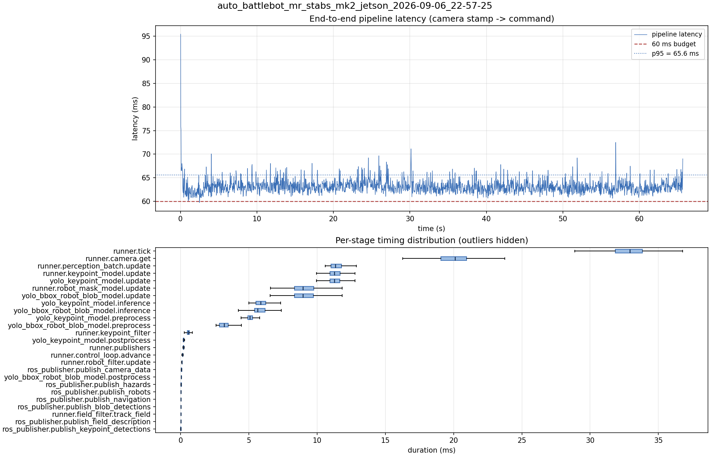

# Latency report: auto_battlebot_mr_stabs_mk2_jetson_2026-09-06_22-57-25

engine: yolo26s_nhrl_robots_bbox_2class_rect384x640_2026-09-05_int8_aarch64_sm87.engine (B8)

- Source: `data/recordings/auto_battlebot_mr_stabs_mk2_jetson_2026-09-06_22-57-25.mcap`
- Generated: 2026-09-06 23:02 by `scripts/mcap_latency_report.py`
- Duration: 65.7 s
- Window: after field init (3.3 s into the recording)
- Loop rate: 30.2 Hz mean
- End-to-end latency: mean 63.2 ms / p95 65.6 ms / max 95.4 ms
- Budget: 60 ms -> p95 is OVER BUDGET

| Stage | n | mean (ms) | median (ms) | p95 (ms) | max (ms) | % of tick |
| --- | ---: | ---: | ---: | ---: | ---: | ---: |
| pipeline.latency | 1,971 | 63.15 | 62.97 | 65.56 | 95.43 | - |
| runner.tick | 1,971 | 32.70 | 32.91 | 35.54 | 42.12 | 100.0% |
| runner.camera.get | 1,971 | 19.83 | 20.11 | 22.46 | 29.14 | 60.6% |
| runner.perception_batch.update | 1,971 | 11.50 | 11.34 | 12.55 | 30.31 | 35.2% |
| runner.keypoint_model.update | 1,971 | 11.40 | 11.26 | 12.47 | 30.25 | 34.9% |
| yolo_keypoint_model.update | 1,971 | 11.39 | 11.26 | 12.46 | 30.24 | 34.8% |
| runner.robot_mask_model.update | 1,971 | 9.11 | 8.96 | 10.95 | 24.61 | 27.9% |
| yolo_bbox_robot_blob_model.update | 1,971 | 9.11 | 8.95 | 10.95 | 24.60 | 27.8% |
| yolo_keypoint_model.inference | 1,971 | 5.98 | 5.87 | 7.14 | 21.81 | 18.3% |
| yolo_bbox_robot_blob_model.inference | 1,971 | 5.78 | 5.65 | 6.83 | 21.38 | 17.7% |
| yolo_keypoint_model.preprocess | 1,971 | 5.13 | 5.06 | 5.91 | 8.13 | 15.7% |
| yolo_bbox_robot_blob_model.preprocess | 1,971 | 3.23 | 3.19 | 4.05 | 7.30 | 9.9% |
| runner.keypoint_filter | 1,971 | 0.56 | 0.57 | 0.76 | 1.65 | 1.7% |
| yolo_keypoint_model.postprocess | 1,971 | 0.23 | 0.21 | 0.28 | 1.16 | 0.7% |
| runner.publishers | 1,971 | 0.22 | 0.21 | 0.26 | 2.22 | 0.7% |
| runner.control_loop.advance | 1,971 | 0.15 | 0.14 | 0.18 | 0.41 | 0.5% |
| runner.robot_filter.update | 1,971 | 0.10 | 0.09 | 0.12 | 0.20 | 0.3% |
| ros_publisher.publish_camera_data | 1,971 | 0.06 | 0.06 | 0.08 | 0.15 | 0.2% |
| yolo_bbox_robot_blob_model.postprocess | 1,971 | 0.05 | 0.05 | 0.06 | 0.14 | 0.2% |
| ros_publisher.publish_hazards | 1,971 | 0.04 | 0.04 | 0.04 | 0.12 | 0.1% |
| ros_publisher.publish_robots | 1,971 | 0.03 | 0.03 | 0.04 | 1.08 | 0.1% |
| ros_publisher.publish_navigation | 1,971 | 0.02 | 0.02 | 0.03 | 1.03 | 0.1% |
| ros_publisher.publish_blob_detections | 1,971 | 0.02 | 0.02 | 0.04 | 0.93 | 0.1% |
| runner.field_filter.track_field | 1,971 | 0.02 | 0.02 | 0.06 | 0.09 | 0.1% |
| ros_publisher.publish_field_description | 1,971 | 0.01 | 0.01 | 0.01 | 0.91 | 0.0% |
| ros_publisher.publish_keypoint_detections | 1,971 | 0.01 | 0.01 | 0.01 | 2.01 | 0.0% |

