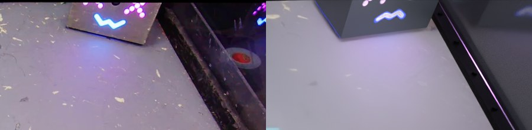
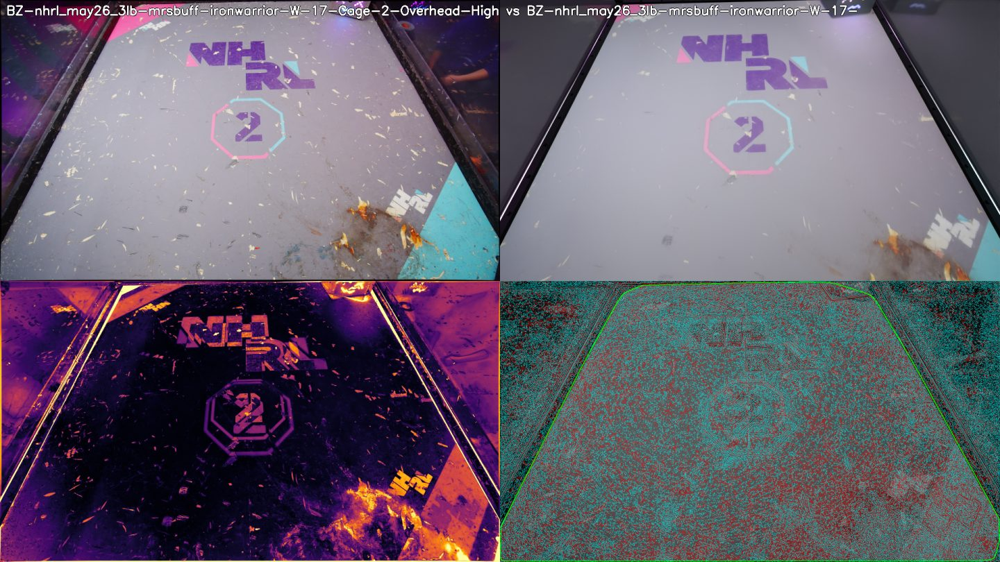
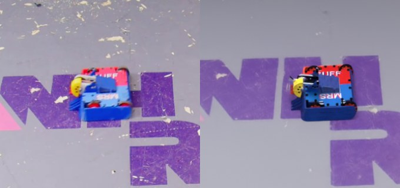
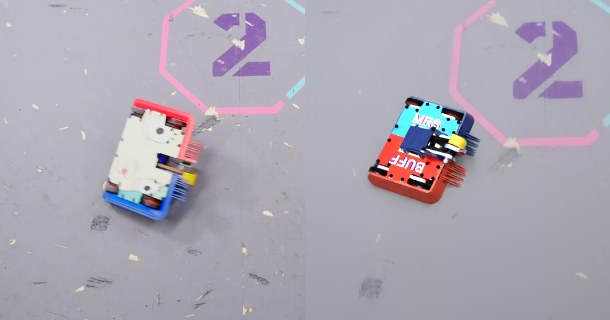
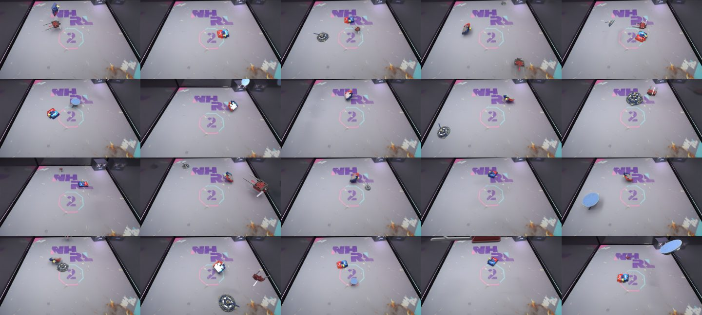

# Cage-high Blender scene of the NHRL 3 lb cage, graded against footage

Status: **built** (2026-09-11). Code: `playground/cage_scene/`, `training/synthetic/synthgen/cage.py`,
`training/synthetic/synthgen/cage_spec.py`, `training/synthetic/render_cage_view.py`,
`training/synthetic/render_cage_samples.py`, spec `training/synthetic/cage/cage2_overhead_high.toml`.
Outputs under `runs/cage_scene/` (gitignored). Figures: `assets/2026-09-11_cage_scene/`.

The goal was a Blender scene of the NHRL cage built for one camera, the fixed
`Cage-2-Overhead-High` iPhone that films every 3 lb fight, rendered through the existing
BlenderProc image and scored by pixel difference against robot-free frames from the clips.
The venue HDRI from the 2024 walk-around was not used as a light: its quality is too poor.
Lighting is explicit (LED tubes, coloured wash, dark backdrop) and tuned by the grade.

## Which cage

Cage 1 hosts the 12 lb and 30 lb fights on a larger mat. The 3 lb fights are in Cage 2
(13 downloaded clips: 2 Apr, 8 May, 1 May Pro, 2 Jun 2026) and once in Cage 5. A first pass on
Cage 1 fit a plausible 1.3 m camera against a 2.35 m mat, which is wrong by the cage scale
factor and was discarded. Everything below is Cage 2.

## Camera

Intrinsics are the measured iPhone calibration in `config/cameras/brettzone_cage_high.toml`
(fx 876.5 at 1920 px, 95.2 deg horizontal), rectified the way the C++ `Rectifier` does it
(alpha 1.0), so renders use the rectified K (fx 872.1, fy 870.8, cx 961.6, cy 534.8).

The near mat edge runs off the bottom of the frame in every Cage 2 clip, so the pose is
solved from three fitted edge lines (far, left, right) by least squares from a seed, six
equations for six unknowns. The seed is the 2024 Cage 2 pose from the true_battlebot
`metrics_tool/nhrl_cage_2.toml` (height 1.66 m, tilt 29.4 deg from straight down). The
mat is assumed 2.35 m square.

| event | clips used | height | tilt from down | yaw |
| --- | --- | --- | --- | --- |
| Apr 2026 | 2 | 1.158 m | 31.9 deg | 0.6 deg |
| May 2026 | 7 | 1.164 m | 31.8 deg | -0.3 deg |
| May Pro 2026 | 1 | 1.161 m | 32.0 deg | 0.6 deg |
| Jun 2026 | 1 | 1.156 m | 37.7 deg | -1.7 deg |

Two clips failed the sanity checks and are excluded: `may26 stingoperation-mrsbuff` (a
robot ghost in the median frame pulled the right edge) and `jun26 mothership-uchfunt` (the
house bot box on the near-left rail padded the hull and the fit yawed 24 deg). The camera
sits 1.2 m up, 1.20 to 1.25 m behind the mat centre, and moved between May and June:
same height, 6 deg more downtilt. Against the 2024 prior the 2026 mount is 0.5 m lower.

The floor albedo per event is the median of that event's rectified target frames warped
onto the mat plane at 1024 px/m (2406 px square); 96.7% of the mat is observed in May, the
near strip the camera cuts off is filled with the mat mean.

## Scene

Metres, W frame: mat centre origin, z up, +y away from the camera. Mat 2.35 m square,
12 mm thick, albedo from footage. Steel rails fill the 44 mm gap between mat and the 8 ft
wall plane, 20 mm above the mat, with bolt heads every 0.20 m. Polycarbonate panels
(12 mm, IOR 1.586) on the wall plane to 1.22 m, corner posts, a stage riser down to the
venue floor 0.70 m below, the textured house bot model (`training/data/environments/nhrl_3lb_cage/house_bot/HOUSE BOT.glb`
with the `HouseBot` PBR set; the GLB ships lying on its side, so it is rolled -90 deg about
its LED-face normal to stand up, yawed to face the camera, its saturated LED texels made
emissive with a strength set against the solved exposure so they keep their pink and blue
instead of clipping to white, and lit from the camera side by a narrow spot since the overhead tubes do not
reach its vertical face) on the far-right rail where the May framing shows it, a 3x2 rig of short emissive LED tubes 2.2 m
up, a magenta and a cyan area light behind the side panels, and a dark backdrop cylinder
with faint emissive strips for the far fixtures. Exposure and colour
gain are solved from the mat-region means of the target frames before the final render
(gain 2.9, colour gain about 0.91 / 1.00 / 0.81 RGB on the first pass).

## Grading

`playground/cage_scene/grade_render.py` scores each render against its clips on the full
frame, inside the mat hull, and outside it: L1 grey and RGB at quarter resolution, SSIM
(11x11 Gaussian), symmetric Canny edge chamfer distance, Lab mean and std deltas, and the
IoU of the rendered mat mask against the target hull. Two baselines are scored the same
way: `baseline_mean`, the mean of all target frames against each target (the clip-to-clip
floor from exposure drift and mat wear), and `baseline_flat`, the target's own mat-mean
colour everywhere.

### Sweeps (event poses, 32 samples, auto exposure)

Floor drop of the venue floor: 0.25 / 0.45 / 0.70 m gave outside L1 27.2 / 26.5 / 25.8;
nothing else moved. Kept 0.70.

Wash light strength (both lights): 0 / 10 / 25 W gave outside L1 25.2 / 25.7 / 25.8 and
outside Lab dL +0.7 / +3.4 / +5.6. Kept 10 for the tint the footage shows through the
panels; the L1 cost is 0.5.

| variant | inside L1 | inside SSIM | outside L1 | outside SSIM | full L1 |
| --- | --- | --- | --- | --- | --- |
| rail 20 mm above mat | 13.26 | 0.715 | **23.64** | **0.512** | **16.51** |
| rail 50 mm (start) | 13.22 | 0.715 | 25.68 | 0.477 | 16.94 |
| rail 90 mm | 13.17 | 0.715 | 28.51 | 0.444 | 17.57 |
| tubes at 2.2 m | **12.85** | 0.716 | 25.59 | 0.475 | 16.62 |
| tubes at 3.0 m (start) | 13.22 | 0.715 | 25.68 | 0.477 | 16.94 |
| tubes at 4.0 m | 13.50 | 0.714 | 26.27 | 0.474 | 17.31 |
| mat roughness 0.4 / 0.7 / 0.9 | 14.22 / 13.22 / 13.13 | 0.716 / 0.715 / 0.714 | | | |
| mat specular 0.0 / 0.3 / 0.6 | 13.19 / 13.22 / 13.28 | 0.712 / 0.715 / 0.717 | | | |

The rail height is the one geometry parameter the outside region resolves; tube height
is the one the inside shading resolves. Mat roughness and specular are within noise.

### Final render

Per-clip poses, 128 samples, OptiX denoiser, auto exposure (gain 3.3, colour gain
1.00 / 1.00 / 0.98 RGB), 11 target clips, with the lighting settled by the robot-frame stage
below (0.3 m tubes, fill 0.20, mat albedo gain 0.35, tinted panels, dark venue). Lower is
better except SSIM and mat IoU.

| region | metric | render | flat baseline | mean-of-targets baseline |
| --- | --- | --- | --- | --- |
| full | L1 grey | **15.9** | 41.3 | 10.3 |
| full | SSIM | **0.672** | 0.635 | 0.821 |
| full | edge chamfer px | **1.47** | n/a | 1.53 |
| full | mat IoU | 0.989 | | |
| inside hull | L1 grey | **12.4** | 17.9 | 9.6 |
| inside hull | SSIM | 0.724 | 0.755 | 0.839 |
| inside hull | edge chamfer px | **1.57** | n/a | 1.58 |
| inside hull | Lab dL / da / db | -2.8 / +0.2 / 0.0 | -1.8 / -0.4 / -0.3 | -3.1 / +0.1 / +0.1 |
| outside hull | L1 grey | **24.0** | 111.8 | 11.4 |
| outside hull | SSIM | **0.521** | 0.290 | 0.772 |
| outside hull | edge chamfer px | **1.22** | n/a | 1.44 |
| outside hull | Lab dL / da / db | +12.7 / -9.0 / +4.8 | +117.7 / -8.8 / +3.3 | +1.5 / 0.0 / -0.3 |

Event poses (one camera per event, 4 renders) score within 0.3 L1 of the per-clip poses on
every region (full L1 15.8, mat IoU 0.985), so the per-event camera is good enough for the
sample set.

The render beats the flat baseline on every metric except inside-hull SSIM (0.724 against
0.755): the flat colour has no structure to mismatch, while the render's debris and seams
come from a texture averaged over seven fights and land a few pixels off each clip's own.
It beats the mean-of-targets baseline on edge chamfer in all three regions, so the geometry
lines up better than the footage lines up with itself, and sits 1.5 to 2 times further from
the targets than they sit from each other on L1.

From the first render to the final one: full-frame L1 grey 38.2 to 15.9, outside SSIM 0.475
to 0.521, mat IoU 0.986 to 0.989. The house bot model at the far-right rail:

## Robot lighting against real frames

An empty-cage match says nothing about how a robot is lit, so the second grade puts MRS BUFF
MK3 where it really was. `pick_robot_frames.py` runs the yolo26x pose model over the four
Cage 2 clips with a good camera fit, keeps frames where MRS BUFF is detected with both
keypoints, clear of the opponent and inside the hull, and projects the keypoints through the
fitted camera onto the mat plane: position from the midpoint, heading from back to front.
Twelve frames, three per clip (a pre-roll frame at rest plus two mid-fight). The CAD MRS BUFF
is rendered upright at that pose from that clip's camera and graded on the detected robot
box, a shadow ring around it on the mat, and the rest of the mat.

First finding: the rendered robot was half as bright as the real one (mean grey 60 against
129) while the mat matched. The mat texture is a photograph of the lit mat, so as an albedo it
is far brighter than the paint, and once exposure is fitted to it every true-albedo object is
under-lit. Tube geometry and fill barely move this (robot grey 59 to 64 across ten lighting
variants); `mat.albedo_gain` does, by letting the lights carry the mat's brightness.

| lighting variant (12 frames, 64 samples) | robot L1 | robot dL | robot grey | ring L1 | ring drop vs mat |
| --- | --- | --- | --- | --- | --- |
| base (2x3 rig, 0.6 m tubes, 2.2 m, fill 0.03) | 49.1 | -16.4 | 60 | 19.5 | +4.8 |
| tubes 0.3 m | 48.1 | -15.7 | 63 | 19.4 | +4.6 |
| tubes 1.2 m | 49.8 | -16.2 | 59 | 19.7 | +4.6 |
| tube radius 0.05 m | 54.3 | -4.4 | 64 | 28.6 | +5.3 |
| rig at 1.7 m / 3.0 m | 48.7 / 49.4 | -16.3 / -16.5 | 61 / 60 | 19.5 / 19.6 | +4.5 / +5.4 |
| 2x2 rig / 4x3 rig | 48.8 / 50.4 | -15.9 / -16.0 | 62 / 59 | 19.5 / 20.0 | +4.7 / +4.3 |
| fill 0.10 / 0.20 | 48.6 / 48.2 | -15.6 / -14.9 | 62 / 64 | 19.5 / 19.5 | +4.5 / +4.3 |

The real frames' ring is not darker than the rest of the mat at all (drop -4.4: the ring sits
on the plain grey while the rest of the mat holds the dark logo), so the render's shadows
were too deep as well as its robot too dark. Kept: 0.3 m tubes, fill 0.20.

| `mat.albedo_gain` (12 frames, 64 samples, 0.3 m tubes, fill 0.20) | robot L1 | robot dL | ring L1 | mat-rest L1 |
| --- | --- | --- | --- | --- |
| 1.00 | 47.4 | -14.5 | 19.4 | 19.3 |
| 0.70 | 45.9 | -9.8 | 19.1 | 19.3 |
| 0.50 | 44.7 | -5.0 | 18.9 | 19.2 |
| **0.35** | **44.2** | **+0.2** | 18.6 | 19.2 |
| 0.25 | 44.4 | +5.0 | 18.3 | 19.3 |

Gain 0.35 puts the rendered robot's brightness on the real one and is kept. The mat itself is
unaffected by construction (auto exposure refits the lights each time), and the remaining
robot L1 of 44 is dominated by the box region's own content: a blurred, glossy real robot
against a sharp CAD render, plus the real frames being darker overall than the robot-free
median target (mat-rest L1 19, Lab dL +6 to +8), which is the iPhone exposing differently
mid-fight than the median frame.

Final robot-frame grade (12 frames, 128 samples, the settled spec):

| region | metric | render | flat baseline | real |
| --- | --- | --- | --- | --- |
| robot box | L1 grey | 44.6 | 42.6 | |
| robot box | Lab dL / da / db | **-2.6** / -7.7 / -0.8 | +18.9 / -13.6 / -0.8 | |
| robot box | SSIM | 0.195 | 0.242 | |
| robot box | edge chamfer px | 1.30 | n/a | |
| robot box | footprint IoU with the detected box | 0.38 | | |
| shadow ring | L1 grey | 18.9 | 20.1 | |
| shadow ring | ring / rest-of-mat brightness | 0.976 | | 1.031 |
| rest of mat | L1 grey | 19.0 | 19.8 | |

The rendered robot is now as bright as the real one and its shadow is within 5% of the real
ring-to-mat ratio (the real ring reads slightly brighter than the mat around it because the
mat's own logo sits elsewhere). It is still bluer-greener than the real robot (da -7.7): the
real MRS BUFF top is a printed sticker photographed under LED light, the render uses the CAD
part colours. The box L1 stays near the flat baseline because the real robot is motion
blurred and glossy while the render is sharp, and SSIM inside a 110 px box is noise-limited.

### Buying the outside region back

The fill the robots need is ambient light from every direction, and the venue floor and
crowd bowl seen through the panels receive it too. Darkening what is behind the glass, and
the glass itself, gives the outside back without touching the mat or the robots (event
poses, 32 samples, auto exposure):

| variant | inside L1 | outside L1 | outside SSIM | outside dL | full L1 | full SSIM |
| --- | --- | --- | --- | --- | --- | --- |
| fill 0.20 as tuned for the robots | 12.6 | 28.5 | 0.489 | +22.0 | 17.1 | 0.664 |
| + venue floor 0.02, backdrop 0.006 | 12.6 | 27.6 | 0.494 | +20.4 | 16.9 | 0.665 |
| + wash lights off | 12.7 | 27.2 | 0.496 | +19.5 | 16.9 | 0.663 |
| **+ panel tint 0.6, roughness 0.08** | 12.5 | **24.0** | **0.516** | +13.0 | **16.0** | **0.670** |

The tinted, slightly rough panel is kept: the real polycarbonate is scratched and dusty and
darkens everything behind it. At 128 samples on the per-clip poses this lands at full-frame L1 15.9 and outside L1 24.0,
the best of the run, with the robots lit to match.

## Sample set

`training/synthetic/render_cage_samples.py` renders the same scene with robots on the mat
through the same synthgen placement, gating and YOLO pose label writers as the generic
pipeline: MRS BUFF MK3 (exact CAD) plus one or two Meshy NHRL opponents per image, camera
drawn from the four event poses, tube strength jittered +-25%, exposure solved against the
targets at the start of the run. 100 images at 1920x1080, 128 samples, seed 0, 100 scenes
attempted, none dropped: `runs/cage_scene/samples/{images,labels,data.yml,sheet.png}`.

| | count |
| --- | --- |
| images | 100 |
| MRS BUFF MK3 boxes with keypoints | 97 |
| Meshy opponent boxes | 127 |
| images with 1 / 2 / 3 labels | 13 / 50 / 37 |

### In the generic generator

`render_cage_samples.py` stays the cage-only renderer from the fitted poses; the generic
pipeline now also renders cage scenes, so one dataset carries both halves.
`[cage]` in `training/synthetic/config.toml` turns it on and sets the fraction of images
(0.5), and `synthgen/cage_scene.py` holds the cage in one Blender collection that hides and
shows per scene, restoring the arena's view transform, glass bounces, sample count and camera
intrinsics exactly. The split is tracked rather than coin-flipped, so a short run lands on the
ratio. The cage half uses the measured `brettzone_cage_high` intrinsics rectified to the output
resolution (fx 581 at 1280x720, 95.5 deg horizontal) instead of the arena half's default lens.

The camera is no longer one of the four fitted poses. `synthgen/cage_mount.py` samples a mount
the way ours would go on: a wall (all four, since which one depends on the match), an offset
along it, a height, an inset past the wall plane, a downtilt, and a little yaw and roll. The
ranges in `[cage.mount]` bracket the eleven fits above, and the inset stays clear of the
polycarbonate so a mount never shoots through it. A mount is redrawn (up to 40 times) until the
robot centroid projects in frame, the same guarantee `setup_scene_cameras` gives the arena half.

Cage scenes carry one extra class. The house bot is robot-shaped scenery that sits in frame in
real cage footage, so it is labelled `house_bot` with front/back keypoints rather than left
unlabelled: `cage.house_bot_keypoints` reads them off the placed model the way
`nhrl_common.keypoints_along_axis` does for the CAD distractors, on the centerline at ground
height at the footprint extremes, with the LED face (the model's own +x, which
`HouseBotBoxSpec.yaw_deg` already aims) as the front. It is boxed from its own segmentation
category, so a robot in front of it shrinks the box to what is still visible.

Assets moved to `training/data/environments/nhrl_3lb_cage/` (mat albedos, house bot model and
its PBR set), and the albedo builder with them, as
`training/synthetic/build_cage_floor_texture.py`; it writes into that directory by default.

## What the grade says and does not say

- Inside the hull the render sits between the two baselines: better than a flat mat colour,
  worse than the mean of the real frames. The remaining inside error is mostly per-clip
  debris and wear that a per-event texture averages away, plus the tone curve and white
  balance of the iPhone, which a Standard sRGB view transform does not reproduce.
- Outside the hull the render beats the flat baseline by a wide margin but the SSIM stays
  low: the real outside is a crowd, a venue floor and reflections in scratched
  polycarbonate, and the scene has a dark backdrop with emissive strips.
- Three-line pose fits have zero residual by construction (six equations, six unknowns),
  so the pose quality shows in the grade (mat IoU, chamfer) and in the sanity checks, not in
  a residual number.

## Out of scope, noted

`scripts/nhrl_to_recordings.py` and `scripts/video_to_mcap.py` still default `focal_px` to
1331 while the measured calibration is 876.5; a pose fitted through their MCAP
`camera_info` would be about 50% off in range.

## Next steps

1. Split the albedo into base mat and per-event decals so June's DAZN / Pro Tour layout
   renders from the same scene.
2. Fit the mat size (2.30 to 2.40 m) jointly with the pose once a robot of known size is in
   frame; the three-line solve cannot separate them.
3. Grade the sample set with the domain probe in
   `training/model_eval/interpret_context_vs_appearance.py` against real cage crops.
