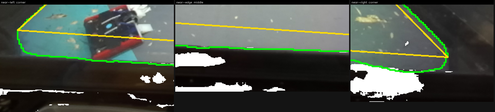
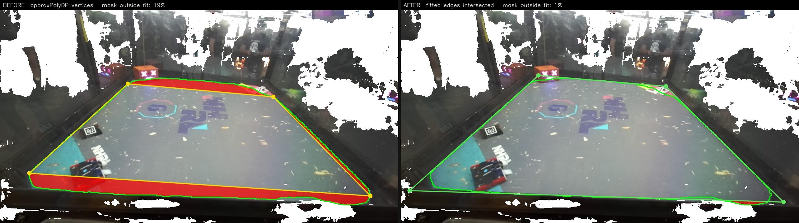
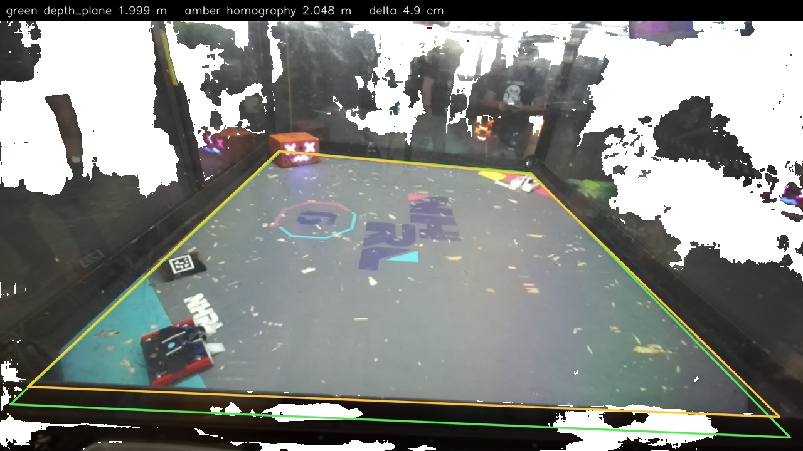

# Camera to field transform: depth plane against RGB-only homography

Status: **done** (2026-09-08). Code: `playground/field_transform/`. Data:
`data/downloads/mini_bot_2024-10-26/`. Figures: `assets/2026-09-08_field_transform/`.

Two ways to get `tf_camera_from_fieldcenter`, compared on three 2024-10-26 competition
recordings with a static ZED on a tripod:

- **`depth_plane`**, a Python port of the shipped C++ path in
  `src/field_filter/point_cloud_field_filter.cpp`. Mask, depth, point cloud, RANSAC plane,
  flatten, minimum-area rectangle. Measures the field size.
- **`homography`**, new. The same mask, but only its outline in RGB, solved against a field
  of known metric size. `H = K [r1 r2 t]` up to scale, so `K^-1 H` gives two rotation
  columns and the translation. No depth.

**They agree to 5 cm in range, 0.5 degrees in plane tilt and 1 degree in yaw** on the two
well-framed recordings. The third is clipped by the image border and is worse, correctly
flagged rather than silently wrong.

Getting there took one real fix. The first version disagreed by 22 to 27 cm, and none of
that was the segmentation.

## Answer to "can DeepLab be improved to capture the field edges?"

**It does not need to be, for this.** The mask was never the error source here.



Green is the DeepLab outline, amber the four-sided fit, zoomed 3x along the near edge. In
the middle panel the green line sits on the boundary between the grey mat and the black
cage frame to within a few pixels, while the amber fit is about 100 px above it. The right
panel shows why a quadrilateral is the wrong model in the first place: the mat's corner is
physically **rounded**, so no four vertices lying on that outline can describe it.

The measurable ceiling on the mask is resolution, not accuracy. The model runs at 344x344
and its argmax is nearest-upscaled to 1280x720, so each mask pixel covers 3.72 px
horizontally and 2.09 px vertically. That quantization is real but small, and it averages
out: each fitted edge uses several hundred boundary points, so the line lands far better
than any single boundary pixel.

Where a model change *would* help is shape, not sharpness. A head that regressed the four
field corners directly, or a boundary with a quadrilateral prior, would remove the corner
extraction step entirely rather than making it more accurate. That is a different model,
not a better-trained version of this one. Two smaller notes: the mat corners are genuinely
rounded, so "the correct edges" are the straight sides extrapolated to their intersection,
which is a geometry decision rather than a labelling one; and none of this is limited by
the 2024 footage being out of domain, since the mask tracks the mat on all three
recordings.

## The bug that actually mattered

`cv2.approxPolyDP` returns vertices that lie **on** the outline, so it can only ever
produce a quadrilateral inscribed in the mask. Against a rounded mat corner it chords
across, and the fit came out about 19% small in area, which is 11% linearly.

That error is not visible in any residual. Reprojection error was **0.0 px on all three
frames**: the homography fits whatever four corners it is handed, however wrong they are.



Red is mask area outside the fitted quad. Left, `approxPolyDP` vertices leave 19% of the
mask outside. Right, the fix: assign every contour point to whichever side of the current
quad it is nearest, drop the outer 20% of each side as belonging to the rounding, fit the
survivors, and intersect adjacent lines. Four iterations. That extrapolates back to where
the edges actually meet and leaves 1%.

A quad 11% small with the true metric size assigned to it puts the camera 11% too far
away, which is exactly the bias that was measured.

## Results

Field size 2.35 m. `depth_plane` measures it; `homography` is told it.

| recording | range depth | range homog | Δt before | **Δt after** | Δnormal | Δyaw |
|---|---|---|---|---|---|---|
| `11-30-53` | 1.798 m | 1.821 m | 22.4 cm | **5.0 cm** | 0.48° | 1.00° |
| `13-29-41` | 1.999 m | 2.048 m | 18.3 cm | **5.2 cm** | 0.53° | 0.49° |
| `16-18-52` *clipped* | 1.946 m | 2.039 m | 27.4 cm | **14.8 cm** | 11.04° | 5.00° |



Mask coverage went from 1.26 / 1.24 / 1.23 to 0.967 / 0.982 / 0.960, so the fitted quad now
sits just outside the mask, as corner extrapolation over a rounded corner should.

The clipped recording is worse on plane tilt after the fix (4.08° to 11.04°) rather than
better. With one side of the field running off the image, the fitted "edge" there is the
image border, and extrapolating that confidently is worse than chording it. Clipping has to
be excluded, not fitted around.

### The nominal cage size is the wrong number

Assuming 2.4384 m (8 ft) added about 6% range error before any of the above. That is the
outer cage; the DeepLab mask covers the **floor mat** inside it, and the mat is smaller:

| source | field size |
|---|---|
| nominal 8 ft cage | 2.4384 m |
| `depth_plane` measured | 2.303 to 2.374 m |
| the bags' own `/filter/field` | 2.361 to 2.402 m |

Range scales linearly with the assumed size, so this method needs the mat dimension, not
the cage dimension.

## Validation

Both implementations were checked against synthetic ground truth before touching real data:
render a known field from a known pose, recover it both ways.

| case | depth err | measured size | homog err | A vs B |
|---|---|---|---|---|
| overhead 3.0 m, 5° | 3.2 mm | 2.440 x 2.437 | 4.3 mm | 2.8 mm, 0.00° |
| tripod 4.0 m, 25° | 6.0 mm | 2.452 x 2.439 | 5.4 mm | 2.7 mm, 0.01° |
| tripod 4.5 m, 35°, yaw 20° | 8.5 mm | 2.452 x 2.449 | 9.2 mm | 5.8 mm, 0.03° |
| tripod 5.0 m, 45°, offset | 6.6 mm | 2.452 x 2.453 | 5.1 mm | 2.1 mm, 0.06° |
| **field clipped** | 4.5 mm | 2.445 x 2.443 | **141 mm** | 139 mm, 6.14° |

With the field fully in frame both land within 3 to 9 mm, and the depth port recovers a
true 2.4384 m cage as 2.44 to 2.45 m. The clipped row is the failure mode to design around.

## Data limits

Only **3 frames**, not the 10 asked for. The ZED RGB and depth streams were never recorded
in these bags: no `image_rect_color`, no `depth_registered`. The only per-pixel data is
`/camera_0/point_cloud/cloud_registered`, published once per field initialisation, and
there are four such messages across 31 GB of bags.

That cloud is enough. It is an organized 1280x720 XYZ+BGRA cloud in the optical frame,
verified by unprojecting z through K and reproducing the cloud's own x and y to 0.0000 m,
so it yields both the depth image the C++ path wants and the RGB the homography wants.
Camera info reports `plumb_bob` with all-zero distortion, so the images are rectified and
straight world lines stay straight; the curvature in the mask outline is the mat's real
shape, not lens distortion.

## Reproducing

```bash
mcap convert ~/Downloads/mini_bot_2024-10-26T13-29-41-003.bag \
    data/downloads/mini_bot_2024-10-26/mini_bot_2024-10-26T13-29-41.mcap

venv/bin/python playground/field_transform/compare_field_transform.py \
    data/downloads/mini_bot_2024-10-26/*.mcap --field-size 2.35 2.35 \
    -o data/downloads/mini_bot_2024-10-26/field_compare
```

Reading the converted files needs `mcap-ros1-support`, which was added to the venv.

## Two checks worth keeping

Neither failure mode above shows up in a residual, so both checks are structural:

- `touches_border` flags a mask reaching the image edge. The corners are then where the
  field crosses the border, not where the field ends.
- mask area over quad area flags an outline that is not the quadrilateral this method
  assumes. It caught all three frames at 1.23 to 1.26 before the fix and clears at 0.96 to
  0.98 after.
