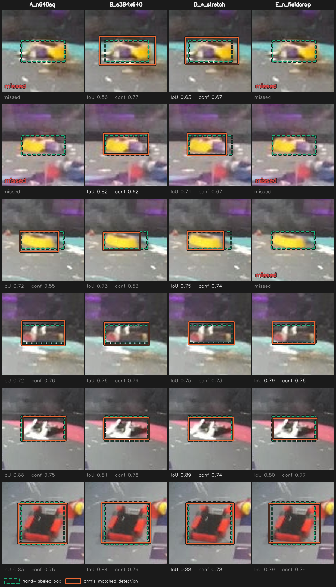

# Input geometry: how should the frame reach the network?

All five planned arms are trained and scored. Arm F, added after D reported, is still
training, and Jetson latency is still outstanding. Plan: `input_resolution_plan.md`.

**Answer: deploy `yolo26s` at 384x640.** It beats the current `yolo26n` at 640x640 by 0.050
recall on 40% fewer tensor pixels. The padding a letterbox spends is worth nothing (+0.003),
so the geometry is free; what the freed budget buys is a bigger model. Separately, filling
the tensor by stretching rather than padding is worth +0.031 on its own, because it lands a
robot on 1.33x the pixels for nothing. See "Verdict" at the end.

## Question

Both corpora are 16:9. Training is 1920x1080, the eval and deployment ZED are 1280x720.
Letterboxing 16:9 into a square 640x640 puts the content in 640x360 and fills the
remaining 280 rows, 43.8% of the input tensor, with grey padding. Which preprocessing
makes the best use of a fixed inference budget: keep the letterbox, drop the padding,
raise resolution, stretch, or crop to the field?

## What each geometry actually hands the detector


Top row is every arm's tensor at true pixel scale, so the sizes are directly comparable
and the padding shows up as grey. Bottom row zooms the same robot out of each tensor with
nearest-neighbour sampling, so the pixel budget per robot is visible rather than
tabulated. On this eval frame:

| arm | tensor | padding | robot sqrt-area at the tensor |
|---|---|---:|---:|
| A `640x640` letterbox | 409,600 px | 43.8% | 25 px (COCO-small) |
| A2/B `384x640` letterbox | 245,760 px | 6.2% | 25 px |
| C `576x1024` letterbox | 589,824 px | 0.0% | 40 px |
| D `640x640` stretch | 409,600 px | 0.0% | 34 px |
| E `640x640` field crop | 409,600 px | 65.5% | 25 px |
| E′ `384x640` field crop | 245,760 px | 42.4% | 25 px |

Two things fall out of the picture that the plan's table did not predict.

**The stretch arm buys object scale for free.** Squeezing 16:9 into a square costs 0.5x
horizontally but only 0.89x vertically, so a robot lands at sqrt(0.5 x 0.89) = 0.67 of its
source size against 0.50 for the letterbox. That is 1.33x more robot at the same 409,600
tensor pixels and no padding. Object scale is the one thing the plan says none of the
geometries address, and D addresses it without spending anything. The cost is a
preprocessing fork, and an unverified interaction with the `degrees=45.0` rotation
augmentation.

**The field crop only spends its winnings on padding.** Panels E and E′ use the box the
DeepLab model actually predicts for that frame, not the label boxes. The field is wide and
short, so the crop pads more than the uncropped frame does and leaves the robot at exactly
arm A's scale. Putting it in a rectangular tensor instead of a square one does not rescue
it: E′ gets A2's robot scale with arm A's padding. E′ was never trained; see
"Arm E: cut on zoom, reinstated on false positives" below for what the trained arm did.

## The trap that would have invalidated A2, B and C

The plan flagged this as an open question. It is real, and it fires on this corpus.

Ultralytics sizes rectangular batches from the images' own aspect ratios, then refuses to
shuffle when the resulting batch shapes are not all identical
(`ultralytics/models/yolo/detect/train.py:95`). It logs a warning and continues. A silent
`shuffle=False` feeds the optimizer aspect-sorted batches, which on a corpus built from
recordings means recording-ordered batches, for the whole run.

`nhrl_robots_bbox_2class` is 99.85% 1920x1080. It also carries 39 pre-letterboxed YouTube
frames at 1920x886, from one segment. Those 39 gave one batch of 810 a different shape:

```
imgsz=640:  n_batches=810  shapes=[(320, 640) x 1, (384, 640) x 809]    all equal: False
imgsz=1024: n_batches=810  shapes=[(480, 1024) x 1, (576, 1024) x 809]  all equal: False
```

0.15% of the corpus was enough to turn shuffling off. `training/yolo/make_uniform_aspect_subset.py`
builds a symlinked view without them, and every batch then comes out at one shape:

```
imgsz=640:  n_batches=809  shapes=[(384, 640) x 809]    all equal: True
imgsz=1024: n_batches=809  shapes=[(576, 1024) x 809]   all equal: True
```

Only the train split is filtered. Validation runs with `rect=True` and `shuffle=False`
regardless, so its 113 odd frames are harmless, and leaving val byte-identical keeps val
metrics comparable with arm A.

### The mosaic question, answered

The plan's other open question was whether mosaic, which composites four images onto a
square canvas, survives `rect=True` or quietly turns the batches into distorted composites.
Building the real training dataset with the full augmentation config and collating a batch
by hand answers it without spending a GPU:

```
rect  640: batch (16, 3,  384,  640)
rect 1024: batch (16, 3,  576, 1024)
square 640: batch (16, 3, 640,  640)
```

The rectangular batches come out at exactly the geometries the plan predicted, through the
real dataloader with mosaic, mixup and copy-paste enabled.


Every tile is one 16:9 scene, not a four-way composite squeezed into a square. The mosaic
worry does not apply.

The picture shows something else worth carrying into the results. `degrees=45.0`,
`scale=0.5` and `translate=0.5` leave the scene sitting rotated inside a grey border in
nearly every tile, often occupying well under half of it. This experiment is arguing about
43.8% of the tensor being grey; augmentation already hands the network grey borders of the
same order on every training image. That is a plausible mechanism for the scouting result
the plan reports, that removing 44% of the tensor moved recall by 0.002.

All sixteen tiles come from one recording because the figure indexes the dataset directly
and bypasses the sampler. It is not evidence about shuffling; the batch-shape check above
is.

**This does put A2, B and C on 25,875 training images against arm A's 25,914.** The 0.15%
difference is three orders of magnitude below the ~0.048 run-to-run recall spread
`data_epoch_min` measured, so it cannot carry a result, but it is a difference and it is
recorded here rather than left implicit.

`train.py` gained `--imgsz` and `--rect` to run these arms. Rectangular geometry has to
come from `rect=True`, because `check_imgsz(..., max_dim=1)` rejects an `[h, w]` pair for
training.

Export was verified separately: `convert_to_onnx.py --imgsz 384 640` on the arm A weights
produces `input [1, 3, 384, 640] -> output [1, 6, 5040]`, and
`yolo_bbox_robot_blob_model.cpp:73` reads the input size from the engine, so a rectangular
engine is a drop-in swap.

## Scouting the preprocessing on arm A's weights

Before any arm was trained, both new preprocessing modes were run through arm A's
square-trained weights on the full 688-frame eval set. These are a floor, not a
prediction: the weights never saw a stretched or cropped image.

| candidate | agnostic recall | precision | f1 | mAP50 | mAP50-95 |
|---|---:|---:|---:|---:|---:|
| A letterbox (baseline) | 0.780 | 0.858 | 0.817 | 0.754 | 0.481 |
| A stretched | 0.777 | 0.845 | 0.810 | 0.737 | 0.457 |
| A field-cropped | 0.791 | 0.890 | 0.838 | 0.774 | 0.503 |

Paired bootstrap, 1000 resamples, against A letterbox:

| candidate | metric | delta | 95% CI | verdict |
|---|---|---:|---|---|
| A stretched | recall | -0.003 | -0.018 to 0.011 | ns |
| A stretched | precision | -0.013 | -0.026 to 0.000 | ns |
| A field-cropped | recall | +0.011 | -0.002 to 0.025 | ns |
| A field-cropped | **precision** | **+0.032** | **0.019 to 0.044** | **better** |
| A field-cropped | f1 | +0.020 | 0.010 to 0.031 | better |

The stretch result says nothing about arm D: feeding letterbox-trained weights a stretched
frame shows them the wrong aspect ratio, and losing 0.003 recall for it is a mild result,
not a bad one. D has to be trained stretched to mean anything.

The field-crop result does say something, and it contradicts the reasoning below. Cropping
lifts precision by 0.032 with a CI clear of zero, on weights that never trained on a crop.
Recall does not move. The next section prices the crop's *zoom* correctly and finds none;
what it never priced is that a crop also deletes the crowd, the cage exterior and the
lights, and that is where the gain is. False positives, not object scale.

Numbers live in `training/data/nhrl_keypoints_eval_test/scores_input_geometry_scouting/`.
A single recording had suggested recall 0.835 to 0.873; on the full set that shrank to
0.780 to 0.791 and lost significance, which is the same lesson the plan records about the
one frame where the rectangular engine found three boxes and the square one found none.

## Arm E: cut on zoom, reinstated on false positives

The plan's gate asked whether the field occupies a similar fraction of the frame in both
corpora, on the theory that NHRL's overhead cage cameras are framed tight on the cage and
a crop would be a no-op there while the ZED sees much less. Measured with
`training/deeplab/field_fraction_gate.py` over 250 train and 688 eval frames, using the
`field_deeplabv3p_r50_2026-07-29` model the arm would use:

| corpus | field mask | field bbox | bbox p10-p90 |
|---|---:|---:|---:|
| train | 56.0% | 62.9% | 28.9-88.7% |
| eval (pooled) | 35.2% | 52.8% | 34.4-70.8% |

Those are close, so the plan's stated cut criterion does not fire. It was the wrong
measurement. What decides the arm is how much margin the crop needs before it stops
slicing robots in half, and how much zoom survives that margin:

| margin | train kept | train whole | train zoom | eval kept | eval whole | eval zoom |
|---:|---:|---:|---:|---:|---:|---:|
| 0.00 | 94.3% | 60.8% | 1.26x | 93.7% | 64.5% | 1.38x |
| 0.10 | 98.9% | 81.9% | 1.10x | 100.0% | 88.8% | 1.27x |
| 0.20 | 99.7% | 96.4% | 1.03x | 100.0% | 95.2% | 1.20x |
| 0.35 | 100.0% | 99.9% | 1.00x | 100.0% | 96.8% | 1.12x |

At margin 0 the crop zooms, but clips 39% of training robots. At the margin that keeps
them whole, the crop already covers the median training frame. Those zoom numbers are an
upper bound: they assume the crop fills the tensor, which no fixed engine input does.

Pricing the crop against real engine inputs kills the arm outright. Letterbox scale is set
by whichever axis binds first, and the field box spans nearly the full frame width on both
corpora, so the crop removes rows that the width-bound scale was going to apply anyway.
Median over the same frames, at margin 0.20:

| tensor | px | train zoom / pad, no crop | train zoom / pad, cropped | eval zoom / pad, no crop | eval zoom / pad, cropped |
|---|---:|---:|---:|---:|---:|
| 640x640 | 409,600 | 1.00x / 43.8% | 1.00x / 44.7% | 1.00x / 43.8% | 1.00x / 58.4% |
| 384x640 | 245,760 | 1.00x / 6.2% | 1.00x / 7.8% | 1.00x / 6.2% | 1.00x / 30.7% |
| 576x1024 | 589,824 | 1.60x / 0.0% | 1.60x / 4.4% | 1.60x / 0.0% | 1.60x / 26.1% |
| 320x1024 | 327,680 | 0.89x / 44.4% | 0.91x / 43.6% | 0.89x / 44.4% | 1.25x / 24.8% |

**The crop buys exactly zero zoom at every 16:9-or-squarer tensor, and pays padding for
it.** A square tensor is not what makes it fail, so a rectangular one does not fix it:
384x640 cropped is the same 1.00x as 384x640 uncropped, with padding up from 6.2% to 30.7%
on eval. Panel E′ in the figure is that row.

The only shape where cropping helps is one far wider than the frame, and that is where the
plan's domain-gap worry finally shows up: at 320x1024 the crop gives eval 1.25x but
training 0.91x, because the crops have different aspect ratios in the two corpora (median
2.41 on eval against 1.81 on training). A tensor tuned to the deployment camera's crop
would train the detector at a scale the training corpus never delivers.

On zoom alone that is a dead arm, and it was cut on 2026-09-05 for exactly that reason.
**That call was wrong, and the scouting pass above is why.** Every number in this section
prices what a crop does to object scale. None of them price what it does to the background:
a crop deletes the crowd, the cage exterior, the neighbouring cage and the overhead lights,
and those are what a false positive is made of. Cropping lifts precision 0.032 with a CI
clear of zero on weights that never trained on a crop.

The arm is running, at 640x640 as the plan specifies, which keeps it a single-variable
comparison against arm A: same model, same tensor size, crop or no crop.

Its cost stands as described: a DeepLab pass over 32,487 images in dataset prep, a crop
branch in the C++ preprocessor if it is adopted, and a runtime dependency of the detector
on the field estimate. What has changed is that there is now a measured gain to weigh
against it. `training/deeplab/build_field_crop_dataset.py` builds the corpus: `masks`
caches a field box per frame, `crop` rewrites images and labels against it.

## Arms

All trained on the uniform-aspect view of `nhrl_robots_bbox_2class`, 100 epochs, batch 96,
seed 0, three GPUs, submitted through `training/gpu_queue.py`.

| arm | model | input | resize scale from 1280 | pad | tensor px | state |
|---|---|---|---:|---:|---:|---|
| A | yolo26n | 640x640 letterbox | 0.50 | 43.8% | 409,600 | reused, `2026-09-04_00-56-05_yolo26n` |
| A2 | yolo26n | 384x640 letterbox | 0.50 | 6.3% | 245,760 | queued |
| B | yolo26s | 384x640 letterbox | 0.50 | 6.3% | 245,760 | queued |
| C | yolo26n | 576x1024 letterbox | 0.80 | 0% | 589,824 | queued |
| D | yolo26n | 640x640 anisotropic | 0.50 x / 0.89 y | 0% | 409,600 | queued |
| E | yolo26n | 640x640 field-cropped | variable | varies | 409,600 | queued |

| F | yolo26s | 640x640 anisotropic | 0.50 x / 0.89 y | 0% | 409,600 | queued, added after D reported |

D and E were originally gated on the A2/B/C verdict. Ben asked for every arm to run, so
both are queued now instead.

**F is not in the plan.** It was added once B and D reported, because they turned out to
move different levers: B has 3.4x the parameters at 1.00x object scale, D has 1.33x object
scale at `n` size, and the plan contains no arm that has both. Neither component adds a
runtime dependency, which is what makes the combination worth a run where a cropped
high-resolution arm is not.

E's corpus comes from a DeepLab pass over all 32,487 images, which found a field in all but
3. Cropping to the field box plus a 0.20 margin drops a label on 1.1% of training frames
(284 of 25,914) and 1.7% of val, and those frames are skipped rather than written: a frame
that keeps the robot in the picture but loses its box trains a false negative. Cropped
images span aspect ratios from 1.3 to 6.4, so E letterboxes them into 640x640 with
`rect=False`, which is also what keeps it a single-variable comparison against arm A.

D trains on the full 25,914-image corpus, not the uniform-aspect view: it is square and
needs no `rect=True`, so it varies preprocessing alone against arm A. Its labels are
byte-identical to the source, since normalized `cx cy w h` are fractions of width and
height and survive an anisotropic resize untouched.

Scoring each arm the way it was trained needed work on the eval path, since `score.py`
letterboxed unconditionally. `TrtYoloModel` now carries a preprocessing mode and returns
per-axis scales, so a stretched detection inverts through two scales instead of one; the
round trip is exact at both geometries. `FieldCropDetector` crops at inference and shifts
detections back rather than pre-cropping the eval set, which leaves GT in full-frame
coordinates so every arm is scored against the same boxes and the paired bootstrap stays
paired.

## Results

Scored on the full 688-frame eval set, `--conf 0.5`, paired bootstrap 1000x against arm A.
Numbers in `training/data/nhrl_keypoints_eval_test/scores_input_geometry/`.

| arm | model | input | robot px | agnostic recall | precision | f1 | mAP50 | mAP50-95 | tensor px |
|---|---|---|---:|---:|---:|---:|---:|---:|---:|
| A | yolo26n | 640x640 letterbox | 1.00x | 0.780 | 0.858 | 0.817 | 0.754 | 0.481 | 409,600 |
| A2 | yolo26n | 384x640 letterbox | 1.00x | 0.784 | 0.861 | 0.820 | 0.758 | 0.480 | 245,760 |
| B | yolo26s | 384x640 letterbox | 1.00x | **0.830** | 0.857 | 0.843 | 0.796 | 0.541 | 245,760 |
| C | yolo26n | 576x1024 letterbox | 1.60x | 0.793 | 0.860 | 0.825 | 0.771 | 0.538 | 589,824 |
| D | yolo26n | 640x640 stretch | 1.33x | **0.811** | 0.866 | 0.838 | 0.773 | 0.501 | 409,600 |
| E | yolo26n | 640x640 field crop | 1.00x | **0.808** | **0.870** | 0.838 | 0.781 | 0.508 | 409,600 |
| F | yolo26s | 640x640 stretch | 1.33x | **0.841** | 0.853 | 0.847 | 0.811 | **0.576** | 409,600 |

| arm | metric | delta vs A | 95% CI | verdict |
|---|---|---:|---|---|
| A2 | recall | +0.003 | -0.009 to 0.017 | ns |
| A2 | precision | +0.003 | -0.010 to 0.014 | ns |
| B | **recall** | **+0.050** | **0.035 to 0.064** | **better** |
| B | precision | -0.001 | -0.014 to 0.012 | ns |
| B | f1 | +0.026 | 0.014 to 0.038 | better |
| D | **recall** | **+0.031** | **0.016 to 0.047** | **better** |
| D | precision | +0.008 | -0.006 to 0.021 | ns |
| D | f1 | +0.020 | 0.008 to 0.033 | better |
| E | **recall** | **+0.028** | **0.015 to 0.043** | **better** |
| E | precision | +0.012 | -0.002 to 0.026 | ns |
| E | f1 | +0.021 | 0.010 to 0.032 | better |
| C | recall | +0.013 | -0.003 to 0.027 | ns |
| F | **recall** | **+0.060** | **0.045 to 0.078** | **better** |
| F | precision | -0.005 | -0.016 to 0.008 | ns |

Three arms, three separate findings, and the design lets each one be attributed.

**Padding is worth nothing.** A2 ties arm A on every metric at 40% fewer tensor pixels.
Geometry alone moves recall by +0.003, inside noise.

**Object scale is worth a lot.** D is arm A's model at arm A's tensor size. The only
difference is that it fills the tensor by stretching instead of padding, which lands a robot
at 1.33x the pixels. That buys +0.031 recall with precision unchanged. The plan's closing
caveat says "none of this addresses object scale" and lists D as an also-ran below the
rectangular arms; object scale turns out to be the thing worth having, and D is how you get
it for free.

**Model size is worth more.** B gains +0.050, and A2 is what proves that is the model-size
term rather than the geometry: comparing B against A alone varies both at once, while A2
pins geometry at nothing. This is a `yolo26s` result, not a 384x640 result. It is also the
most expensive of the three.

**Cropping away the background is worth about the same as scale.** E gains +0.028 recall and
posts the highest precision of any arm at 0.870, though that precision gain does not clear
significance on its own. Notably it is *not* the effect the scouting pass predicted: running
a crop through square-trained weights gained precision (+0.032, significant) and no recall,
while training on crops gained recall and left precision short of significance. The crop
helps either way; the mechanism moved when the model got to learn on cropped images.

E also settles the argument I had with myself about whether to run it at all. I cut the arm
on the grounds that a field crop buys no zoom, which is true and measured. Then the scouting
pass showed it winning on false positives instead, and Ben overruled the cut. The trained arm
gains +0.028 recall. **The cut was wrong**, and the reason it was wrong is worth keeping: the
analysis priced the one mechanism it had a model for, and treated the absence of that
mechanism as the absence of an effect.

The practical conclusion still lands where the cut did, for a different reason. D and E gain
the same amount within overlapping CIs, but D needs a stretch branch in the preprocessor
while E needs a DeepLab field estimate feeding the detector every frame plus a crop branch.
**D dominates E on cost at equal benefit.**

**Resolution buys localization, not detection, exactly as pre-registered.** C has more object
scale than any other arm at 1.60x, and 1.44x arm A's tensor pixels. It gains +0.013 recall
with a CI spanning zero. What it does gain is mAP50-95: 0.538 against A's 0.481, nearly
matching B's 0.541. Tighter boxes, not more robots.

The plan called this in advance. It recorded C's scouting result as "+0.027 mAP50-95 for
+0.003 recall - that is localization tightness", ruled that mAP50-95 must not drive the
decision, and cited `mask_centroid_vs_box_2026-08-03.md` for why: targeting uses the
centroid, so box tightness is not what limits this application. Training at the geometry
changed nothing about that. **Registering the decision rule before looking is what makes
this a clean result rather than an invitation to promote C on its mAP.**

C is also the most expensive arm to train, by a distance. See "Arm C monopolizes the
machine" below.

That C loses to D is the sharpest thing in the table. C has *more* object scale than D, 1.60x
against 1.33x, and 44% more tensor pixels, and it gains less recall. Their CIs overlap, so
this is not a significant difference between the two arms and a single seed cannot settle it.
But it does mean scale alone is not a clean explanation for D. Whatever D is doing -- filling
the tensor, or the anisotropy itself acting on the augmentation pipeline -- more pixels
spent isotropically does not reproduce it.

### The effects do not add, which kills the stretch fork

Measured against arm A the levers looked separable and additive: padding +0.003, resolution
+0.013, object scale by stretching +0.031, background removal +0.028, 3.4x the parameters
+0.050. That reading predicted `yolo26s` with stretched input at about 0.780 + 0.050 + 0.031
= 0.861 recall. Arm F was run to check it.

F is the best arm in the table at 0.841 recall, +0.060 against A, and it posts the highest
mAP50-95 anywhere at 0.576. But the prediction was wrong, and the comparison that matters is
not against A:

| comparison | delta | 95% CI | verdict |
|---|---:|---|---|
| F vs A | +0.060 | 0.045 to 0.078 | better |
| **F vs B** | **+0.011** | **-0.003 to 0.025** | **ns** |
| D vs B | -0.019 | -0.034 to -0.004 | worse |

**Stacked on a bigger model, the stretch buys nothing that can be measured.** D's +0.031
over arm A shrinks to +0.011 with a CI spanning zero once `yolo26s` is underneath it. Roughly
a third of the effect survives, and not enough of it to claim.

The natural reading is that the two levers are buying the same thing. Both help the detector
find small, low-contrast robots near the threshold, which is exactly what the detections
figure shows arm A missing. More capacity and more pixels-per-robot are two routes to that
one outcome, and having taken one route the second is largely redundant.

**This overturns the recommendation this report carried until F reported.** "Adopt B, then
add the stretch for another +0.031" is not supported. The stretch costs a branch in
`YoloBboxRobotBlobModel::letterbox`, a branch in `trt_yolo.py::preprocess_frame`, a config
flag to select it, and a permanent second preprocessing path that every future engine has to
declare correctly -- a failure mode this experiment hit twice, once in the detections figure
and once in the latency run. Paying that for +0.011 ns is not a trade worth making.

Arm D keeps its value as an explanation rather than a product: it is what isolates object
scale from model size and proves the padding is not the thing that matters. It is just not
something to build once B is in place.

Two caveats on the magnitude, neither of which touches the sign:

- The paired bootstrap resamples eval *frames*, so its CI describes sampling noise on this
  688-frame set. It says nothing about training-seed variance, and `data_epoch_min` measured
  a ~0.048 run-to-run spread on a single seed. +0.050 is the same size. What supports the
  effect being real is not the CI alone but that it agrees with the plan's scouting, where
  square-trained `s` also beat `n` by about this much at both geometries.
- Training at the geometry did not beat exporting a square-trained model to it. Scouting had
  `s` at 384x640 at 0.837 recall; B, trained there, came in at 0.830. Inside noise, but it
  means the "train at the geometry you deploy at" premise bought nothing measurable here.

mAP50-95, reported separately and not driving the decision: A2 0.480 against A's 0.481, B
0.541. B's localization is tighter, which `mask_centroid_vs_box_2026-08-03.md` established
is not what limits this application since targeting uses the centroid.

E and C are still training. Latency is deliberately not measured yet: the GPUs are running
the remaining arms, and a contended `benchmark_engines.py` number is worthless. All engines
get timed together once the box is idle.

A2 trained in 1.87 h, B in 2.41 h, D in 1.87 h. No log carries a single `'rect=True' is
incompatible with DataLoader shuffle` warning, confirming on the real three-GPU runs what
the batch-shape check predicted.

### What the disagreements look like



Of 1,730 readable GT robots, the arms disagree on 314. Rows lead with those, smallest first,
since that is where geometry is expected to matter. The top two rows are the shape of the
whole result: a small, low-contrast robot that arm A misses outright and that B and D both
find. The recall deltas are not spread thinly over the eval set, they are concentrated on
robots near the detection threshold.

Row three is worth keeping honest about. E misses a robot the other three find, which is a
reminder that its +0.028 is a net figure over an arm that also introduces its own failures:
when the DeepLab field box is wrong, the crop takes the robot with it.

Every arm is drawn through the preprocessing it was trained with. The first render of this
figure did not do that: it built its own engines and quietly ran D through a letterbox, which
is exactly the silent failure `TrtYoloModel.describe()` now prints the mode to catch. The
figure and `score.py` share one detector builder so they cannot diverge again.

### Arm C monopolizes the machine

Worth recording against C before its recall arrives. `cache="ram"` holds every image resized
to the training geometry, so its size scales with the tensor. At `imgsz=640` that is
640x360x3 = 691 KB an image, about 18 GB per DDP process and 54 GB across three. At
`imgsz=1024` it is 1024x576x3 = 1.77 MB, **about 46 GB per process and 204 GB across three**,
which left 4 GB free on a 251 GB box and started getting unrelated processes killed.

C was restarted with `--cache false`. With the RAM freed the page cache holds the whole 12 GB
corpus, so re-reading JPEGs each epoch costs little. But the cost is real and it is C's
alone: 1.6x the resolution for 2.6x the training memory, on the one arm that cannot share
the machine with anything else.

## Decision rule, registered before looking

Rank arms on agnostic recall on the eval set against arm A, paired bootstrap 1000x, 95% CI
excluding 0, the same metric as `model_size_2026-09-04.md`. Adopt a geometry only if it is
at least recall-neutral against A and reduces measured Jetson
`runner.perception_batch.update`. Report mAP50-95 separately and do not let it drive the
decision: `mask_centroid_vs_box_2026-08-03.md` established that box tightness is not what
limits this application, since targeting uses the centroid.

Single seed per arm. The scouting deltas between geometries were 0.002-0.005 recall,
far below the ~0.048 run-to-run spread `data_epoch_min` measured, so this experiment can
establish parity and not a small win. A 0.003 difference is not a result.

## Latency

`benchmark_engines.py`, 300 timed iterations after 50 warmup, one real eval frame, on an
idle box. Submitted through the queue at priority 2 precisely so the worker's idle-GPU check
would guarantee no contention: every earlier attempt would have been taken while three GPUs
were saturated with training.

| arm | GPU ms | total ms | vs A GPU | vs A total | tensor px |
|---|---:|---:|---:|---:|---:|
| A `640x640` | 1.228 | 2.293 | — | — | 409,600 |
| A2 `384x640` | **1.050** | **1.816** | **-14.5%** | **-20.8%** | 245,760 |
| B `s` `384x640` | 1.226 | 1.982 | -0.2% | -13.6% | 245,760 |
| C `576x1024` | 1.509 | 3.215 | +22.9% | +40.2% | 589,824 |
| D stretch | 1.222 | 2.249 | -0.5% | -1.9% | 409,600 |
| E field crop | 1.218 | 2.301 | -0.8% | +0.3% | 409,600 |

**B costs the same GPU time as the model it replaces.** 1.226 ms against arm A's 1.228 ms,
for +0.050 recall. That is the deployment claim the plan set out to test, stated as "the
bigger model at nano cost", confirmed on the trained engines rather than on scouting
exports. Total time is 13.6% lower because the smaller input also cuts preprocessing.

A2 is the clean geometry result: same accuracy as A, 14.5% less GPU time and 20.8% less
total. Nobody should deploy A2 when B is available at the same tensor size, but it is the
number that proves the padding was pure waste.

C fails the second half of the rule as decisively as the first: +22.9% GPU and +40.2% total
for a recall delta whose CI spans zero.

D and E are the same tensor size as A and time the same, so their recall gains cost nothing
at inference. Two caveats on those two rows. `benchmark_engines.py` builds its engines
without a preprocessing mode, so D was timed through a letterbox and E without its crop; a
stretch is one `cv2.resize` against a resize plus a `copyMakeBorder`, so if anything D is
slightly cheaper than shown. E's row does **not** include the DeepLab field estimate, which
`runner.cpp:382` already computes before perception, nor the crop itself.

The `dets` column is worth reading: D scores 0 detections on this frame. That is not a bug in
the arm, it is the preprocessing mismatch showing up directly -- a stretch-trained engine fed
a letterboxed frame finds nothing. It is the same failure the detections figure hit, and the
reason `TrtYoloModel.describe()` prints the mode.

## Verdict

Applying the rule above to the measured arms:

| arm | recall vs A | vs B | GPU ms vs A | verdict | what it costs to adopt |
|---|---:|---:|---:|---|---|
| A2 `384x640` | +0.003 ns | — | -14.5% | recall-neutral | nothing, drop-in engine swap |
| **B** `s` `384x640` | **+0.050 better** | — | **-0.2%** | **adopt** | nothing, drop-in engine swap |
| C `576x1024` | +0.013 ns | — | +22.9% | reject | 1.44x the tensor, 204 GB to train |
| D stretch | +0.031 better | -0.019 worse | -0.5% | reject | a stretch branch in two preprocessors |
| E field crop | +0.028 better | — | -0.8% | reject | a per-frame field estimate feeding the detector |
| F `s` stretch | +0.060 better | +0.011 ns | -0.5% | reject | the same stretch branch, for no measurable gain |

**Deploy `yolo26s` at 384x640.** It beats the current `yolo26n` at 640x640 by 0.050 recall
with precision unchanged, on 40% fewer tensor pixels, and the C++ blob model reads its input
size from the engine so the swap needs no code change. This is the deployment question the
plan set out to answer and the answer is yes: `s` quality at `n` cost.

**Do not build the stretch fork.** Arm F tested whether the stretch stacks on B and it does
not: +0.011 recall with a CI spanning zero. The +0.031 that D wins against arm A is largely
the same thing `yolo26s` already buys, so paying for a permanent second preprocessing path
gets nothing measurable. If someone wants to revisit it, the way in is a second seed on B and
F, not a bigger single-seed delta.

**Reject C and E**, for different reasons. C fails the rule outright: recall-neutral, so its
mAP50-95 cannot buy adoption, and it is the most expensive arm to train and to run. E passes
the rule but loses to D on cost at equal benefit, and coupling the detector to the field
estimate is a failure mode the current pipeline does not have. The figure above shows E
missing a robot the other three arms find, which is what that coupling looks like when the
field box is wrong.

The plan's closing caveat half survives. It said "none of this addresses object scale ...
only arm C and arm E change the scale at all" and expected geometry to be a latency lever and
not an accuracy one. Geometry is indeed not an accuracy lever, +0.003, and the plan was right
that the remaining headroom is in the corpus rather than in preprocessing. It missed that
arm D changes object scale too, by 1.33x for free, which made D look like the find of the
experiment for about a day. Arm F then showed that gain does not survive contact with a
bigger model. **The plan's ranking of D below the rectangular arms turns out to be correct,
for a reason the plan did not give.**

That sequence is the methodological point of this report. D against A was a real, significant
+0.031 with a clean CI, and it was still the wrong thing to build, because the comparison that
governs the decision is against the arm you would otherwise ship, not against the arm you
happen to be running today.

## What is still missing

- **Jetson latency.** The x86 numbers are measured and B clears the rule on them. The Jetson
  sequence from `model_size_2026-09-04.md` still has to be run on the Orin: an A6000 result
  does not establish a reduction in `runner.perception_batch.update` on the deployment
  hardware, which is what the rule actually names and what the 60 ms budget is set by. B is
  ready to adopt pending that measurement, not before it.
- **A second seed on B and F.** F is +0.011 over B with a CI of -0.003 to 0.025. That is the
  one comparison in this report where a second seed would actually change a decision: if the
  stretch really is worth 0.011 on top of `s`, a paired pair of seeds would show it, and if it
  is not, the fork stays unbuilt on firmer ground than one run each.
- **Single seed everywhere.** Every delta here is one training run against one training run,
  and `data_epoch_min` measured ~0.048 run-to-run spread on this corpus. B's +0.050 and D's
  +0.031 are supported by agreeing with the scouting pass, not by their CIs, which cover
  eval-frame sampling and not seed variance. A second seed on B and D would settle it.
- **The keypoint model and DeepLab still take their own input sizes.** A rectangular blob
  engine does not change that, and nothing here should be read as a shared resize.
