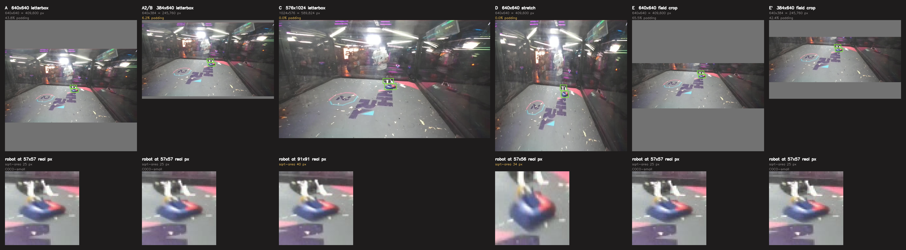
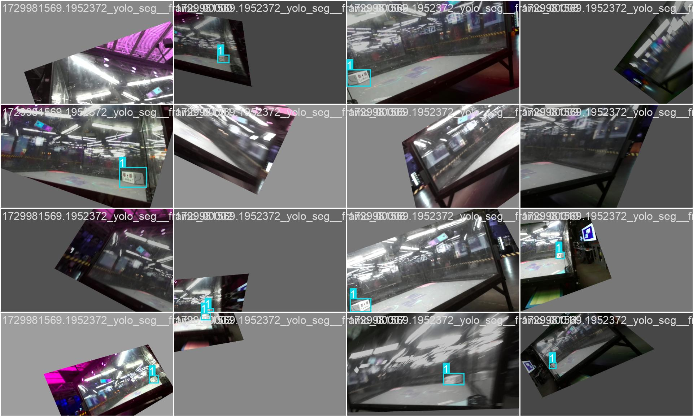

# Input geometry: how should the frame reach the network?

Status: **arms A2, B and C are queued and not yet trained.** Everything below the
"Arms" heading is measured; the arm results section is empty until they run. Plan:
`input_resolution_plan.md`.

## Question

Both corpora are 16:9. Training is 1920x1080, the eval and deployment ZED are 1280x720.
Letterboxing 16:9 into a square 640x640 puts the content in 640x360 and fills the
remaining 280 rows, 43.8% of the input tensor, with grey padding. Which preprocessing
makes the best use of a fixed inference budget: keep the letterbox, drop the padding,
raise resolution, stretch, or crop to the field?

## What each geometry actually hands the detector



Top row is every arm's tensor at true pixel scale, so the sizes are directly comparable
and the padding shows up as grey. Bottom row zooms the same robot out of each tensor with
nearest-neighbour sampling, so the pixel budget per robot is visible rather than
tabulated. On this eval frame:

| arm | tensor | padding | robot sqrt-area at the tensor |
|---|---|---:|---:|
| A `640x640` letterbox | 409,600 px | 43.8% | 25 px (COCO-small) |
| A2/B `384x640` letterbox | 245,760 px | 6.2% | 25 px |
| C `576x1024` letterbox | 589,824 px | 0.0% | 40 px |
| D `640x640` stretch | 409,600 px | 0.0% | 34 px |
| E `640x640` field crop | 409,600 px | 65.5% | 25 px |
| E′ `384x640` field crop | 245,760 px | 42.4% | 25 px |

Two things fall out of the picture that the plan's table did not predict.

**The stretch arm buys object scale for free.** Squeezing 16:9 into a square costs 0.5x
horizontally but only 0.89x vertically, so a robot lands at sqrt(0.5 x 0.89) = 0.67 of its
source size against 0.50 for the letterbox. That is 1.33x more robot at the same 409,600
tensor pixels and no padding. Object scale is the one thing the plan says none of the
geometries address, and D addresses it without spending anything. The cost is a
preprocessing fork, and an unverified interaction with the `degrees=45.0` rotation
augmentation.

**The field crop only spends its winnings on padding.** Panels E and E′ use the box the
DeepLab model actually predicts for that frame, not the label boxes. The field is wide and
short, so the crop pads more than the uncropped frame does and leaves the robot at exactly
arm A's scale. Putting it in a rectangular tensor instead of a square one does not rescue
it: E′ gets A2's robot scale with arm A's padding. See "Arm E is cut" below.

## The trap that would have invalidated A2, B and C

The plan flagged this as an open question. It is real, and it fires on this corpus.

Ultralytics sizes rectangular batches from the images' own aspect ratios, then refuses to
shuffle when the resulting batch shapes are not all identical
(`ultralytics/models/yolo/detect/train.py:95`). It logs a warning and continues. A silent
`shuffle=False` feeds the optimizer aspect-sorted batches, which on a corpus built from
recordings means recording-ordered batches, for the whole run.

`nhrl_robots_bbox_2class` is 99.85% 1920x1080. It also carries 39 pre-letterboxed YouTube
frames at 1920x886, from one segment. Those 39 gave one batch of 810 a different shape:

```
imgsz=640:  n_batches=810  shapes=[(320, 640) x 1, (384, 640) x 809]    all equal: False
imgsz=1024: n_batches=810  shapes=[(480, 1024) x 1, (576, 1024) x 809]  all equal: False
```

0.15% of the corpus was enough to turn shuffling off. `training/yolo/make_uniform_aspect_subset.py`
builds a symlinked view without them, and every batch then comes out at one shape:

```
imgsz=640:  n_batches=809  shapes=[(384, 640) x 809]    all equal: True
imgsz=1024: n_batches=809  shapes=[(576, 1024) x 809]   all equal: True
```

Only the train split is filtered. Validation runs with `rect=True` and `shuffle=False`
regardless, so its 113 odd frames are harmless, and leaving val byte-identical keeps val
metrics comparable with arm A.

### The mosaic question, answered

The plan's other open question was whether mosaic, which composites four images onto a
square canvas, survives `rect=True` or quietly turns the batches into distorted composites.
Building the real training dataset with the full augmentation config and collating a batch
by hand answers it without spending a GPU:

```
rect  640: batch (16, 3,  384,  640)
rect 1024: batch (16, 3,  576, 1024)
square 640: batch (16, 3, 640,  640)
```

The rectangular batches come out at exactly the geometries the plan predicted, through the
real dataloader with mosaic, mixup and copy-paste enabled.



Every tile is one 16:9 scene, not a four-way composite squeezed into a square. The mosaic
worry does not apply.

The picture shows something else worth carrying into the results. `degrees=45.0`,
`scale=0.5` and `translate=0.5` leave the scene sitting rotated inside a grey border in
nearly every tile, often occupying well under half of it. This experiment is arguing about
43.8% of the tensor being grey; augmentation already hands the network grey borders of the
same order on every training image. That is a plausible mechanism for the scouting result
the plan reports, that removing 44% of the tensor moved recall by 0.002.

All sixteen tiles come from one recording because the figure indexes the dataset directly
and bypasses the sampler. It is not evidence about shuffling; the batch-shape check above
is.

**This does put A2, B and C on 25,875 training images against arm A's 25,914.** The 0.15%
difference is three orders of magnitude below the ~0.048 run-to-run recall spread
`data_epoch_min` measured, so it cannot carry a result, but it is a difference and it is
recorded here rather than left implicit.

`train.py` gained `--imgsz` and `--rect` to run these arms. Rectangular geometry has to
come from `rect=True`, because `check_imgsz(..., max_dim=1)` rejects an `[h, w]` pair for
training.

Export was verified separately: `convert_to_onnx.py --imgsz 384 640` on the arm A weights
produces `input [1, 3, 384, 640] -> output [1, 6, 5040]`, and
`yolo_bbox_robot_blob_model.cpp:73` reads the input size from the engine, so a rectangular
engine is a drop-in swap.

## Scouting the preprocessing on arm A's weights

Before any arm was trained, both new preprocessing modes were run through arm A's
square-trained weights on the full 688-frame eval set. These are a floor, not a
prediction: the weights never saw a stretched or cropped image.

| candidate | agnostic recall | precision | f1 | mAP50 | mAP50-95 |
|---|---:|---:|---:|---:|---:|
| A letterbox (baseline) | 0.780 | 0.858 | 0.817 | 0.754 | 0.481 |
| A stretched | 0.777 | 0.845 | 0.810 | 0.737 | 0.457 |
| A field-cropped | 0.791 | 0.890 | 0.838 | 0.774 | 0.503 |

Paired bootstrap, 1000 resamples, against A letterbox:

| candidate | metric | delta | 95% CI | verdict |
|---|---|---:|---|---|
| A stretched | recall | -0.003 | -0.018 to 0.011 | ns |
| A stretched | precision | -0.013 | -0.026 to 0.000 | ns |
| A field-cropped | recall | +0.011 | -0.002 to 0.025 | ns |
| A field-cropped | **precision** | **+0.032** | **0.019 to 0.044** | **better** |
| A field-cropped | f1 | +0.020 | 0.010 to 0.031 | better |

The stretch result says nothing about arm D: feeding letterbox-trained weights a stretched
frame shows them the wrong aspect ratio, and losing 0.003 recall for it is a mild result,
not a bad one. D has to be trained stretched to mean anything.

The field-crop result does say something, and it contradicts the reasoning below. Cropping
lifts precision by 0.032 with a CI clear of zero, on weights that never trained on a crop.
Recall does not move. The next section prices the crop's *zoom* correctly and finds none;
what it never priced is that a crop also deletes the crowd, the cage exterior and the
lights, and that is where the gain is. False positives, not object scale.

Numbers live in `training/data/nhrl_keypoints_eval_test/scores_input_geometry_scouting/`.
A single recording had suggested recall 0.835 to 0.873; on the full set that shrank to
0.780 to 0.791 and lost significance, which is the same lesson the plan records about the
one frame where the rectangular engine found three boxes and the square one found none.

## Arm E: cut on zoom, reinstated on false positives

The plan's gate asked whether the field occupies a similar fraction of the frame in both
corpora, on the theory that NHRL's overhead cage cameras are framed tight on the cage and
a crop would be a no-op there while the ZED sees much less. Measured with
`training/deeplab/field_fraction_gate.py` over 250 train and 688 eval frames, using the
`field_deeplabv3p_r50_2026-07-29` model the arm would use:

| corpus | field mask | field bbox | bbox p10-p90 |
|---|---:|---:|---:|
| train | 56.0% | 62.9% | 28.9-88.7% |
| eval (pooled) | 35.2% | 52.8% | 34.4-70.8% |

Those are close, so the plan's stated cut criterion does not fire. It was the wrong
measurement. What decides the arm is how much margin the crop needs before it stops
slicing robots in half, and how much zoom survives that margin:

| margin | train kept | train whole | train zoom | eval kept | eval whole | eval zoom |
|---:|---:|---:|---:|---:|---:|---:|
| 0.00 | 94.3% | 60.8% | 1.26x | 93.7% | 64.5% | 1.38x |
| 0.10 | 98.9% | 81.9% | 1.10x | 100.0% | 88.8% | 1.27x |
| 0.20 | 99.7% | 96.4% | 1.03x | 100.0% | 95.2% | 1.20x |
| 0.35 | 100.0% | 99.9% | 1.00x | 100.0% | 96.8% | 1.12x |

At margin 0 the crop zooms, but clips 39% of training robots. At the margin that keeps
them whole, the crop already covers the median training frame. Those zoom numbers are an
upper bound: they assume the crop fills the tensor, which no fixed engine input does.

Pricing the crop against real engine inputs kills the arm outright. Letterbox scale is set
by whichever axis binds first, and the field box spans nearly the full frame width on both
corpora, so the crop removes rows that the width-bound scale was going to apply anyway.
Median over the same frames, at margin 0.20:

| tensor | px | train zoom / pad, no crop | train zoom / pad, cropped | eval zoom / pad, no crop | eval zoom / pad, cropped |
|---|---:|---:|---:|---:|---:|
| 640x640 | 409,600 | 1.00x / 43.8% | 1.00x / 44.7% | 1.00x / 43.8% | 1.00x / 58.4% |
| 384x640 | 245,760 | 1.00x / 6.2% | 1.00x / 7.8% | 1.00x / 6.2% | 1.00x / 30.7% |
| 576x1024 | 589,824 | 1.60x / 0.0% | 1.60x / 4.4% | 1.60x / 0.0% | 1.60x / 26.1% |
| 320x1024 | 327,680 | 0.89x / 44.4% | 0.91x / 43.6% | 0.89x / 44.4% | 1.25x / 24.8% |

**The crop buys exactly zero zoom at every 16:9-or-squarer tensor, and pays padding for
it.** A square tensor is not what makes it fail, so a rectangular one does not fix it:
384x640 cropped is the same 1.00x as 384x640 uncropped, with padding up from 6.2% to 30.7%
on eval. Panel E′ in the figure is that row.

The only shape where cropping helps is one far wider than the frame, and that is where the
plan's domain-gap worry finally shows up: at 320x1024 the crop gives eval 1.25x but
training 0.91x, because the crops have different aspect ratios in the two corpora (median
2.41 on eval against 1.81 on training). A tensor tuned to the deployment camera's crop
would train the detector at a scale the training corpus never delivers.

On zoom alone that is a dead arm, and it was cut on 2026-09-05 for exactly that reason.
**That call was wrong, and the scouting pass above is why.** Every number in this section
prices what a crop does to object scale. None of them price what it does to the background:
a crop deletes the crowd, the cage exterior, the neighbouring cage and the overhead lights,
and those are what a false positive is made of. Cropping lifts precision 0.032 with a CI
clear of zero on weights that never trained on a crop.

The arm is running, at 640x640 as the plan specifies, which keeps it a single-variable
comparison against arm A: same model, same tensor size, crop or no crop.

Its cost stands as described: a DeepLab pass over 32,487 images in dataset prep, a crop
branch in the C++ preprocessor if it is adopted, and a runtime dependency of the detector
on the field estimate. What has changed is that there is now a measured gain to weigh
against it. `training/deeplab/build_field_crop_dataset.py` builds the corpus: `masks`
caches a field box per frame, `crop` rewrites images and labels against it.

## Arms

All trained on the uniform-aspect view of `nhrl_robots_bbox_2class`, 100 epochs, batch 96,
seed 0, three GPUs, submitted through `training/gpu_queue.py`.

| arm | model | input | resize scale from 1280 | pad | tensor px | state |
|---|---|---|---:|---:|---:|---|
| A | yolo26n | 640x640 letterbox | 0.50 | 43.8% | 409,600 | reused, `2026-09-04_00-56-05_yolo26n` |
| A2 | yolo26n | 384x640 letterbox | 0.50 | 6.3% | 245,760 | queued |
| B | yolo26s | 384x640 letterbox | 0.50 | 6.3% | 245,760 | queued |
| C | yolo26n | 576x1024 letterbox | 0.80 | 0% | 589,824 | queued |
| D | yolo26n | 640x640 anisotropic | 0.50 x / 0.89 y | 0% | 409,600 | queued |
| E | yolo26n | 640x640 field-cropped | variable | varies | 409,600 | queued |

D and E were originally gated on the A2/B/C verdict. Ben asked for every arm to run, so
both are queued now instead.

E's corpus comes from a DeepLab pass over all 32,487 images, which found a field in all but
3. Cropping to the field box plus a 0.20 margin drops a label on 1.1% of training frames
(284 of 25,914) and 1.7% of val, and those frames are skipped rather than written: a frame
that keeps the robot in the picture but loses its box trains a false negative. Cropped
images span aspect ratios from 1.3 to 6.4, so E letterboxes them into 640x640 with
`rect=False`, which is also what keeps it a single-variable comparison against arm A.

D trains on the full 25,914-image corpus, not the uniform-aspect view: it is square and
needs no `rect=True`, so it varies preprocessing alone against arm A. Its labels are
byte-identical to the source, since normalized `cx cy w h` are fractions of width and
height and survive an anisotropic resize untouched.

Scoring each arm the way it was trained needed work on the eval path, since `score.py`
letterboxed unconditionally. `TrtYoloModel` now carries a preprocessing mode and returns
per-axis scales, so a stretched detection inverts through two scales instead of one; the
round trip is exact at both geometries. `FieldCropDetector` crops at inference and shifts
detections back rather than pre-cropping the eval set, which leaves GT in full-frame
coordinates so every arm is scored against the same boxes and the paired bootstrap stays
paired.

## Results

Pending. Arms A2, B and C are queued behind other work on the shared GPUs.

## Decision rule, registered before looking

Rank arms on agnostic recall on the eval set against arm A, paired bootstrap 1000x, 95% CI
excluding 0, the same metric as `model_size_2026-09-04.md`. Adopt a geometry only if it is
at least recall-neutral against A and reduces measured Jetson
`runner.perception_batch.update`. Report mAP50-95 separately and do not let it drive the
decision: `mask_centroid_vs_box_2026-08-03.md` established that box tightness is not what
limits this application, since targeting uses the centroid.

Single seed per arm. The scouting deltas between geometries were 0.002-0.005 recall,
far below the ~0.048 run-to-run spread `data_epoch_min` measured, so this experiment can
establish parity and not a small win. A 0.003 difference is not a result.
