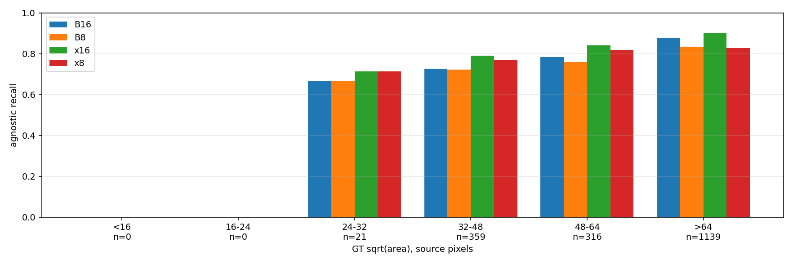
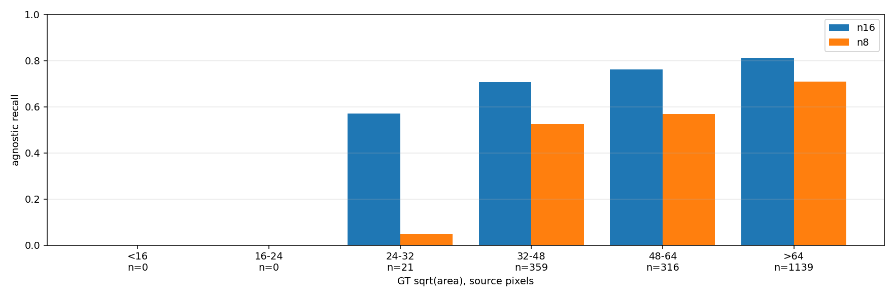

# INT8 quantization: what does 8-bit cost, and what does it buy?

All nine arms are built and scored. Jetson latency is outstanding and is the half the
deployment decision needs. Plan: `int8_quantization_plan.md`.

**Answer: implicit post-training INT8 is dead for this detector.** Every arm loses recall
significantly, from -0.032 on the shipping model to -0.138 on the one running on the robot
today. All three decision-rule clauses fail, and they fail on accuracy before latency is
even consulted. `yolo26x` had 0.038 of recall to spend before it stopped beating the arm we
are already shipping; quantization charged it 0.054, so `x` has no route into this pipeline
by this path. The speed is real - 31.8% of `x`'s GPU time on the A6000 - and it is not for
sale at this price. See "Verdict" at the end.

## Question

Two questions, one measurement. What does INT8 cost in recall per model size, and does the
tick time it frees pay for something the pipeline wants - a bigger detector, the
`yolo26x-pose` upgrade, or both?

Every arm is graded against **arm B, `yolo26s` at 384x640, recall 0.830**, the arm
`input_geometry_2026-09-05.md` adopted, and not against the `yolo26n` at 640x640 that is on
the robot today. That report's closing methodological point applies directly here: the
comparison that governs the decision is against the arm you would otherwise ship.

## Setup

| | |
|---|---|
| Eval set | `training/data/nhrl_keypoints_eval_test`, 688 reviewed frames, 1835 scored boxes |
| Level | agnostic, `--conf 0.5`, match IoU 0.5, paired bootstrap 1000x, 95% CI |
| Labels | `opponent,house_bot`, `taxonomy_merged.yaml` |
| Calibration | 1000 frames, `nhrl_robots_bbox_2class` val split, entropy2 |
| Box | megamind, 3x RTX A6000 (sm86), TensorRT 10.14.1.48.post1 |
| Numbers | `training/data/nhrl_keypoints_eval_test/scores_int8*` |

Every FP16 arm is the engine the earlier reports scored, unrebuilt, and each reproduces its
published recall to three decimals: `n` 0.780, `s` 0.839, `x` 0.868, B 0.830. Each INT8 arm
is the same ONNX file through the new `--int8` path, so an FP16-to-INT8 delta is a build
difference and nothing else.

## This comparison has no seed variance

Every earlier experiment in this series compares two training runs, and `data_epoch_min`
measured ~0.048 of run-to-run recall spread on this corpus, larger than most of the deltas
being argued over. `input_geometry_2026-09-05.md` lists single-seed as its top open caveat
for that reason.

Here the FP16 and INT8 arms are the same weights. Quantization is a build step, not a
training run, so a recall delta between them cannot be seed noise. The paired bootstrap
covers eval-frame sampling and nothing else, and a 0.005 difference is readable in a way it
was not in the geometry report. The one stochastic input left is which frames calibrate, and
arm S bounds that rather than assuming it away.

## Results - what INT8 costs

| arm | model | input | build | recall | precision | f1 | mAP50-95 |
|---|---|---|---|---:|---:|---:|---:|
| n16 | `yolo26n` | 640x640 | FP16 | 0.780 | 0.858 | 0.817 | 0.481 |
| n8 | `yolo26n` | 640x640 | INT8 | **0.642** | 0.865 | 0.737 | 0.359 |
| s16 | `yolo26s` | 640x640 | FP16 | 0.839 | 0.891 | 0.864 | 0.563 |
| s8 | `yolo26s` | 640x640 | INT8 | 0.792 | 0.858 | 0.823 | 0.485 |
| S | `yolo26s` | 640x640 | INT8, 2nd sample | 0.800 | 0.891 | 0.843 | 0.489 |
| x16 | `yolo26x` | 640x640 | FP16 | **0.868** | 0.910 | 0.889 | 0.630 |
| x8 | `yolo26x` | 640x640 | INT8 | 0.814 | 0.936 | 0.871 | 0.526 |
| B16 | `yolo26s` | 384x640 | FP16 | 0.830 | 0.857 | 0.843 | 0.541 |
| B8 | `yolo26s` | 384x640 | INT8 | 0.798 | 0.883 | 0.838 | 0.507 |

Paired bootstrap within each model, INT8 against its own FP16 engine:

| model | FP16 | INT8 | delta | 95% CI | verdict |
|---|---:|---:|---:|---|---|
| `yolo26n` 640x640 | 0.780 | 0.642 | **-0.138** | [-0.158, -0.120] | worse |
| `yolo26s` 640x640 | 0.839 | 0.792 | -0.047 | [-0.060, -0.034] | worse |
| `yolo26x` 640x640 | 0.868 | 0.814 | -0.054 | [-0.069, -0.041] | worse |
| **`yolo26s` 384x640 (B)** | 0.830 | 0.798 | **-0.032** | [-0.043, -0.022] | worse |

**Capacity buys quantization tolerance.** The loss is not a constant tax. `n` gives up
0.138 recall, four times what B gives up, and the ordering follows model size: the smallest
model has the least redundancy to spend on rounding error. The arm currently deployed on the
robot is the arm INT8 destroys.

**Precision goes up while recall goes down** on every arm that survives at all: `x` 0.910 to
0.936, B 0.857 to 0.883. The quantized network emits fewer boxes and is right more often
about the ones it emits. That is the signature of detections sliding below the 0.5
threshold rather than of boxes landing in the wrong place.

mAP50-95, reported separately and not driving the decision per
`mask_centroid_vs_box_2026-08-03.md`: it falls further than recall everywhere, B 0.541 to
0.507 and `x` 0.630 to 0.526, so box tightness degrades too. Targeting uses the centroid, so
this is recorded and not weighed.

## Decision rule, as registered

- **(a) INT8 on the shipping model.** Adopt B8 only if its recall against B16 is neutral.
  **Fails.** -0.032, CI [-0.043, -0.022], excludes 0. Do not quantize the deployment model.
- **(b) INT8 on `x`.** Adopt only if `x8` beats B16 significantly **and** Jetson
  `runner.tick` lands under 33.3 ms. **Fails on the first half.** `x8` scores 0.814 against
  B16's 0.830, delta -0.016, CI [-0.034, +0.002], not significant and point-worse. The
  budget was arithmetic set before the measurement: `x16` beats B16 by +0.038, and INT8 cost
  `x` 0.054. It spent more than it had. The Jetson tick was never reached, and the phase 2
  training run is not started.
- **(c) The pose funding case.** INT8 on the detector is worth adopting if it is
  recall-neutral and frees at least 3.3 ms of Jetson tick. **Fails.** No arm is
  recall-neutral, so the clause cannot open regardless of what the Orin would have measured.

**Verdict: keep B16, `yolo26s` at 384x640 in FP16. Implicit PTQ is rejected for every arm
in this experiment, and `yolo26x` stays out of this pipeline.**

## Where the losses land - and the prediction that was wrong

The plan predicted a specific failure mode: a distant robot produces low-amplitude
activations, a wide INT8 scale rounds them to zero before the head sees them, so small and
far robots should disappear while close ones survive. `recall_by_size.py` bins GT boxes by
sqrt(area) using `score.py`'s own matcher and tests that directly.

Bins are source pixels. The eval set is 588 frames at 1280x720 and 100 at 1920x1080, so the
tensor scale differs per frame; the tensor-space median is 33.8 px with 43.7% below COCO's
32 px small threshold, reproducing `input_resolution_plan.md`'s 33.7 px and 44%. The bins map
to these tensor medians:

| source bin | boxes | tensor median |
|---|---:|---:|
| 24-32 px | 21 | 15.6 px |
| 32-48 px | 359 | 20.8 px |
| 48-64 px | 316 | 28.3 px |
| >64 px | 1139 | 44.5 px |

Only the last bin is not COCO-small at the tensor. Recall delta, INT8 against the same
model's FP16:

| source bin | B8 - B16 | `x8` - `x16` | `n8` - `n16` |
|---|---|---|---|
| 24-32 px | 0.000 `ns` | 0.000 `ns` | **-0.524** [-0.737, -0.300] |
| 32-48 px | -0.006 `ns` | -0.019 `ns` | -0.184 [-0.228, -0.144] |
| 48-64 px | -0.025 [-0.044, -0.009] | -0.025 `ns` | -0.193 [-0.238, -0.148] |
| >64 px | **-0.043** [-0.056, -0.030] | **-0.075** [-0.095, -0.056] | -0.102 [-0.123, -0.081] |



**On B and `x` the prediction is backwards.** The loss grows with object size and is
significant only in the one bin that is not COCO-small. B loses 0.006, 0.025 and 0.043
across the three well-populated bins, monotone in the wrong direction, and `x` loses 0.019,
0.025 and 0.075 the same way.

**On `n` the prediction holds, and then some.** `n8` finds 1 of the 21 boxes in the smallest
bin against `n16`'s 12, a 0.524 collapse, and its loss shrinks as objects grow. So the small
object failure mode is real, but it appears only where quantization damage is already
catastrophic. For the two models that tolerate INT8 at all, what is left over lands on the
large end instead.



Two honest limits on this. The 24-32 px bin holds 21 boxes, so only an effect the size of
`n`'s is visible there at all. And the corpus does not contain a genuinely large-object
regime to contrast against: the biggest bin's median is 44.5 tensor px, which is COCO-small
plus a third.

## Arm S - the calibration sample is not the explanation

`s8` rebuilt from a second 1000-frame calibration sample, disjoint from the first by
construction:

| | recall | precision | mAP50-95 |
|---|---:|---:|---:|
| `s8`, sample `0/2` | 0.792 | 0.858 | 0.485 |
| `s8`, sample `1/2` | 0.800 | 0.891 | 0.489 |
| delta | +0.008, CI [-0.001, +0.016], `ns` | +0.034, better | +0.004 |

The plan's registered check was whether the two `s8` arms differ by more than the
FP16-to-INT8 delta itself. They do not: +0.008 against -0.047, a fifth of it, and not
significant. 1000 frames is enough, and the recall loss is a property of quantizing this
network rather than of which frames were fed to the calibrator.

Worth recording that the sample is not free either. Precision moves +0.034 between the two
samples and archetype-level recall moves +0.010 with a CI that just clears zero, so a
calibration sample is worth up to about a third of the `s` quantization loss. That bounds it
rather than dismissing it.

## Latency - dev box

`benchmark_engines.py`, 300 timed iterations after 50 warmup, on the same eval frame the
geometry report's latency table used, submitted through the queue so the idle-GPU check
guarantees no contention. `gpu` is `_run` alone; `total` adds letterbox and NMS.

| arm | GPU ms | total ms | GPU vs FP16 | engine size |
|---|---:|---:|---:|---:|
| n16 | 1.251 | 2.285 | — | 6.9 MB |
| n8 | 1.168 | 2.167 | **-6.6%** | 4.1 MB |
| s16 | 1.538 | 3.126 | — | 20.9 MB |
| s8 | 1.310 | 2.873 | **-14.8%** | 11.0 MB |
| x16 | 4.284 | 5.778 | — | 110.1 MB |
| x8 | 2.923 | 4.143 | **-31.8%** | 58.5 MB |
| B16 | 1.219 | 1.969 | — | 20.5 MB |
| B8 | 1.034 | 1.805 | **-15.2%** | 10.9 MB |

Quantization does what it claims to. The gain scales with model size, 6.6% on `n` and 31.8%
on `x`, which is what you would expect when the larger model spends proportionally more of
its time moving weights. Engine files roughly halve.

**The x86 number does not answer the deployment question and is not quoted as if it does.**
The A6000 has roughly 768 GB/s of memory bandwidth against the Orin Nano's ~102 GB/s, so the
detector is far closer to bandwidth-bound on the Jetson and the Orin might well gain more.
That was a hypothesis for the Jetson run to test, and it is now moot: the accuracy clauses
close before latency is consulted.

For the record, the arithmetic the Jetson run would have started from.
`model_size_2026-09-04.md` measured `x`'s detector inference at 49.96 ms inside a 58.22 ms
tick, needing 24.9 ms removed to fit the frame period. A 31.8% cut takes 49.96 ms to about
34 ms and the tick to roughly 42 ms, still over. Extrapolation, not measurement, and it does
not decide anything here.

## Latency - Jetson, not measured

Decision rules (b) and (c) both need Jetson `runner.tick`, and the plan says so directly:
"An x86 latency number cannot satisfy (b) or (c). Only the Jetson can." The Orin is not
reachable from megamind (`ssh jetson` does not resolve), so this half is outstanding.

It no longer changes the verdict. (b) requires `x8` to beat B16 on recall **and** fit the
tick; the recall half already failed. (c) requires recall neutrality, which no arm has. A
Jetson measurement could only have confirmed a rejection that accuracy already decided.

If it is run later, the sequence from `model_size_2026-09-04.md` is unchanged:

1. Copy the ONNX files, plus the `.calib` caches from `.cache/tensorrt/int8/` (18 KB each).
   If the Orin's TensorRT is not 10.14 the builder refuses the cache by its header rather
   than calibrating on nothing, and the 1000 frames listed in the `.frames.txt` manifest
   beside each cache have to come over instead: 264 MB.
2. Build on the Orin, producing `_int8_aarch64_sm87.engine`. Note that
   `config/_jetson.toml` still names `yolo26s_nhrl_robots_bbox_2class_2026-09-04` at
   640x640, so arm B has never been built for aarch64 and its FP16 engine is needed too.
3. `sudo jetson_clocks`, swap the engine into `config/_jetson.toml`
   `[robot_mask_model.engine] candidates`, run live with `[mcap] enable = true`.
4. `scripts/mcap_latency_report.py data/recordings/<run>.mcap --csv`, read the window after
   field init.

## How the INT8 engines were built

`convert_to_tensorrt.py` had no INT8 path: it set `BuilderFlag.FP16` and its one precision
flag was `--no-fp16`. The new flags are `--int8`, `--calib-dir`, `--calib-count`,
`--calib-partition`, `--calib-cache` and `--calib-algo`.

TensorRT 10.14.1.48.post1 still ships `IInt8EntropyCalibrator2`, `IInt8MinMaxCalibrator`,
`BuilderFlag.INT8` and `config.int8_calibrator`. They are deprecated in favour of explicit
Q/DQ, which is a different export pipeline and out of scope; the deprecation warning fires
on the one assignment to `config.int8_calibrator` and is suppressed there.

Both precision flags are set, so layers TensorRT will not quantize fall back to FP16 rather
than to FP32, and `--int8 --no-fp16` is refused.

**Preprocessing.** The calibrator feeds frames through
`auto_battlebot.trt_yolo.preprocess_frame`, the same letterbox `score.py` and the C++
pipeline use, with `letterbox_padding=0.1` passed explicitly: `preprocess_frame` defaults it
to 0.0 while `TrtYoloModel` and the deployed engine use 0.1. Calibration is a measurement of
activation ranges, so a preprocessing mismatch would shift every scale in the network. The
blob comes back transposed and non-contiguous and gets the same `ascontiguousarray` that
`TrtYoloModel._run` applies before its own upload.

**The input size comes from the parsed network**, not `--imgsz`, so the 384x640 arm
calibrates at 384x640 with no extra flag.

**Failing loudly.** TensorRT catches every exception raised inside `get_batch` and finishes
the build with whatever batches it already had, so a corrupt JPEG would produce a quietly
miscalibrated engine that loads and runs normally. The calibrator counts batches in Python
and the build rejects any engine whose calibrator did not consume every frame it was given.

**Filenames.** The precision tag goes into the stem ahead of the platform tag, so FP16 names
stay byte-identical for `config/_desktop.toml` and `config/_jetson.toml`, and the trailing
`_<arch>_sm<XX>.engine` shape the candidate lists match on is unchanged:

```
yolo26s_nhrl_robots_bbox_2class_rect384x640_2026-09-05_x86_64_sm86.engine        # unchanged
yolo26s_nhrl_robots_bbox_2class_rect384x640_2026-09-05_int8_x86_64_sm86.engine   # new
```

Build times, cold INT8 tactic search against a timing cache that already held FP16 entries:
`n` 100.6 s, `s` 239.6 s, B 211.9 s, `x` 581.3 s. The plan's claim that tactic entries are
precision-keyed and the cache is safe to share holds up: arm S is the same network and
precision as `s8` and built in 133.6 s against `s8`'s 239.6 s, most of the remainder being
its own 100 s of calibration.

## The calibration sample

1000 frames from the `nhrl_robots_bbox_2class` val split, stratified across its 26 scenes by
max-min fair allocation and evenly spaced within each scene. No RNG: the same directory
gives the same 1000 frames. The val split is scene-disjoint from train and shares nothing
with `nhrl_keypoints_eval_test`, so no calibration frame reaches the scored set.

Stratification is not decoration. The val split holds 6,573 frames in 26 scenes and its
three largest cage cameras hold 1,658 of them, so a plain stride over the directory draws
277 of its 1000 frames from those three and misses three scenes entirely. Fair allocation
caps every scene at 49 and reaches all 26.

Arm S needs a second sample sharing nothing with the first, and shifting the picks by half a
stride does not deliver it: the smallest scenes get consumed whole, and two such samples
still shared 162 of 1000 frames. `--calib-partition I/N` thins each scene to every Nth frame
before allocating, so `0/2` and `1/2` cannot overlap by construction. Every arm here
calibrates on `0/2` and arm S on `1/2`; measured overlap is 0 frames. The cost is that `1/2`
reaches 24 scenes rather than 26, because two scenes contribute a single frame each and it
lands in `0/2`.

**The cache is keyed to the sample, not just the model.** The plan called for
`.cache/tensorrt/int8/<onnx-stem>.calib`. That name would have answered arm S with a copy of
`s8`: TensorRT reads whatever cache it finds and skips calibration entirely, so a rebuild
with a different sample would silently reuse the old scales and report success. The name
carries the frame count and partition (`..._1000_p1-2.calib`), and a frame manifest is
written beside it.

Dumping one confirms the format the plan described: a version header plus one
`tensor_name: hex_scale` line per tensor, 393 tensors, with no architecture, no `sm` tag and
no CPU arch. It is platform independent. The header is `TRT-101401-EntropyCalibration2`, so
a JetPack shipping a TensorRT other than 10.14 rejects it and has to recalibrate locally.

## Answers

### What does INT8 cost in recall? - **strong, and more than expected**

Between 0.032 and 0.138 of agnostic recall, significant on every arm, scaling inversely with
model capacity. Nothing in this experiment was recall-neutral, and the shipping model was the
cheapest arm to quantize rather than a safe one.

### Does the tick time it frees pay for anything? - **no**

It frees real time, up to 31.8% of `x`'s GPU cost on the A6000. Both spending plans in the
plan need recall neutrality to open, and neither gets it. `yolo26x` needed to arrive under
0.038 of loss and arrived at 0.054.

### Is `yolo26x` reachable? - **not by this route**

`model_size_2026-09-04.md` said revisit `x` only after buying back tick time elsewhere.
Quantization is the cheapest such lever and it does not buy enough, because it charges the
recall that made `x` worth wanting. The other two named candidates - moving
`publish_camera_data` after the command send, and merging the two YOLOs into one multi-head
engine - are untouched by this result and are now the remaining ones.

### Where does quantization hurt? - **moderate, and not where the plan said**

On `s` and `x` the loss grows with object size and is significant only in the largest bin.
The predicted small-object collapse shows up only on `n`, where the damage is severe
everywhere. Single corpus, one calibration algorithm, so this is a finding to carry rather
than a law.

## Caveats

- **Post-training quantization only.** If PTQ is dead for this model that does not make INT8
  dead. Quantization-aware training and explicit Q/DQ export are a different and much more
  expensive path, and nothing here rules them in or out.
- **The Jetson half is missing.** It cannot change the verdict, since both latency clauses
  are gated behind accuracy conditions that failed, but the deployment latency claim is
  unmeasured.
- **A version-mismatched calibration cache used to be a silent failure.** TensorRT rejects a
  cache whose header does not match the running build and then asks the calibrator for
  batches; with a cache but no `--calib-dir` there are none, and the batch-count check cannot
  see it because a cache was read. `check_cache_header` now refuses that combination up
  front. No engine in this report was built that way - every arm here calibrated from
  frames.
- **entropy2 only.** `--calib-algo minmax` exists and costs one rebuild. Given that the
  losses land on large objects rather than clipped small ones, minmax - which never clips -
  is a less obvious remedy than it looked when the plan named it, but it is untested.
- **Single calibration sample per arm**, bounded by arm S on `yolo26s` at 640x640 and assumed
  to transfer to `n`, `x` and B.
- **`x` at 640x640 against B at 384x640** is a geometry confound in the latency table only.
  Accuracy is unaffected per the A2-against-A result in `input_geometry_2026-09-05.md`.
- **Everything is letterbox**, so `benchmark_engines.py` timing through its default letterbox
  is correct here, unlike in the geometry report.
- **The 24-32 px bin holds 21 boxes.** Only an effect the size of `n`'s is detectable there.

## Verdict

Keep `yolo26s` at 384x640 in FP16. Do not quantize it, do not quantize the `yolo26n` still on
the robot, and stop treating `yolo26x` as one lever away from deployable. The three clauses
were registered before the measurement and all three fail; the one that came closest,
`x8` against B16 at -0.016 with a CI spanning zero, fails by being indistinguishable from the
model it was supposed to replace while costing 2.4x its GPU time.

The build path is worth keeping even though the result is a rejection. It is nine flags and
one calibrator, the cache transports to the Orin, and the next model that wants testing at
8 bits costs one queue submission instead of a day.

## Artifacts

- Report numbers: `training/data/nhrl_keypoints_eval_test/scores_int8/`,
  `scores_int8_pair_{n,s,x,B}/`, `scores_int8_calib_sample/`,
  `scores_int8_by_size{,_x,_n}/`
- Engines: `data/models/*_int8_x86_64_sm86.engine`, plus
  `yolo26s_nhrl_robots_bbox_2class_2026-09-04_calibB_int8_x86_64_sm86.engine` for arm S
- Calibration caches and frame manifests: `.cache/tensorrt/int8/`
- Size-split figures for all three model pairs:
  `assets/2026-09-06_int8_quantization/recall_by_size_{B,x,n}.png`
- Queue jobs 32-37, logs in `runs/queue/logs/`

## Reproduce

```bash
Q="venv/bin/python training/gpu_queue.py"
M="data/models"
CALIB="training/data/nhrl_robots_bbox_2class/val/images"

# Blocks 1 and 2, one process so the timing cache stays warm between models
$Q submit --name int8_build --by claude-int8 -d 0 -- \
  venv/bin/python training/yolo/convert_to_tensorrt.py \
    $M/yolo26n_nhrl_robots_bbox_2class_2026-09-04.onnx \
    $M/yolo26s_nhrl_robots_bbox_2class_2026-09-04.onnx \
    $M/yolo26s_nhrl_robots_bbox_2class_rect384x640_2026-09-05.onnx \
    --int8 --calib-dir "$CALIB" --calib-count 1000 --calib-partition 0/2

# Arm S: same weights as s8, disjoint calibration sample, distinct engine name
$Q submit --name int8_build_armS --by claude-int8 -d 0 -- \
  venv/bin/python training/yolo/convert_to_tensorrt.py \
    $M/yolo26s_nhrl_robots_bbox_2class_2026-09-04.onnx \
    --int8 --calib-dir "$CALIB" --calib-count 1000 --calib-partition 1/2 \
    -o $M/yolo26s_nhrl_robots_bbox_2class_2026-09-04_calibB.engine

$Q submit --name int8_build_x --by claude-int8 -d 0 -- \
  venv/bin/python training/yolo/convert_to_tensorrt.py \
    $M/yolo26x_nhrl_robots_bbox_2class_2026-09-04.onnx \
    --int8 --calib-dir "$CALIB" --calib-count 1000 --calib-partition 0/2 --workspace 8
```

Scoring, one cross-arm run plus one paired run per model:

```bash
GT=training/data/nhrl_keypoints_eval_test
venv/bin/python training/model_eval/score.py $GT \
  --candidate n16=... --candidate n8=... --candidate s16=... --candidate s8=... \
  --candidate s8_calibB=... --candidate x16=... --candidate x8=... \
  --candidate B16=... --candidate B8=... \
  --labels "opponent,house_bot" --taxonomy training/model_eval/taxonomy_merged.yaml \
  --conf 0.5 --baseline B16 --bootstrap 1000 --output $GT/scores_int8
```

Every run prints `GT: 688 frames`. A count of 429 means `score.py` fell back to the stale
`.edit_state.json` and the numbers do not compare to either published report. `--labels`
must stay two entries long: `score.py` infers `num_classes` from its length, and a wrong
count misparses the output tensor into `num_keypoints=0` and near-zero recall, which looks
like a broken engine rather than a bad flag.

Recall split by object size, one run per model pair so the baseline is that model's own FP16
engine:

```bash
venv/bin/python training/model_eval/recall_by_size.py $GT \
  --candidate x16=... --candidate x8=... \
  --labels "opponent,house_bot" --taxonomy training/model_eval/taxonomy_merged.yaml \
  --conf 0.5 --baseline x16 --bootstrap 1000 --output $GT/scores_int8_by_size_x
```

Dev-box latency, through the queue so the idle-GPU check guarantees no contention, on the
same eval frame the geometry report timed so the rows compose:

```bash
$Q submit --name int8_bench --by claude-int8 -d 0 -- \
  venv/bin/python training/model_eval/benchmark_engines.py \
    --candidate n16=... --candidate n8=... \
    --frame $GT/main_2026-05-02_14-12-25_repaired__2026-05-02T14-12-27/images/1777745812904707000.png \
    --iterations 300 --warmup 50
```
