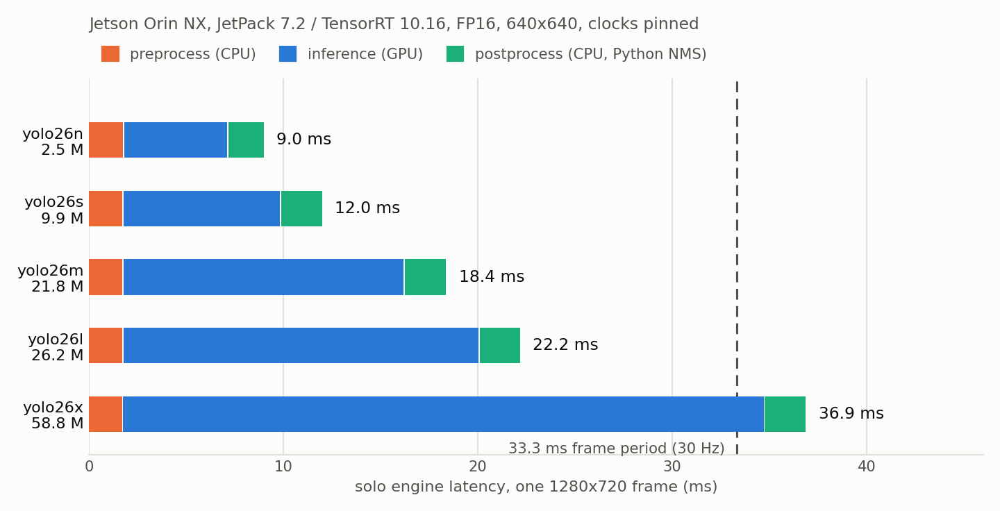

# What do the five yolo26 sizes cost on the JetPack 7 Jetson? - 2026-09-19

Engine-level latency for `yolo26{n,s,m,l,x}` measured on the deployment Jetson after the
JetPack 7 move, plus the two models the rig actually ships today. Same five checkpoints as
`model_size_2026-09-04.md` (`nhrl_robots_bbox_2class`, 100 epochs, batch 96), rebuilt as
`aarch64_sm87` FP16 engines under TensorRT 10.16 and timed with
`training/model_eval/benchmark_engines.py`.

The 2026-09-04 sweep only ever measured `n`, `s` and `x` on Jetson hardware, and it did so
through live runs on JetPack 6. `m` and `l` were skipped because the eval set had already
dominated them. This report fills in all five on JetPack 7, at the engine level.

Predecessor: `model_size_2026-09-04.md` (the accuracy sweep and the JetPack 6 live runs),
`input_geometry_2026-09-05.md` (why deployment moved to 384x640).

## Headline

1. **Only `n` and `s` leave usable headroom.** Solo, end to end, on one 1280x720 frame:
   `n` 9.0 ms, `s` 11.9 ms, `m` 18.5 ms, `l` 22.2 ms, `x` 36.9 ms. `x` exceeds the 33.3 ms
   frame period by itself, before the keypoint model, the field mask, or any other pipeline
   stage gets a turn.
2. **GPU time scales far slower than parameter count, and that does not rescue the big
   arms.** `x` carries 23.5x the parameters of `n` but costs 6.2x the GPU time. The scaling
   is favorable and still lands `x` outside the budget.
3. **The CPU stages are flat and cheap.** Preprocess is 1.76 ms for every arm and
   postprocess is 1.9-2.2 ms regardless of size. Across a 6.2x span of GPU cost the CPU
   share falls from 41% of the total on `n` to 11% on `x`, so model choice is a GPU
   decision on this box.
4. **Host-device copies cost a flat 1.2 ms.** The gap between `trtexec --noDataTransfers`
   and the Python `gpu` stage is 1.12-1.26 ms across all five arms, which is the 4.9 MB
   input blob moving each way. It does not grow with the model.
5. **JetPack 7 did not change the ranking or the verdict.** Applying the in-batch factor
   below reproduces the JetPack 6 live numbers for `n`, `s` and `x` to within 0.3 ms. The
   deployment decision from 2026-09-04 stands unchanged on the new platform.
6. **The deployed pair costs 7.8 ms each, solo.** `yolo26s` detector at 384x640 is 7.84 ms
   and `yolo26s-pose` is 7.80 ms. The detector's GPU stage at 384x640 (5.23 ms) is level
   with `yolo26n` at 640x640 (5.35 ms), which is the geometry trade
   `input_geometry_2026-09-05.md` bought.

## Setup

| | |
|---|---|
| Box | Jetson Orin NX 16 GB, `auto-battlebot-compute-1`, JetPack 7.2 / L4T R39.2 |
| Software | TensorRT 10.16.2.10, CUDA 13.2, Python 3.12.3, driver 595.78 |
| Power | MAXN, `jetson_clocks` applied, GPU pinned at 918 MHz |
| Load | Idle box, load average 0.57, nothing else running |
| Engines | FP16, `--workspace 2`, built on the Jetson from the megamind ONNX |
| Arms | `yolo26n` 2.50 M params / `s` 9.95 M / `m` 21.78 M / `l` 26.18 M / `x` 58.81 M |
| Geometry | 640x640 letterbox for the sweep; 384x640 for the deployed pair |
| Frame | One real 1280x720 frame from the 2026-08-29 Jetson eval scene, 2 labelled robots |
| Sampling | 300 timed iterations, 50 warmup, conf 0.5, NMS IoU 0.45 |

`pycuda` has no JetPack 7 wheel, so I built it from source into the Jetson venv. That is
the only change needed to run `TrtYoloModel` on this platform; `trt_yolo.py` itself is
untouched.

## Results - raw GPU compute

`trtexec --loadEngine --noDataTransfers`, 300 iterations, 1000 ms warmup. This is kernel
time with the input already resident, so it is the floor for any runtime.

| arm | median | mean | p90 | p99 | throughput |
|---|---:|---:|---:|---:|---:|
| n | 4.227 ms | 4.227 ms | 4.232 ms | 4.239 ms | 236.5 qps |
| s | 6.987 ms | 6.987 ms | 6.996 ms | 7.002 ms | 143.1 qps |
| m | 13.216 ms | 13.216 ms | 13.231 ms | 13.245 ms | 75.7 qps |
| l | 17.106 ms | 17.220 ms | 17.787 ms | 17.814 ms | 58.1 qps |
| x | 31.837 ms | 31.950 ms | 32.536 ms | 33.349 ms | 31.3 qps |

Spread is tight everywhere: p99 sits within 0.3% of the median for `n` through `m`, and
within 5% for `l` and `x`. A pinned Orin NX is a quiet measurement environment.

## Results - full inference path

`benchmark_engines.py`, which I extended for this run to break the total into the same
three stages the C++ path has. `post` is the residual (`total - pre - gpu`) computed from
means, since means are additive and medians are not.



| arm | pre | gpu | post | total median | total p90 | total vs `n` | dets |
|---|---:|---:|---:|---:|---:|---:|---:|
| n | 1.796 ms | 5.351 ms | 1.889 ms | 9.032 ms | 9.088 ms | 1.00x | 2 |
| s | 1.767 ms | 8.110 ms | 2.166 ms | 11.904 ms | 12.290 ms | 1.32x | 2 |
| m | 1.760 ms | 14.473 ms | 2.194 ms | 18.504 ms | 18.592 ms | 2.05x | 3 |
| l | 1.757 ms | 18.326 ms | 2.119 ms | 22.252 ms | 22.315 ms | 2.46x | 1 |
| x | 1.756 ms | 33.090 ms | 2.164 ms | 37.056 ms | 37.125 ms | 4.10x | 2 |

Three things fall out of the stage split:

**Preprocess is constant at 1.76 ms.** It letterboxes 1280x720 into 640x640 and builds the
NCHW float blob, which is the same work for every arm. The 0.04 ms spread across five
models is noise.

**Postprocess does not track model size either.** It ranges 1.89-2.19 ms with no ordering
by size; the variation follows the surviving box count (1 to 3 detections), not the
network. Decoding 8400 anchors dominates, and every arm emits the same `[1, 6, 8400]`
head.

**The copy tax is flat.** Subtracting the `trtexec` median from the `gpu` median gives
1.124, 1.123, 1.257, 1.220 and 1.253 ms for `n` through `x`. A 640x640x3 float32 input is
4.9 MB and the output is 202 KB, and that transfer is the same for every arm.

### How GPU cost scales with capacity

| arm | params vs `n` | GPU time vs `n` | ms per M params |
|---|---:|---:|---:|
| n | 1.00x | 1.00x | 2.14 |
| s | 3.98x | 1.52x | 0.82 |
| m | 8.71x | 2.70x | 0.66 |
| l | 10.47x | 3.42x | 0.70 |
| x | 23.52x | 6.17x | 0.56 |

Cost per parameter falls by 3.8x from `n` to `x`, so the big arms use the GPU far more
efficiently than the small ones. `n` spends most of its time on fixed overhead rather than
arithmetic. That is the argument for a bigger model on paper, and it still does not close
the gap: `x` needs 33.1 ms of GPU time and the whole tick budget is 33.3 ms.

## Results - the deployed pair at 384x640

What the rig runs today, per `config/_jetson.toml`. Both models timed solo on the same
frame.

| model | pre | gpu | post | total median | total p90 | dets |
|---|---:|---:|---:|---:|---:|---:|
| `yolo26s` detector, 384x640 | 1.212 ms | 5.229 ms | 1.384 ms | 7.842 ms | 7.890 ms | 3 |
| `yolo26s-pose` keypoints, 384x640 | 1.227 ms | 5.483 ms | 1.081 ms | 7.797 ms | 7.834 ms | 0 |

The geometry change is worth more than a model-size step. `yolo26s` at 384x640 spends
5.23 ms on the GPU against 8.11 ms at 640x640, a 36% cut for 40% fewer tensor pixels, and
lands level with `yolo26n` at 640x640 (5.35 ms). The rig runs the `s` network at the `n`
network's old GPU cost.

The keypoint model found nothing on this frame, so its 1.081 ms postprocess is a
no-detection floor rather than a typical cost. The detector's 1.384 ms on three detections
is the better guide for what decode costs at this geometry.

## Transfer to the C++ application

The C++ detector path in `src/robot_blob_model/yolo_bbox_robot_blob_model.cpp:88-106` runs
the same three stages under the same names, so the mapping is direct rather than
analogical:

| Python (`trt_yolo.py`) | C++ | Transfers? |
|---|---|---|
| `preprocess_frame` | `preprocess_image`, timed as `preprocess` | Partly. Both call OpenCV resize, but Python adds a numpy transpose and copy the C++ avoids. |
| `_run` | `TrtEngine::execute`, timed as `inference` | Yes, closely. Both do H2D, enqueue, D2H, one stream sync. |
| NMS / decode | `decode_detections` + `non_max_suppression`, timed as `postprocess` | No. Python numpy decode is the stage C++ should beat by the widest margin. |

`TrtEngine::execute` (`src/tensorrt_inference/trt_engine.cpp:469-516`) stages through
pinned host memory, so its two copies should be somewhat faster than pycuda's pageable
ones. The measured `gpu` column is therefore a mild over-estimate of the C++ `inference`
stage, which is the safe direction to be wrong in.

### The in-batch factor

Solo engine timing is not what the application pays. The C++ `PerceptionBatch` runs the
detector and the keypoint model concurrently on one GPU, and they contend. The 2026-09-04
live runs measured that contention directly: with the keypoint engine held fixed across all
three arms, its own inference time rose 8.15 ms, 11.72 ms, 32.81 ms as the detector grew
from `n` to `s` to `x`. A co-running model more than quadrupled in cost without changing.

Comparing those live C++ numbers against my solo measurements gives a consistent ratio:

| arm | live C++ `inference`, JP6 | solo `gpu`, JP7 | ratio |
|---|---:|---:|---:|
| n | 8.18 ms | 5.355 ms | 1.53x |
| s | 11.98 ms | 8.114 ms | 1.48x |
| x | 49.96 ms | 33.006 ms | 1.51x |

One multiplicative factor of about 1.5x describes the gap across a 6.2x span of GPU cost.
That consistency is the useful part: a constant ratio is what GPU sharing produces, and it
lets me extend the two arms nobody has ever run on Jetson hardware.

| arm | solo `gpu` | estimated in-batch `inference` |
|---|---:|---:|
| n | 5.355 ms | 8.1 ms (measured 8.18) |
| s | 8.114 ms | 12.2 ms (measured 11.98) |
| m | 14.473 ms | 21.9 ms |
| l | 18.330 ms | 27.7 ms |
| x | 33.006 ms | 49.8 ms (measured 49.96) |

Read `m` and `l` as estimates, not measurements. The `n`/`s`/`x` rows agreeing with the
live runs is not independent confirmation, because the factor was fitted to those same
three points. What it does show is that one factor fits all three at once, across a 6.2x
span, rather than each arm needing its own correction. That is what makes interpolating
`m` and `l` between them defensible.

Two things could produce a clean constant ratio, and this data cannot separate them: GPU
contention in the parallel batch, and a uniform JetPack 6 to 7 engine speedup. Contention
is certainly part of it, because the 2026-09-04 runs measured a fixed keypoint model
inflating 4.03x as the detector grew. Whether it is all of it needs a live JetPack 7 run.

### What this means for a model swap

At 640x640, `m` would put roughly 21.9 ms of detector inference inside a 33.3 ms tick and
`l` roughly 27.7 ms, before the keypoint model's own inflated share, the field mask, the
filter, and navigation. Neither leaves room. The 2026-09-04 conclusion that `m` and `l` are
dominated by `s` was reached on accuracy alone; the latency data now says the same thing
from the other side.

The one number I cannot produce is a measured `runner.tick`. The e-CAM25 module was
destroyed on 2026-09-19 by a reversed FPC: the `ecam25_ar0234` driver loads on this box but
the sensor never enumerates, so there is no `/dev/video0` and no live run until the module
is replaced. The Jetson also builds with `BUILD_WITH_ZED=OFF`, so SVO playback is not
available there as a fallback. Everything above is engine-level measurement plus the
JetPack 6 live data; none of it is a measured end-to-end latency on JetPack 7.

## Answers

### Does the JetPack 7 move change the model choice? - **no**

The five arms rank the same and the estimated in-batch costs reproduce the JetPack 6 live
numbers to within 0.3 ms. `s` remains the only arm besides `n` with room inside the frame
period, and `x` remains unaffordable by a wide margin.

### What would it take to afford `x`? - **more than any single fix on the table**

`x` needs 33.1 ms of solo GPU time, about 49.8 ms in-batch. The candidates in
`parallel_yolo_batch/comparison.md` are moving `publish_camera_data` after command send
(~10 ms) and merging the two YOLOs into one multi-head engine. Even both together do not
cover a 49.8 ms detector inside a 33.3 ms period. INT8 was already ruled out on accuracy in
`int8_quantization_2026-09-06.md`.

Running `x` at 384x640 is the one combination nobody has measured. Scaling by the 0.64
geometry ratio observed on `s` puts it near 21 ms solo and 32 ms in-batch, which is still
outside the budget but no longer absurd. If `x`'s +0.088 recall is ever worth chasing, that
is the experiment to run, not `x` at 640x640.

## Caveats

- **No end-to-end measurement.** No `runner.tick`, no `pipeline.latency`, no loop rate. The
  camera is dead and the Jetson has no SVO playback path. Engine-level numbers plus a
  fitted factor are not a substitute for a live run, and the report should be re-checked
  against one when the e-CAM25 is replaced.
- **The in-batch factor is fitted, not derived.** Three points, all from JetPack 6 live
  runs. It conflates GPU contention with any JetPack 6 to 7 engine speed difference, and I
  cannot separate the two without a live JetPack 7 run. The prior report's independent
  observation that a fixed keypoint model inflated 8.15 to 32.81 ms is the evidence that
  contention is real and large.
- **Single frame, single run.** One 1280x720 frame with 2 labelled robots, one benchmark
  pass per arm. Postprocess cost depends on surviving box count, so a busier frame would
  push the `post` column up for every arm. The GPU stage is unaffected.
- **The sweep geometry is not the deployed geometry.** The five arms are 640x640;
  deployment has run 384x640 since 2026-09-05. The size curve is measured at the old
  geometry, which is what makes it comparable to `model_size_2026-09-04.md` and what makes
  it one step removed from today's rig.
- **`post` is a residual, not a timed loop.** It is `total - pre - gpu` on means. Any
  per-iteration overhead that sits outside the two timed inner stages lands in that column.
- **Engine build times are not comparable across arms.** `l` built in 78 s against `m`'s
  287 s because the shared timing cache was warm by then. The cache was cold for `n`.

## Verdict

- **Keep `yolo26s`.** Unchanged from 2026-09-04, now confirmed on JetPack 7 hardware.
- **Do not deploy `m` or `l`.** Already dominated on accuracy; the estimated 21.9 ms and
  27.7 ms in-batch inference costs close the question from the latency side.
- **Do not deploy `x` at 640x640.** 33.1 ms solo GPU time exceeds the entire frame period
  on its own.
- **Measure `x` at 384x640 before writing it off entirely.** It is the only untested
  combination with a plausible path into budget, and `x` is the only arm with a recall gain
  worth this much work.
- **Re-run this against a live tick when the camera is replaced.** The fitted factor is the
  weakest link in the chain and a single live run on JetPack 7 would replace it with a
  measurement.

## How the numbers were produced

Engines must be built on the Jetson; `aarch64_sm87` plans are not portable from the dev
box, and JetPack 7's TensorRT 10.16 will not load JetPack 6 plans.

```bash
# dev box: megamind has the ONNX, the Jetson cannot resolve megamind, so relay
scp megamind:~/auto-battlebot/data/models/yolo26{n,s,m,l,x}_nhrl_robots_bbox_2class_2026-09-04.onnx .
rsync -a ./ ben@192.168.50.147:~/auto-battlebot/data/models/

# Jetson: one-time, no JetPack 7 wheel exists
PATH=/usr/local/cuda/bin:$PATH venv/bin/pip install pycuda

# Jetson: build, then pin clocks and idle the box before timing
venv/bin/python training/yolo/convert_to_tensorrt.py \
  data/models/yolo26n_nhrl_robots_bbox_2class_2026-09-04.onnx --workspace 2
sudo jetson_clocks

/usr/src/tensorrt/bin/trtexec --loadEngine=<engine> --noDataTransfers \
  --iterations=300 --warmUp=1000 --avgRuns=100

venv/bin/python training/model_eval/benchmark_engines.py \
  --candidate n=data/models/yolo26n_..._aarch64_sm87.engine \
  --candidate s=data/models/yolo26s_..._aarch64_sm87.engine \
  --frame data/bench_frame.png --iterations 300 --csv out.csv
```

Check `uptime` before trusting a number. The app briefly appeared on the box mid-session
and would have corrupted the run had it overlapped.

## Artifacts

- Per-stage CSVs: `assets/2026-09-19_jetson_model_size/jetson_size_sweep_640.csv`,
  `jetson_deployed_384x640.csv`
- Raw `trtexec` output: `assets/2026-09-19_jetson_model_size/trtexec_raw_gpu.txt`
- Plot: `assets/2026-09-19_jetson_model_size/stage_latency.png`
- Engines (Jetson only, not in git):
  `data/models/yolo26{n,s,m,l,x}_nhrl_robots_bbox_2class_2026-09-04_aarch64_sm87.engine`
- Benchmark tool: `training/model_eval/benchmark_engines.py`, extended in this run with the
  stage breakdown and `--csv`
