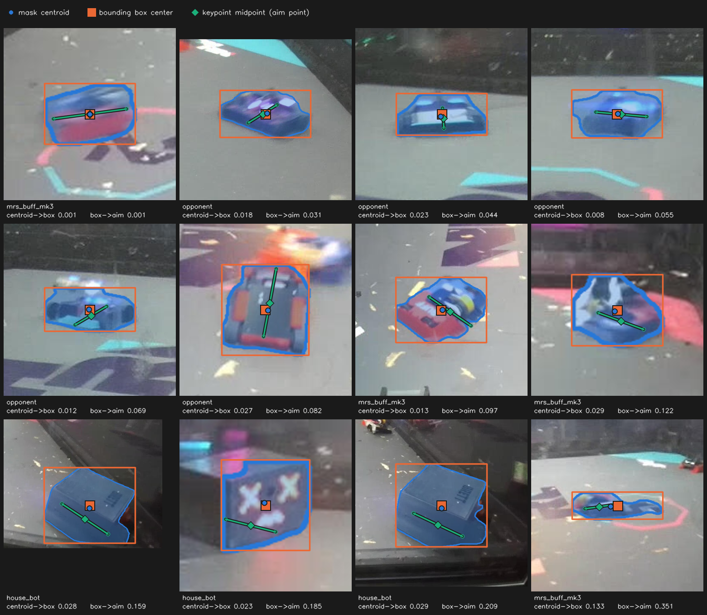
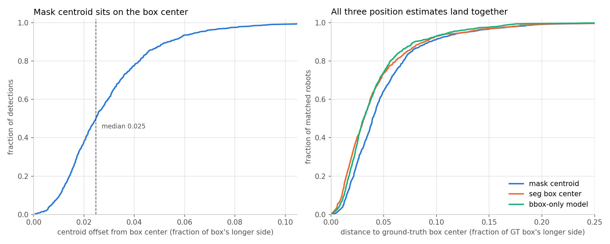
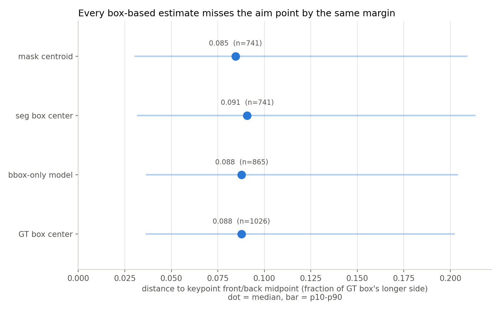
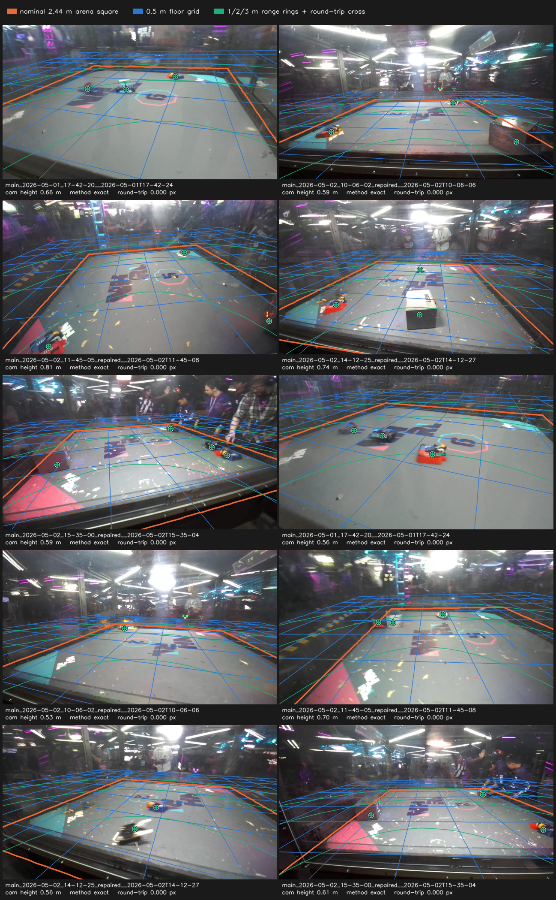

# Mask centroid vs box center — 2026-08-03

Question for the blog post: when the YOLO-seg blob model emits a mask and a box for the same
robot, does the mask centroid tell the pipeline anything the box center does not? It does not.
The centroid sits 2.75 px from its own box center at the median, 2.5 % of the robot's own
on-screen size.

Graded against the point the aim controller actually wants, the keypoint front/back midpoint, the
two are equally wrong. Mask centroid 9.91 px median, seg box center 11.10 px, and a hand-labeled
GT box center 9.69 px. Every box-derived position misses the aim point by roughly 9 % of the
robot's size, and the spread between the three ways of computing it is about 1 px. **The estimator
choice is noise; the box-center-to-aim-point gap is the error that matters, and only the keypoint
model closes it.**

The run also scores the seg baseline against the deployed-track 2-class mixed bbox model on the
same eval set. The bbox model wins on every headline metric, so nothing is lost by throwing the
mask head away.

## Headline

1. **The centroid lands on the box center.** Median offset 2.75 px (0.025 of the box's longer
   side). 87.6 % of detections fall within 5 % of that side, 99.3 % within 10 %. The worst
   detection in 817 is 31.5 px off, 17.7 % of its box.
2. **The aim point is not the box center, and no box-based method gets there.** A perfectly
   labeled GT box center still sits **0.088 of the robot's size (9.69 px median)** from the
   keypoint midpoint. That is 3.5x the centroid-to-box-center offset and it is irreducible: it is
   a property of boxes, not of detection error.
3. **Which box-derived point you pick barely matters.** Median distance to the aim point: mask
   centroid 0.085, GT box center 0.088, bbox-only model 0.088, seg box center 0.091. All four sit
   inside a 0.006 band while each carries ~0.09 of error.
4. **The ranking flips with the reference, and the flip is smaller than the error.** Against the
   GT box center the seg box center wins by 1.38 px [1.08, 1.71]; against the keypoint midpoint the
   mask centroid wins by 1.20 px [0.88, 1.51]. Both deltas are ~1 px out of ~10. Read this as a
   tie, not as evidence for either.
5. **A bbox-only model matches the seg box center.** On the 698 robots both models found they
   differ by +0.315 px [−0.030, +0.682] against the GT box center and −0.211 px [−0.500, +0.120]
   against the aim point, **not significant** either way.
6. **On the floor that gap is about 4 cm, and it doubles with range.** Projected through the
   exported camera transforms, the aim point sits 37-49 mm from a box-derived position at the
   median. Split by range it runs 31 mm at 0.86 m out to 56 mm at 2.32 m, while the *pixel* error
   shrinks from 18.7 px to 5.7 px over the same span.
7. **The bbox model is the better detector anyway.** Agnostic F1 0.893 vs 0.819, recall 0.847 vs
   0.756, precision 0.944 vs 0.894, mAP50-95 0.560 vs 0.517.

Twelve matched robots, ordered by how far the predicted box center sits from the aim point, from the
closest case in the set to the 99th percentile. Solid box and filled square are the seg model's
prediction, dashed box and hollow square the hand-drawn label. The blue circle stays inside the
orange square in every tile, the hollow GT square rings it whenever localization is good, and the
green diamond walks away regardless of which box you started from.







## Setup

| | |
|---|---|
| eval set | `training/data/nhrl_keypoints_eval_test`, 372 reviewed frames, 1026 scored GT robot boxes |
| seg baseline | `yolo26n-seg_nhrl_robots_2026-04-27`, 5 classes `[object, robot, house_bot, mr_stabs_mk2, mrs_buff_mk3]` |
| bbox comparison | `yolo26n_nhrl_robots_bbox_2class_mixed_2026-07-31`, 2 classes `[robot, house_bot]` |
| taxonomy | `taxonomy_merged.yaml` for both (our robots fold into `opponent`; `object` excluded) |
| thresholds | conf 0.5, NMS IoU 0.45, match IoU 0.5, imgsz 640 |
| hardware | dev box, RTX A6000 (sm86), `_x86_64_sm86` engines |

Offsets are normalized by the box's longer side, the same convention `score.py` uses for keypoint
PCK. A typical robot box on this eval set is 122 px on its longer side (p10 59, p90 242), so 0.025
is about 3 px.

Two reference points grade the position estimates:

- **GT box center**, the center of the hand-drawn label box. This is what the labels encode and
  what IoU matching is built on.
- **Keypoint front/back midpoint**, the middle of the chassis along the robot's heading axis. This
  is the point the aim controller steers at.

All 1026 GT boxes carry front and back keypoints at visibility 2, opponents and house bots
included, with a median front-to-back separation of 0.53 of the box's longer side. None are
editor-seeded stubs sitting at the box center, so the midpoint is a real second reference across
the whole eval set rather than an our-robots-only subset.

## Result 1: the centroid sits on the box center

817 seg detections at conf 0.5, each carrying a mask.

| quantity | mean | median | p90 | p95 | max |
|---|---|---|---|---|---|
| offset (px) | 4.27 | 2.75 | 9.59 | 13.14 | 31.48 |
| offset (fraction of longer side) | 0.029 | 0.025 | 0.053 | 0.066 | 0.177 |
| mask fill of its own box | 0.752 | 0.758 | 0.890 | 0.916 | 0.969 |

Fraction of detections whose centroid falls within a given fraction of the box's longer side:

| threshold | share |
|---|---|
| 0.02 | 0.378 |
| 0.05 | 0.876 |
| 0.10 | 0.993 |

The mask fills 76 % of its box at the median, which is why the two agree. A robot seen from the
arena camera is a roughly convex blob that fills most of its bounding rectangle, so the pixel-mass
centroid and the rectangle center coincide.

Per class, and by box size:

| class | n | median offset | p90 | median mask fill |
|---|---|---|---|---|
| house_bot | 210 | 0.021 | 0.058 | 0.822 |
| mrs_buff_mk3 | 290 | 0.022 | 0.043 | 0.739 |
| opponent | 282 | 0.029 | 0.059 | 0.713 |
| mr_stabs_mk2 | 35 | 0.035 | 0.051 | 0.808 |

| box longer side (px) | n | median offset (px) | median offset (norm) |
|---|---|---|---|
| 29–80 | 205 | 1.57 | 0.024 |
| 80–122 | 204 | 2.10 | 0.021 |
| 122–173 | 204 | 3.20 | 0.022 |
| 173–644 | 204 | 7.12 | 0.031 |

The normalized offset is flat across box sizes. The pixel offset grows with the box because it is
a fixed fraction of it, not because big detections are worse.

## Result 2: which position estimate is closest to the GT box

The reference here is the hand-drawn GT box, so the "seg box center" and "bbox-only model" rows are
each a predicted box measured against the labeled box: this table is the localization error of the
two detectors, with the mask centroid as a third contender. Distance from each estimate to the GT
box center, over class-blind IoU≥0.5 matches.

| estimate | n matched | mean (px) | median (px) | mean (norm) | median (norm) |
|---|---|---|---|---|---|
| seg mask centroid | 741 | 6.66 | 4.70 | 0.050 | 0.039 |
| seg box center | 741 | 5.28 | 3.59 | 0.042 | 0.031 |
| bbox-only model box center | 865 | 4.89 | 3.62 | 0.041 | 0.031 |

Paired bootstrap (1000 resamples, 95 % CI) over the GT boxes both estimators matched:

| comparison | n | delta (px) | 95 % CI | verdict |
|---|---|---|---|---|
| mask centroid − seg box center | 741 | +1.376 | [+1.077, +1.710] | **seg box center better** |
| mask centroid − bbox-only model | 698 | +1.710 | [+1.324, +2.132] | **bbox-only model better** |
| seg box center − bbox-only model | 698 | +0.315 | [−0.030, +0.682] | ns |

The centroid loses because a robot silhouette is not symmetric. A spinning weapon, a wedge, or a
partly occluded chassis pulls the pixel mass off center while the box stays anchored to the
extremes. Part of the gap is the metric: the labeler drew tight rectangles, so the box center is
the quantity ground truth encodes, and an estimator that reports a box center starts with an
advantage. Result 3 grades the same estimates against a reference that has no such bias.

## Result 3: distance to the keypoint midpoint, the aim point

The front/back keypoint midpoint is where the aim controller wants to put the crosshair. It is the
only reference here that is independent of boxes, so it is the one that can rank a predicted box and
the GT box on the same scale. That adds a fourth row, the GT box center itself, which carries zero
detection error and shows what a box can do at best.

| estimate | n | mean (px) | median (px) | mean (norm) | median (norm) | p90 (norm) |
|---|---|---|---|---|---|---|
| seg mask centroid | 741 | 16.09 | 9.91 | 0.108 | **0.085** | 0.209 |
| seg box center | 741 | 17.29 | 11.10 | 0.113 | 0.091 | 0.213 |
| bbox-only model box center | 865 | 15.85 | 9.63 | 0.108 | 0.088 | 0.204 |
| **GT box center (the label itself)** | 1026 | 15.45 | 9.69 | 0.107 | 0.088 | 0.202 |

Paired bootstrap (1000 resamples, 95 % CI), same convention as Result 2:

| comparison | n | delta (px) | 95 % CI | verdict |
|---|---|---|---|---|
| mask centroid − seg box center | 741 | −1.201 | [−1.510, −0.879] | mask centroid better |
| mask centroid − bbox-only model | 698 | −1.378 | [−1.856, −0.953] | mask centroid better |
| mask centroid − GT box center | 741 | −0.932 | [−1.438, −0.423] | mask centroid better |
| seg box center − bbox-only model | 698 | −0.211 | [−0.500, +0.120] | ns |
| seg box center − GT box center | 741 | +0.269 | [−0.071, +0.667] | ns |

Two things to take from this table, in order of size.

**The floor dominates.** The GT box center is a hand-drawn label with no detection error in it, and
it still misses the aim point by 9.69 px, 0.088 of the robot's size. Every estimator lands within
1.7 px of that floor. Whatever you compute from a bounding box, you inherit the fact that the
center of a rectangle around a robot is not the middle of the robot.

**The centroid's win is real but small.** It beats the seg box center by 1.20 px and even beats the
perfect GT box center by 0.93 px, both with CIs clear of zero. That is the mask doing its job: pixel
mass tracks the chassis, while the enclosing rectangle gets stretched by a protruding weapon or arm.
But 1 px against a 10 px error does not change any downstream decision, and the sign flips depending
on which reference you grade against (Result 2 has the box center ahead by a similar margin). Treat
the three box-derived estimates as tied.

Per class, the floor is what varies, not the estimator:

| class | n | mask centroid | seg box center | bbox model | GT box center |
|---|---|---|---|---|---|
| house_bot | 206 | 0.195 | 0.195 | 0.196 | 0.199 |
| opponent | 461 | 0.076 | 0.077 | 0.086 | 0.079 |
| mrs_buff_mk3 | 359 | 0.062 | 0.069 | 0.068 | 0.073 |

Median distance to the aim point, normalized by the GT box's longer side. House bots are the outlier
at 0.199, more than twice the other classes, and all four estimators are equally far off on them.
The NHRL house bots are long and asymmetric, so the midpoint of their chassis sits well away from
the center of the rectangle that encloses them. Columns are medians over each class's own matched
subset, so rows do not have identical n across columns.

## Result 4: the same error in millimetres on the arena floor

Pixels do not have a fixed size on the ground, so the normalized numbers above hide the thing that
matters for aiming. `export_camera_transforms.py` writes `tf_field_from_camera` and the intrinsics
per eval frame, which turns any pixel into a floor position: the pixel becomes a camera ray, the ray
is rotated into the field frame, and it is intersected with the plane the robot sits on. That is the
projection the runtime uses in `project_keypoint_onto_plane`, and the plane height comes from the
same `[robot_filter] keypoint_height_meters*` config the runtime reads (0 m for our robots, 0.12 m
for house bots, 0.03 m default).

Distances are computed **between floor points**, not scaled from a pixel distance. A single
millimetres-per-pixel factor would be wrong at both ends of the arena.

| estimate | n | median (mm) | mean (mm) | p90 (mm) |
|---|---|---|---|---|
| seg mask centroid | 692 | **37.2** | 73.5 | 206.4 |
| seg box center | 692 | 40.6 | 75.1 | 202.8 |
| bbox-only model box center | 802 | 47.2 | 72.9 | 183.2 |
| GT box center (the label itself) | 955 | 49.0 | 73.8 | 183.4 |

**The aim point is about 4 cm from any box-derived position at the median, and the mean is nearer
7 cm.** For scale, the robots are roughly 20-30 cm across and the arena is 2.44 m square.

Localization error is far smaller than the box-center bias. Predicted box centre to GT box centre
runs 14.8 mm (seg) and 15.1 mm (bbox model) at the median, roughly a third of the aim-point gap.
Detection is not what is costing accuracy here.

### By range from the camera

Four equal-count bands of the robot's ground range from the camera nadir. Ranges span 0.34-4.12 m,
median 1.65 m.

| band | n | median range | mask centroid | seg box center | bbox-only model | GT box center | seg box center (px) |
|---|---|---|---|---|---|---|---|
| 0.34-1.16 m | 239 | 0.86 m | 25.8 mm | 30.7 mm | 32.1 mm | 32.8 mm | 18.7 px |
| 1.16-1.65 m | 239 | 1.41 m | 29.9 mm | 31.7 mm | 36.6 mm | 34.6 mm | 11.2 px |
| 1.65-2.09 m | 238 | 1.91 m | 55.4 mm | 61.3 mm | 62.6 mm | 59.4 mm | 9.3 px |
| 2.09-4.12 m | 239 | 2.32 m | 50.7 mm | 55.7 mm | 56.8 mm | 63.3 mm | 5.7 px |

**The pixel error and the floor error move in opposite directions.** A far robot is small on screen,
so its box-center-to-aim-point gap shrinks from 18.7 px to 5.7 px. But each of those pixels covers
much more ground, so the same error grows from 31 mm to 56 mm on the floor. Reading the pixel column
alone would suggest distant robots are the easy case; in the units navigation consumes they are
roughly twice as bad.

The near band is the one that matters for a hit: at 0.86 m the aim point sits ~3 cm from the box
center, and at 2.3 m it is ~5.5 cm. The estimator ordering holds at every range, and the spread
between estimators stays inside 7 mm in every band.

### Checking the projection

The floor numbers are only as good as the exported pose, so the transform is drawn back onto the
frames. The nominal 2.44 m arena square, a 0.5 m floor grid, and 1/2/3 m range rings are projected
through `tf_field_from_camera`, and each aim point is round-tripped pixel to floor and back.



The orange square lands on the cage walls across all seven recordings and the grid lies flat on the
floor, which is the check that the pose is right. The round-trip residual is 0.000 px everywhere,
which only proves the projection math is self-consistent; it says nothing about the pose, so the
square is the load-bearing part of this figure. Camera height varies 0.53-0.81 m between frames
because the camera moves during a fight, which is why the transform is per frame rather than per
recording.

## Result 5: seg baseline vs 2-class mixed bbox model

Two separate `score.py` runs. `--labels` is one shared mapping for all candidates, so a 5-class and
a 2-class engine cannot share a run, which also means no paired bootstrap between them.

Agnostic level, all robots collapsed to one blob:

| model | precision | recall | F1 | mAP50 | mAP50-95 | matched GT |
|---|---|---|---|---|---|---|
| seg baseline | 0.894 | 0.756 | 0.819 | 0.736 | 0.517 | 741 / 1026 |
| **bbox 2class mixed** | **0.944** | **0.847** | **0.893** | **0.833** | **0.560** | 865 / 1026 |

Archetype level (`opponent`, `house_bot`), the vocabulary both models can emit:

| model | precision | recall | F1 | mAP50-95 | opponent AP50-95 | house_bot AP50-95 | wrong-class rate |
|---|---|---|---|---|---|---|---|
| seg baseline | 0.876 | 0.741 | 0.803 | 0.594 | 0.439 | **0.749** | 0.021 |
| **bbox 2class mixed** | **0.937** | **0.841** | **0.886** | **0.610** | **0.513** | 0.707 | **0.007** |

The bbox model finds 124 more robots out of 1026, fires wrong-class a third as often, and gives up
0.042 of house_bot AP. The seg baseline's agnostic numbers reproduce `seg_vs_bbox_2026-07-18.md` to
three decimals and the bbox model's reproduce `synthetic_arms_2026-07-31.md`, which is the harness
sanity check that these runs sit on the same footing as the earlier reports.

Instance level is not comparable and is omitted. The 2-class model has no `mr_stabs_mk2` or
`mrs_buff_mk3` head, so every correct detection of our own robot scores as a wrong class (0.367
wrong-class rate against the seg model's 0.153).

## Caveats

- **The centroid analysis runs through ultralytics on the `.pt` weights, not the TensorRT engine.**
  `TrtYoloModel` discards the mask coefficients, so there is no engine path to a mask. Detection
  counts from this path differ slightly from the engine runs in Result 5. The offsets are still
  self-consistent because centroid and box come from the same forward pass.
- **Offsets are measured only where the seg model fired.** The 285 GT robots it missed contribute
  nothing here, so this says nothing about whether a mask would help on hard detections.
- **The keypoint midpoint is hand-labeled ground truth, not a model output.** Result 3 measures how
  far box-derived positions sit from the aim point, not how well the deployed pose model finds it.
  The pose model's own keypoint error is a separate measurement (`score.py`'s `kp_err_px`).
- **The midpoint is a proxy for the chassis center, not a verified one.** It is the average of two
  labeled points on the robot's heading axis. For a robot whose front and back keypoints are not
  symmetric about its true center of rotation, the midpoint carries that asymmetry.
- **Robots running off the frame inflate the tail, not the medians.** The labeler clips the box at
  the image border but places keypoints at the chassis ends even when those land outside the frame,
  so a truncated robot shows a large box-center-to-midpoint gap that is an artifact of the clipping.
  79 of 1034 GT boxes are truncated by that test (27 % of house_bot, 2-4 % of everything else).
  Dropping them moves the medians by under 0.005: house_bot 0.1989 to 0.1983, overall 0.0877 to
  0.0838. The house_bot result is real geometry, not clipping. The mosaic excludes truncated robots
  because they are misleading as illustrations even though they barely move the statistics.
- **10 of 1034 GT boxes have their keypoint midpoint outside their own box,** by at most 0.13 of the
  box side. That is 1 % of the set and is not what drives the 0.088 median.
- **35 detections are labeled `mr_stabs_mk2`, which does not appear in these fights.** They are
  misclassifications of other robots. Their mask-vs-box geometry is still valid, so they stay in
  the offset tables and are called out in the per-class row.
- **No paired significance between the two models** in Result 5, because `--labels` is one shared
  mapping and the engines have different class counts. That comparison is two independent runs on
  identical frames.
- **The two references disagree about which estimate wins,** by about a pixel in each direction.
  The GT box center reference favors box centers by construction; the keypoint midpoint favors the
  centroid slightly. Neither margin is large enough to act on, which is the finding.

## Reproduce

```bash
source scripts/activate_python.sh
OUT=training/data/nhrl_keypoints_eval_test/scores_mask_centroid_2026-08-03

python training/model_eval/mask_centroid_vs_box.py training/data/nhrl_keypoints_eval_test \
  --seg-weights data/models_v2/yolo26n-seg_nhrl_robots_2026-04-27.pt \
  --seg-labels "opponent,opponent,house_bot,mr_stabs_mk2,mrs_buff_mk3" \
  --bbox-weights data/models/yolo26n_nhrl_robots_bbox_2class_mixed_2026-07-31.pt \
  --bbox-labels "opponent,house_bot" \
  --taxonomy training/model_eval/taxonomy_merged.yaml --conf 0.5 --output $OUT/centroid

python training/model_eval/make_field_projection_check.py training/data/nhrl_keypoints_eval_test \
  -o docs/experiments/perception_performance/assets/2026-08-03_mask_centroid/field_projection_check.png

python training/model_eval/make_centroid_mosaic.py training/data/nhrl_keypoints_eval_test \
  --seg-weights data/models_v2/yolo26n-seg_nhrl_robots_2026-04-27.pt \
  --seg-labels "opponent,opponent,house_bot,mr_stabs_mk2,mrs_buff_mk3" \
  --taxonomy training/model_eval/taxonomy_merged.yaml \
  -o docs/experiments/perception_performance/assets/2026-08-03_mask_centroid/examples_mosaic.png

python training/model_eval/score.py training/data/nhrl_keypoints_eval_test \
  --candidate seg_baseline=data/models_v2/yolo26n-seg_nhrl_robots_2026-04-27_x86_64_sm86.engine \
  --labels "opponent,opponent,house_bot,mr_stabs_mk2,mrs_buff_mk3" \
  --taxonomy training/model_eval/taxonomy_merged.yaml --conf 0.5 --output $OUT/seg

python training/model_eval/score.py training/data/nhrl_keypoints_eval_test \
  --candidate bbox_2class_mixed=data/models/yolo26n_nhrl_robots_bbox_2class_mixed_2026-07-31_x86_64_sm86.engine \
  --labels "opponent,house_bot" \
  --taxonomy training/model_eval/taxonomy_merged.yaml --conf 0.5 --output $OUT/bbox
```

## Artifacts

- Tools (new): `training/model_eval/{mask_centroid_vs_box.py, make_centroid_mosaic.py, camera_geometry.py, make_field_projection_check.py}`
- Camera geometry: `camera_info.json` + `camera_transforms/<stamp>.json` per sub dataset, written by `export_camera_transforms.py`. 955 of 1026 GT boxes have a usable (`exact` or `interpolated`) pose; the rest are `unavailable` or `ambiguous` and are dropped from the floor-unit tables.
- Scores: `training/data/nhrl_keypoints_eval_test/scores_mask_centroid_2026-08-03/{centroid,seg,bbox}/`
- Report assets: `assets/2026-08-03_mask_centroid/{examples_mosaic.png, field_projection_check.png, mask_centroid_vs_box.png, keypoint_midpoint_error.png, centroid_summary.csv, range_bands.csv, summary_seg_baseline.csv, summary_bbox_2class_mixed.csv, headline_*.png}`
- Per-detection offsets: `.../centroid/centroid_offsets.csv` (817 rows)
- Per-GT-box position errors: `.../centroid/position_errors.csv` (1026 rows, `err_<reference>_<estimator>_{px,norm}` columns for references `gtbox` and `kpmid`)

## Related

- `seg_vs_bbox_2026-07-18.md` established that dropping the seg head costs no box quality and runs
  ~18 % faster. This report closes the remaining gap in that argument: the mask output the head
  was computing carried no position information the box did not already have.
- `synthetic_arms_2026-07-31.md` is where the 2-class mixed model comes from.
- `box_pose_vs_blob_2026-07-14.md` and `all_robots_pose_2026-07-14.md` cover the keypoint model that
  produces the aim point at runtime. Result 3 is the argument for keeping it: the 0.088 gap between
  any box center and the keypoint midpoint is what that model exists to close.
