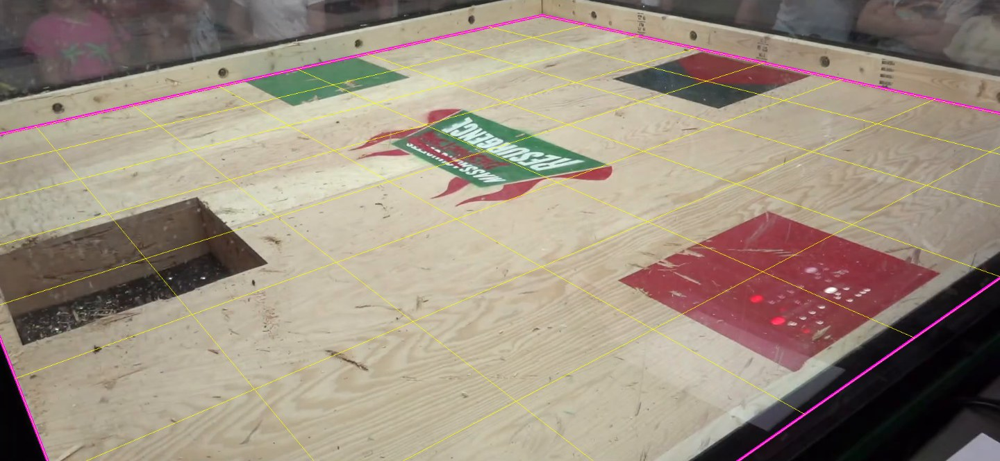
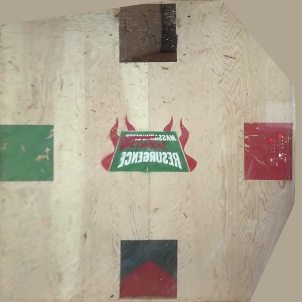
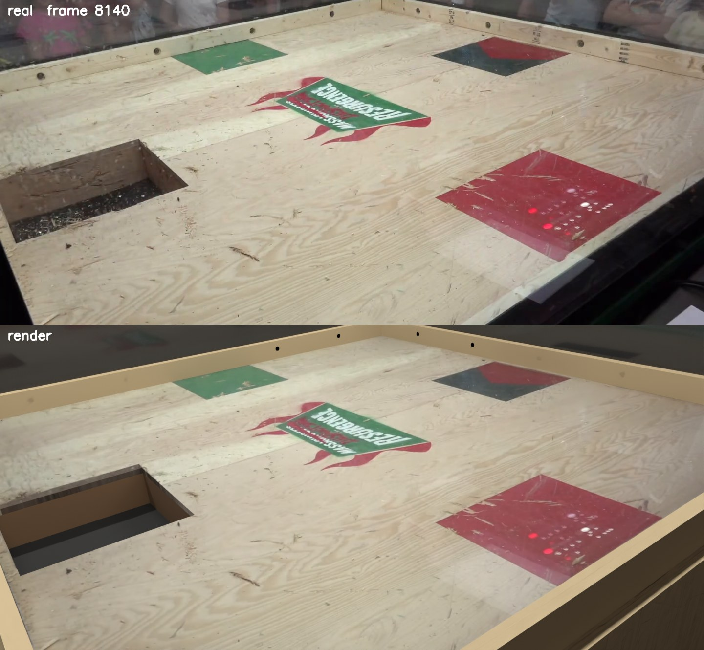
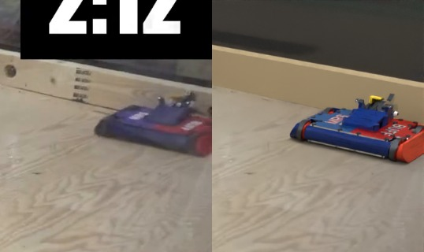
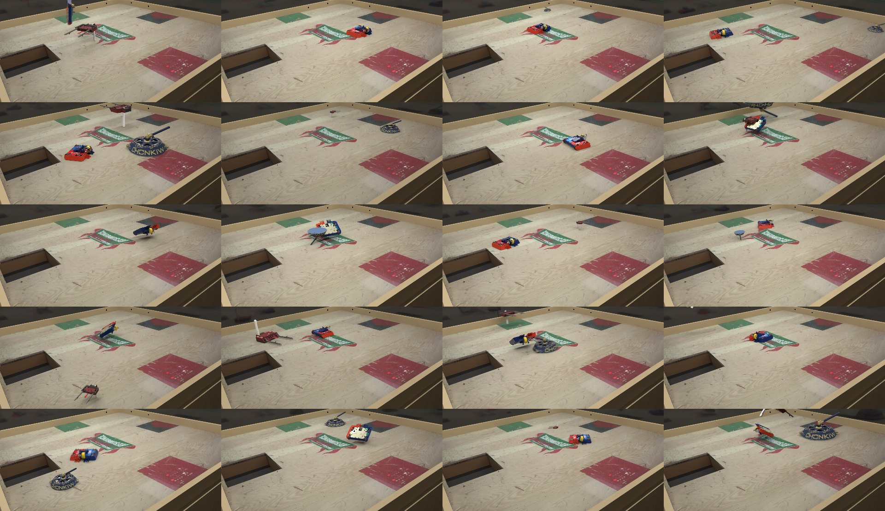

# A MassDestruction arena scene, built from one broadcast clip

Status: **built and wired into the generic pipeline** (2026-09-11). Code:
`playground/massd_scene/`, spec `training/synthetic/cage/massd_resurgence6.toml`, geometry in
`training/synthetic/synthgen/cage_spec.py` and `synthgen/cage.py`. The floor albedo and the
fitted camera live in `training/data/environments/massd_arena/`; the fit's own scratch goes
to `runs/massd_scene/` (gitignored). Figures: `assets/2026-09-11_massd_scene/`.

The NHRL cage-high scene (`cage_scene_render_match_2026-09-11.md`) was built from thirteen
clips of a camera with a measured calibration. This one has neither. The source is a single
YouTube broadcast clip of Resurgence Six,
`data/downloads/massd_resurgence6_mrsbuff/r1_beeroll_vs_mrsbuff.mp4`, from a camera nothing
in this repo knows anything about. Both the focal length and the arena's size had to come
out of the picture.

## Target frame

The fights fill the whole clip, so the per-pixel median the NHRL flow uses still carries
robot ghosts. `extract_target.py --scan` ranks frames by how much of the floor differs from
the clip median and writes a contact sheet; the top of that ranking is between rounds, but
the very best frames have a broom in them, which is thin enough to score well. Frame 8140 is
empty: no robots, no broom, no hands. The broadcast title bar and the LeafLabs sponsor bar
are cropped off with the crop `data/downloads/mass_destruction/MANIFEST.md` already uses for
1080p streams, rows 96 to 982, leaving a 1920x886 picture. Every K and every render below
describes that cropped picture.

## Focal length and pose, together

The plywood floor is a square seen corner-on, so its two edge families have two vanishing
points. With square pixels and the principal point at the image centre, their orthogonality
is one equation for f:

    (u1 - cx)(u2 - cx) + (v1 - cy)(v2 - cy) + f^2 = 0

Both vanishing points come from a RANSAC over LSD segments inside the floor hull. Almost
every straight line in the arena runs along one of the two floor axes: the kick rails, the
painted squares, the pit rim, the plywood seams. The fit
finds 16 and 13 supporting segments in the cropped frame.

| | |
| --- | --- |
| focal length | 1588.4 px at 1920 wide, 62.3 deg horizontal |
| camera height above the floor | 0.752 m |
| tilt from straight down | 63.6 deg |
| position in the floor frame | (-1.13, -1.62) m, 2.0 m out from the centre |
| yaw | 35.7 deg, so the camera looks down a diagonal |

The camera sits just above the 0.66 m wall, looking over the near rail across the arena.
Three floor edges then fix the pose exactly, six equations for six unknowns, the same
situation as the NHRL three-line fit: there is no residual to report. Two independent checks
say it is right anyway.

- **The floor comes out square.** Solving the two floor extents separately, without forcing
  a square, gives 1.012:1.
- **The kick rail reads the same height everywhere.** The bright band above the far floor
  edge is the rail's inner face. Solving its height from that band at four points spread
  along the edge gives 0.099, 0.099, 0.107 and 0.096 m, against a threshold that is worth
  about +-5 px. The spec carries 0.095 m.

## How big is the arena

Nothing in the picture is a known length, so the scale came from outside it. Three numbers
agree on a 2.26 m plywood floor.

1. **MRS BUFF against our own metric recording.** `training/data/nhrl_cage_high_eval/r1_beeroll_vs_mrsbuff`
   has hand-labelled front and back keypoints, 17 frames of this clip with both of them
   visible. Projected onto the floor plane through the fitted camera they sit 0.0513 plane
   units apart at the median. The same labels, drawn to the same convention, on our own ZED
   recording of this venue (`mrs_buff_mk3_massd_ns_jetson_2026-08-29_13-08-16`, 92 labelled
   robots with an exact field pose, metric depth) put them 0.187 m apart. Matching the two
   medians scales the floor to 2.26 x 2.23 m. Comparing the two *labelled* separations rather
   than either against the CAD keypoints (0.1528 m) is deliberate: labellers mark the robot's
   body, a few centimetres off the floor, and both cameras sit low enough that projecting
   those marks onto the floor stretches them by about 10%. The stretch cancels.
2. **The hazard squares land where our hazards file says.** Read off the rectified floor
   texture, the two 0.43 m squares sit at (0, +-0.88) m. `config/hazards/massd_arena_north_south.toml`
   puts its two holes at (0, 0.85) and (0, -0.9).
3. **It is an 8 ft cage with a 2x4 inside it.** 2.4384 m less 0.089 m of rail on each side is
   2.260 m. The point-cloud field fit on `gapfill_baseline_2026-08-29T13-20-08.mcap` reads
   2.348 x 2.379 m for the wall interior, the usual few per cent short of 8 ft. Two other
   recordings from the same day fit 2.36 x 0.86 and 1.67 x 2.62 m, which are not fits of a
   square at all, so this leg of the argument rests on one recording.

The spec takes 2.26 m. It is an input to the pose fit, not an output: everything metric in
the scene scales with it.

## Scene

Metres, W frame: floor centre origin, z up, +y away from the camera. The floor is 2.26 m
square, 19 mm thick, textured with the frame warped onto the floor plane at 1024 px/m (2314
px square); 89.2% of it is observed and the near corner the camera cuts off is filled with
the floor mean.

Three things the NHRL cage did not need were added to the shared spec.

- **`[[pits]]`.** The near hazard square is a real hole: the footage shows its inner walls and
  a gravel floor. The far one reads flat, a dark square with a red chevron painted on it, so
  it stays part of the floor texture. A pit cuts the mat and the riser into pieces around its
  opening and closes the hole with four walls and a floor. Depth 0.13 m is solved from how
  much of the pit floor the near wall hides in the rectified texture. The walls hang from the
  mat's underside rather than from z = 0: a wall top level with the floor surface is coplanar
  with the mat slab above it and z-fights in a ring around the opening. What shows above each
  wall is the mat's own cut edge, which is the plywood rim the footage shows.
- **`panel.walls`.** BlenderProc's segmentation stops at glass, so a pane between the camera
  and the mat costs every label behind it. This camera is outside the cage, past the near and
  left walls, so only the far and right walls are glazed. Glazing all four costs the mat
  mask entirely (IoU 0.987 to 0.000) and 2.7 points of inside L1, so it loses twice over.
- **`frame.bolt_face`.** The rail here is a 0.095 m wooden kick board standing at the floor
  line, not a low ledge, and its carriage bolts go through the face looking at the mat.

The rest is the NHRL scene's parts retuned: wooden rails, polycarbonate, a riser down to the
venue floor, no house bot, a 2x2 rig of overhead tubes, and a backdrop cylinder standing in
for the crowd behind the glass.

## Grading

`playground/cage_scene/grade_render.py`, unchanged, against the one target frame. Note what
that number is and is not: the floor texture was built from this frame, so the inside-hull
score is close to a self-consistency check, not an independent test. The honest numbers are
the ones about geometry and about the region the texture does not cover.

Final render, 256 samples, OptiX denoiser, exposure solved against the target. Lower is
better except SSIM and mat IoU.

| region | metric | render | flat baseline |
| --- | --- | --- | --- |
| full | L1 grey | **12.64** | 42.68 |
| full | SSIM | **0.806** | 0.567 |
| full | edge chamfer px | 1.39 | n/a |
| full | mat IoU | 0.987 | |
| inside hull | L1 grey | **4.43** | 30.92 |
| inside hull | SSIM | **0.938** | 0.640 |
| inside hull | edge chamfer px | 0.96 | n/a |
| inside hull | Lab dL | -0.4 | |
| outside hull | L1 grey | **39.52** | 82.53 |
| outside hull | SSIM | **0.383** | 0.336 |
| outside hull | Lab dL | +10.5 | |

Where the full-frame number came from, in order:

| change | full L1 grey |
| --- | --- |
| 48 samples, everything first-guess | 22.6 |
| 256 samples: the softness was sampling noise, not the texture (inside L1 8.8 to 5.0) | 21.6 |
| kick rail instead of a low ledge; near and left walls unglazed | 17.3 |
| riser ledge shrunk to the wall line, backdrop brightened | 16.0 |
| lighting sweep: 2x2 tubes at 1.4 m, ambient down, venue darkened | 13.2 |
| pit walls hung from the mat underside instead of z = 0 | 13.15 |
| `mat.albedo_gain` 0.35 to 0.50, fitted on real robot frames | **12.64** |

### Sweeps

Lighting, 64 samples, event pose, auto exposure. Ambient barely matters and tube height
matters a lot: a high rig spills light onto the outward-facing side of the near rail, which
the real picture shows almost black.

| variant | inside L1 | outside L1 | outside dL | full L1 |
| --- | --- | --- | --- | --- |
| tubes 3.0 m, ambient 0.42 (start) | 5.62 | 50.0 | +42.6 | 16.04 |
| tubes 3.0 m, ambient 0.10 | 5.53 | 49.0 | +41.6 | 15.72 |
| tubes 2.2 m, ambient 0.10 | 5.60 | 44.3 | +36.4 | 14.70 |
| tubes 1.6 m, ambient 0.10 | 5.24 | 40.1 | +31.2 | 13.48 |
| **tubes 1.4 m, dark venue and backdrop** | **5.11** | 39.7 | +24.4 | **13.29** |
| tubes 1.2 m, dark venue and backdrop | 5.50 | 38.9 | +21.9 | 13.40 |
| tubes 1.6 m, 3x3 rig | 9.19 | 53.9 | +46.0 | 19.79 |
| tubes 2.2 m, all four walls glazed | 8.26 | 40.7 | n/a | 18.24 |

The outside region is still the weak half: +10.5 Lab dL means the render's crowd and venue
are brighter than the real ones, which read almost black behind the near glass that the
segmentation forced out of the scene.

### Robot lighting against real frames

An empty arena says nothing about how a robot is lit, so the second grade puts MRS BUFF MK3
where it really was. This clip already has hand-drawn keypoints in
`training/data/nhrl_cage_high_eval/r1_beeroll_vs_mrsbuff`, so
`robot_frames_from_labels.py` takes the 17 frames where MRS BUFF has both keypoints and no
other robot overlapping its box, projects them through the fitted camera onto the floor, and
writes the layout `pick_robot_frames.py` writes for NHRL. The CAD robot is then rendered at
those poses and graded on the detected box, a shadow ring around it, and the rest of the floor.

The floor's mean is held by auto exposure, so `mat.albedo_gain` trades floor brightness
against light level, and the light level is what the robot sees. 17 frames, 64 samples:

| `mat.albedo_gain` | robot L1 | robot Lab dL | shadow ring L1 | rest of floor L1 |
| --- | --- | --- | --- | --- |
| 0.35 (the NHRL value) | 36.04 | +9.4 | 7.85 | 8.23 |
| 0.45 | 33.58 | +2.4 | 7.77 | 7.87 |
| **0.50** | **33.12** | **-0.3** | 7.80 | 7.81 |
| 0.60 | 33.02 | -4.6 | 8.03 | 7.79 |
| 0.90 | 35.41 | -6.7 | 17.80 | 15.87 |
| 1.30 | 39.87 | -1.5 | 40.35 | 38.35 |

0.50 puts the rendered robot's brightness on the real one and is kept. Carrying the NHRL
value over would have shipped robots 34% too bright (box mean grey 128 against 96 in the
footage). Past 0.60 the exposure can no longer hold the floor and everything falls apart.

The remaining robot L1 of 33 is the box's own content: a blurred, glossy real robot against a
sharp CAD render, and CAD part colours that are a vivid blue and red where the real MRS BUFF
is weathered navy and maroon. Robot-box SSIM is 0.27, footprint IoU with the labelled box
0.50. The rendered shadow is within 4% of the real ring-to-floor brightness ratio.

The match timer the broadcast floats inside the picture survives the banner crop, as
`MANIFEST.md` warns. It is out of the floor hull and out of every robot box used here, so it
costs nothing, but it is in these frames.

## A latent bug this turned up

`synthgen.cage._set_mat_uvs` read the mat's world position from `obj.blender_obj.matrix_world`
on the tick the primitive was created, when Blender still has it as the identity. Every mat
vertex then reported +-1.0 m instead of its real +-1.175 m, so the texture was addressed as if
the mat were 2.0 m across: the floor's features rendered 17.5% too large and the outer 7% of
the albedo never appeared. With one mat box that is invisible. It only showed up here, where
the mat is cut into four pieces around a pit and each piece drew the whole texture. The UV now
comes from the box the geometry module returned, which needs no depsgraph. **The NHRL cage
scene and any dataset rendered from it before this change carry that stretch.**

## Sample set

`render_cage_samples.py`, unchanged except for a pit keep-out: robot and distractor
placements are redrawn until nothing stands over a hole (`--pit-margin`, default 0.12 m).
MRS BUFF MK3 plus one or two Meshy opponents per image, the fitted broadcast camera, tube
strength jittered +-25%.

100 images at 1920x886, 128 samples, seed 0, none dropped:
`runs/massd_scene/samples/{images,labels,data.yml}`.

| | count |
| --- | --- |
| images | 100 |
| MRS BUFF MK3 boxes with keypoints | 92 |
| Meshy opponent boxes | 105 |
| images with 1 / 2 / 3 labels | 25 / 53 / 22 |

The rendered MRS BUFF's box mean grey is 110 against 96 in the real footage, down from 128
before the gain fit; what is left is the box's floor, which reads slightly bright at this
distance.

## What is still wrong

- **The outside of the arena is too bright.** +10.5 Lab dL. The real crowd, venue floor and
  near wall sit behind tinted polycarbonate that the segmentation forced out of the scene,
  and a flat backdrop cylinder is a poor stand-in for a standing crowd.
- **The near corner of the floor is invented.** The camera sees 89.2% of it; the rest is the
  floor's mean colour, flat.
- **The far hazard square is painted, not cut.** In this footage it reads flat, so it is part
  of the texture. If it is a hole at other MassD events, a robot will drive over it.
- **One frame, one camera.** Nothing here averages over clips the way the NHRL scene does, so
  the inside-hull score is close to a self-consistency check. The independent evidence for
  the scene is the pose (square floor, constant rail height), the scale (three ways), and the
  outside-hull and edge numbers.
- **The rendered MRS BUFF still does not look like the real one.** Its brightness is fitted
  (below), but the CAD part colours are a vivid blue and red where the real robot is a
  weathered navy and maroon, and the real one is motion-blurred where the render is sharp.
  Robot-box SSIM stays at 0.27.

## In the generic generator

`render_cage_samples.py` stays the cage-only renderer from the fitted broadcast pose; the
generic pipeline renders this arena too, so one dataset carries all three backdrops. `[cage]`
became `[[cages]]`, an array with one entry per real arena and its own share of the run:

| entry | share of the run |
| --- | --- |
| `nhrl_cage` | 50% |
| `massd_arena` | 25% |
| HDRI arena (what is left) | 25% |

The split is tracked rather than coin-flipped, per arena: each scene goes to whichever arena
is furthest behind its share, so a 200-image run lands on 100 / 50 / 50 exactly. Two cages now
coexist in one Blender file, so each stage owns a named collection, and its lights and house
bot are looked up among the objects it built rather than by name across the whole file.

The mount ranges differ from NHRL's because the arena does: the MassD wall is 0.66 m against
NHRL's 1.22 m, so a camera clamped to it sits at 0.50 to 0.64 m, and it is restricted to the
far and right walls, the two the spec glazes. The `camera_calibration` for this half is the
same wide lens as the NHRL half on purpose: it stands in for our own camera on the arena, not
for the 62-degree broadcast camera the scene was fitted from.

## Next steps

1. Re-render the NHRL cage sample sets: they carry the 17.5% floor-texture stretch.
2. Grade a mixed run's MassD half the way the cage-only set was graded, to check the mount
   sampler does not put the camera somewhere the real one could never go.
