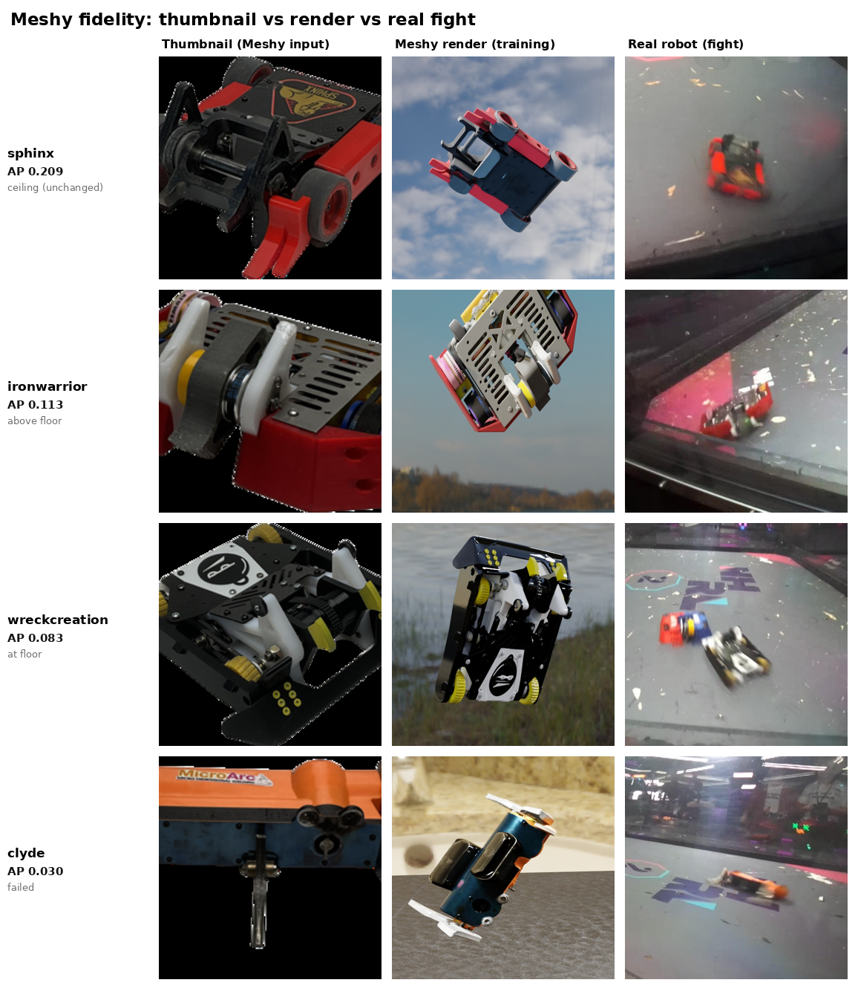

# Meshy AI-model fidelity grade (Exp 1)

Analysis date: 2026-07-16. Model: `yolo26n-pose_meshy_grade_2026-07-16` (interim best.pt, ~epoch 120, still training).

## Summary

Meshy fidelity is per-model, not a blanket pass or fail. Graded per opponent (each eval recording is a single opponent), transfer ranges from the real-trained ceiling to a total failure:

- **sphinx** reached the ceiling: opponent AP50-95 **0.209** vs the real-trained 0.210.
- **ironwarrior** cleared the floor: **0.113**.
- **wreckcreation** landed at the floor: **0.083** (~ generic distractors, 0.084).
- **clyde** failed: **0.030**, near-zero recall (small sample, 22 boxes).

The cause is stale source images: the Meshy models are built from NHRL thumbnails, and opponents rebuild their robots between the thumbnail capture and the fight. sphinx was unchanged so its model matches the real robot; the others changed so their models do not. See the visual comparison below.

The pooled grade across the whole eval (0.068) understated this: it mixes in three recordings whose opponents we have no Meshy model for (pure false negatives) and pools precision-recall curves, dragging the good cases down. The per-opponent view is the correct one.

The pipeline itself is sound: in the same model, synthetic mrs_buff (an exact OnShape CAD model) detects real mrs_buff at 0.383 AP. Synthetic-to-real transfer works; whether a Meshy reconstruction is good enough varies by robot.

## Setup

- **Question:** we have Meshy image-to-3D models of the four opponents mrs_buff fought in the eval (clyde, sphinx, wreckcreation, ironwarrior). Train on them as named classes and measure whether the model detects those real opponents. If the reproductions are faithful, opponent detection should rise above the generic-distractor floor toward the real-trained ceiling.
- **Dataset:** `training/data/meshy_grade`, pure synthetic (BlenderProc), 6 classes `[mr_stabs_mk2, mrs_buff_mk3, clyde, sphinx, wreckcreation, ironwarrior]`. CAD distractors off, objaverse clutter on. 14,264 frames, ~3k per opponent. Our robots are exact CAD; the four opponents are Meshy GLBs (baked texture, `flat_ground`, per-model scale normalized to ~0.29 m).
- **Training:** `yolo26n-pose` on megamind. Synthetic val plateaued early (box mAP50 0.985, pose mAP50 0.973, box mAP50-95 ~0.71 flat from ~epoch 85). Graded on the interim best.pt.
- **Eval:** `training/data/nhrl_keypoints_eval_test`, 372 reviewed frames. GT labels opponents as a single generic `opponent` class (no per-robot identity).
- **Scoring:** `score.py`, `--labels "mr_stabs_mk2,mrs_buff_mk3,opponent,opponent,opponent,opponent"` (the four Meshy classes map to `opponent`), `taxonomy.yaml`, conf 0.5.

## Result

| model | opponent training source | opponent AP50-95 | agnostic recall | agnostic mAP50-95 |
|---|---|---|---|---|
| all_robots | generic CAD distractors (floor) | 0.084 | 0.321 | 0.205 |
| **meshy_grade** | **Meshy models of the 4 real opponents** | **0.068** | 0.300 | 0.169 |
| blob_generic | real opponent frames (ceiling) | 0.210 | 0.675 | 0.479 |
| deploy (Exp 2) | real + synthetic opponent boxes | 0.218 | 0.496 | 0.284 |

- **Pooled grade understated the result.** 0.068 vs generic 0.084 looks like a wash, but pooling includes three recordings with opponents we have no Meshy model for. The per-opponent grade is the true picture.
- **Synthetic mrs_buff transfers fine** (AP 0.383 in this same model), confirming the synthetic pipeline works; per-opponent transfer depends on each Meshy mesh's quality.
- Keypoints (mrs_buff, incidental): heading error 16.5 deg, pck@0.1 0.458. Better than the opponent-diluted deploy model (38.5 deg), worse than the dedicated our-robot model (9.0 deg). Not the focus here.

### Per-opponent grade

Each eval recording is a single opponent (recording -> opponent map below). Scored on that recording alone, all Meshy classes still mapped to `opponent`, so this measures how well each Meshy mesh detects its real counterpart. Floor 0.084, ceiling 0.210.

| opponent | opp GT boxes | opponent AP50-95 | agnostic recall | verdict |
|---|---|---|---|---|
| sphinx | 99 | **0.209** | 0.412 | at the real ceiling |
| ironwarrior | 80 | 0.113 | 0.297 | above floor |
| wreckcreation | 99 | 0.083 | 0.296 | at the floor |
| clyde | 22 | 0.030 | 0.022 | failed (small sample) |

Recording -> opponent: `05-02_10-06` clyde, `05-02_11-45` sphinx, `05-02_14-12` wreckcreation, `05-02_15-35` ironwarrior (provided by the operator; the eval GT itself only labels a generic `opponent`).

## Why fidelity varies by model

**The opponents rebuild their robots between the thumbnail capture and the fight.** The Meshy model is generated from a bot's NHRL thumbnail, which is often from an earlier event. By fight time the robot has been reconfigured (different weapon, wedges, armor, colors), so the model no longer looks like the real robot the camera sees. sphinx is the exception: it was unchanged between thumbnail and fight, so its Meshy model matches the real robot and detects it at the ceiling. clyde/wreckcreation/ironwarrior changed, so their models detect poorly.

This is not a Meshy reconstruction-quality problem. The reconstructions faithfully reproduce their thumbnails; the thumbnails are stale.

Read each row left to right: the NHRL thumbnail Meshy was built from, a render of the resulting model in the training set, and the real robot in its eval fight. sphinx is the same robot in all three. For the others, the real robot in the fight differs from the thumbnail the model was built from.

## Implication

Meshy models work when the source image matches the robot's fight configuration (sphinx reached the ceiling), and fail when it does not (clyde). The fix is the input, not the tool:

- **Build Meshy models from current fight footage, not stale NHRL thumbnails.** A frame from the robot's most recent match reflects its actual configuration. The generation pipeline already accepts an arbitrary source image.
- **Only generate a Meshy model once the opponent's current build is known.** For an upcoming opponent, use the most recent image available and re-check it close to the event.
- **Real opponent boxes remain the configuration-agnostic baseline.** Exp 2's real+synthetic recipe hit 0.218 aggregate opponent AP without depending on any single reconstruction. Use Meshy to supplement it per-robot where the source image is current.

## Caveats

- **Interim checkpoint.** Graded on best.pt at ~epoch 120 while training continued. Synthetic val had plateaued and the gap is fidelity, not training duration, so the final checkpoint will not change the verdict.
- **clyde sample is small.** 22 opponent boxes vs ~80-99 for the others. clyde's near-zero is directionally clear (the model detects almost no opponent in that video) but its exact AP is noisy.
- **Three recordings unmapped.** `05-01_17-42`, `05-02_16-18`, `05-02_17-26` were not mapped to opponents and are excluded from the per-opponent grade; they still drag the pooled aggregate.

## Artifacts

- Model: `data/models/yolo26n-pose_meshy_grade_2026-07-16.{pt,onnx,engine}`
- Scores: `training/data/nhrl_keypoints_eval_test/scores_meshy/{summary.csv, headline.png, confusion_*.png}`
- Dataset: `training/data/meshy_grade` (local + megamind), config `training/synthetic/config_meshy_grade.toml`
