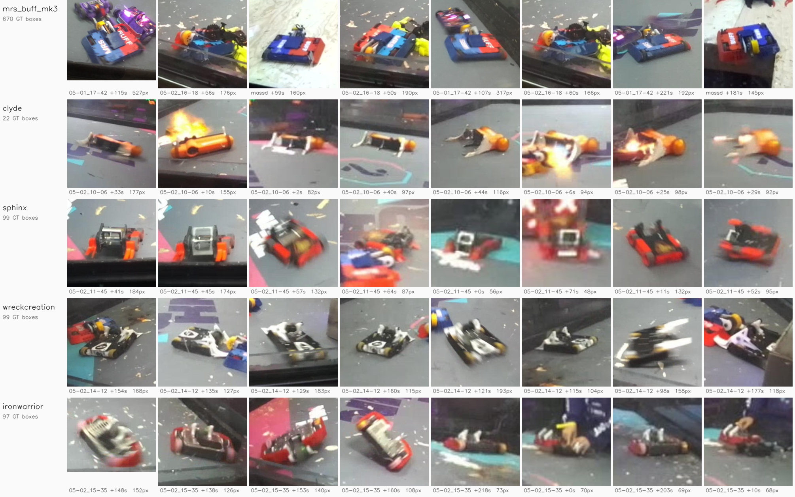

# Meshy AI-model fidelity grade, yolo26x (Exp 1 rerun)

Analysis date: 2026-09-10. Model: `yolo26x-pose_meshy_grade_2026-09-10` (best.pt, epoch 114).
Reruns `meshy_grade_2026-07-16.md` with a yolo26x-pose backbone on the same dataset.

## Summary

Model capacity, not mesh fidelity, was the binding constraint in the July grade. Swapping
yolo26n-pose for yolo26x-pose on the identical dataset raises opponent AP50-95 from **0.048 to
0.105** pooled, and every one of the four graded opponents improves:

- **ironwarrior 0.093 -> 0.296**, a 3.2x gain. July called it "above floor"; it is now the
  second-strongest opponent in the set.
- **sphinx 0.209 -> 0.399**, nearly double, against a re-measured floor of 0.157 on the same frames.
- **clyde 0.030 -> 0.086**, still the weakest but no longer a total failure.
- **wreckcreation 0.085 -> 0.097**, the one opponent that barely moves.

July's per-opponent verdicts ranked the meshes by how stale their source thumbnails were. Three of
the four rankings do not survive the capacity change. ironwarrior's mesh was never the problem;
yolo26n could not use it. Only wreckcreation stays flat under a 5x larger backbone, which is the
one case where the stale-thumbnail explanation still holds up.

Keypoints improved alongside: heading error **16.4 -> 9.8 deg**, pck@0.1 0.432 -> 0.508, both with
bootstrap CIs excluding zero.

## What changed from the July run

Three things differ, and two of them are corrections rather than deliberate variations.

**Backbone.** yolo26n-pose -> yolo26x-pose. This is the intended variable.

**Eval frame count: 372 -> 688.** July scored the subset named by `.edit_state.json`, which records
which frames a human opened in the label editor, not which frames are valid ground truth. It keeps
429 of 688 frames and silently drops two entire recordings (`05-02_17-26`, MassD) while cutting
`05-02_16-18` to 7 frames. `validation_state.json` marks all 688 `pass` and is the authority
`auto_battlebot/eval/dataset.py:reviewed_stems` already prefers. Per-recording scoring still had a
live trap: recording subdirectories carry their own `.edit_state.json`, and `05-01_17-42` holds one
with `reviewed: []`, which kills the run with `No scoreable labels found`. A per-subdirectory
`validation_state.json` derived from the root file now covers all eight recordings.

**Labels were revised between July and now.** ironwarrior's recording carries 97 opponent boxes
today against the 80 July reported.

Together these mean **no number here is line-comparable with the July document**. The July
`scores_meshy` output survives only on pathfinder
(`~/auto-battlebot/training/data/eval_results/scores_meshy`, 372 frames), so rather than cite it, this
run re-scores the original `yolo26n-pose_meshy_grade_2026-07-16` engine on the current 688 frames as
`n_july`. Every comparison below is between candidates measured in the same run on the same frames.

## Setup

- **Dataset:** `training/data/meshy_grade`, unchanged from July, restored from
  `/media/storage/auto-battlebots-archive/meshy_grade`. 12,837 train / 1,426 val, 6 classes
  `[mr_stabs_mk2, mrs_buff_mk3, clyde, sphinx, wreckcreation, ironwarrior]`, 0 corrupt on scan.
- **Training:** `yolo26x-pose`, batch 96 across three A6000s, 200 epochs requested. Graded at
  epoch 114 (see Divergence).
- **Eval:** `training/data/nhrl_keypoints_eval_test`, all 688 frames, 1,843 GT boxes of which 763
  are opponent.
- **Scoring:** `score.py`, conf 0.5, `taxonomy.yaml`, the four Meshy classes mapped to `opponent`.
  Baselines carry their own 3-class map via `--candidate-labels`.

## Result

Pooled over all 688 frames. Baseline `n_july`; every `x_ep114` delta is significant at 95% under the
paired bootstrap.

| model | opponent training source | opponent AP50-95 | agnostic recall | agnostic mAP50-95 | heading err |
|---|---|---|---|---|---|
| n_july (yolo26n) | Meshy models of the 4 opponents | 0.048 | 0.253 | 0.142 | 16.4 deg |
| **x_ep114 (yolo26x)** | **same dataset** | **0.105** | **0.320** | **0.218** | **9.8 deg** |
| x_ep100 (yolo26x) | same dataset | 0.100 | 0.307 | 0.211 | 9.2 deg |
| all_robots | generic CAD distractors (floor) | 0.056 | 0.270 | 0.169 | 15.4 deg |
| deploy | real + synthetic opponent boxes | 0.177 | 0.429 | 0.236 | 40.0 deg |

Key intervals for x_ep114 against n_july: agnostic recall +0.067 [0.053, 0.081], precision +0.241
[0.209, 0.274], heading error -6.55 deg [-9.52, -3.76].

**Pooled yolo26n sat below the floor; yolo26x sits above it.** n_july's 0.048 is under the
generic-distractor floor of 0.056 measured on identical frames, while every per-opponent score below
is above its own floor. That is the pooling artifact July predicted, now confirmed against a
re-measured floor rather than a cited one: pooling mixes in four recordings with opponents that have
no Meshy model and averages precision-recall curves across them.

**x_ep100 and x_ep114 agree to within 0.005 opponent AP**, so the result does not hinge on which
side of the plateau the checkpoint sits.

### Per-opponent grade

Each eval recording is a single opponent, scored on that recording alone with all Meshy classes
mapped to `opponent`. `all_robots` is the floor, re-measured per recording in the same runs.

| opponent | opp GT boxes | floor | n_july | **x_ep114** | change |
|---|---|---|---|---|---|
| sphinx | 99 | 0.157 | 0.209 | **0.399** | +0.190 |
| ironwarrior | 97 | 0.033 | 0.093 | **0.296** | +0.203 |
| wreckcreation | 99 | 0.052 | 0.085 | **0.097** | +0.012 |
| clyde | 22 | 0.000 | 0.030 | **0.086** | +0.056 |

Agnostic recall moves with it: sphinx 0.412 -> 0.511, ironwarrior 0.297 -> 0.422, wreckcreation
0.296 -> 0.354, clyde 0.022 -> 0.111.

Recording -> opponent: `05-02_10-06` clyde, `05-02_11-45` sphinx, `05-02_14-12` wreckcreation,
`05-02_15-35` ironwarrior (provided by the operator; the eval GT labels only a generic `opponent`).

### What the camera sees

One row per robot, the eight sharpest ground-truth crops from the eval frames, at least 4 s
apart within a recording (`training/model_eval/make_robot_capture_mosaic.py`). mr_stabs_mk2 has
no eval frames and is omitted. Opponents are named by recording, as above. clyde's row is the
whole recording: 22 boxes, two of them on fire.

## What this does to July's conclusion

July concluded that Meshy fidelity is per-model and traced the spread to stale NHRL thumbnails: the
opponents rebuild between the thumbnail capture and the fight, so sphinx (unchanged) transferred and
the others did not. The thumbnail evidence in
`assets/meshy_fidelity_comparison.png` is unaffected and those source images really are stale.

What the rerun shows is that the stale-thumbnail effect was not what set the per-opponent ordering.
ironwarrior tripled on a mesh that did not change, so its July score measured yolo26n's capacity,
not its mesh. clyde nearly tripled from a near-zero base. Only wreckcreation is flat under a 5x
larger backbone, and it is the one opponent for which a fidelity ceiling is still the natural
reading.

Capacity and fidelity are not separable from this pair of runs alone. A yolo26s and yolo26m arm on
the same dataset would show where the curve flattens per opponent, and that is the cheap next
experiment.

## Divergence at epoch 145

The run was requested for 200 epochs and cancelled at 154. `train/rle_loss` fell monotonically
without bound, 0.587 at epoch 20 to -4.47 at epoch 144, and NaN appeared at 145. By 150, 40 of 1263
EMA tensors were non-finite, and an EMA never flushes NaN: `epoch150.pt` and `last.pt` both score
synthetic mAP 0.000.

`best.pt` at epoch 114 predates this and is verified NaN-free, as are `epoch50.pt` and
`epoch100.pt`. Synthetic val had plateaued well before the divergence (box mAP50-95 0.810 at epoch
100, 0.822 at 114, 0.818 at 144), so the grading checkpoint is not compromised. Epoch 114 also
tracks the July run closely, which graded an interim best.pt at roughly epoch 120.

RLE is a negative log-likelihood over a learned sigma. As pose mAP50-95 saturated at 0.987 on this
synthetic data, sigma collapsing toward zero would drive the log term to negative infinity, which
matches the observed unbounded descent. That mechanism is untested. yolo26n plateaued at pose
mAP50-95 0.973 and never entered the regime, so this is specific to the larger backbone on
near-saturated synthetic keypoints.

## Caveats

- **No re-measured ceiling.** July's ceiling was `blob_generic`
  (`yolo26n-seg_nhrl_robots_2026-04-27`), which is on neither this machine nor the archive. The
  0.210 figure cannot be reproduced and is not used as a comparison here. `deploy` at 0.177 pooled
  is the strongest opponent detector actually measured in this run.
- **clyde's sample is small**, 22 opponent boxes against 97-99 for the others. Its direction is
  clear; its exact AP is noisy.
- **The dataset cannot be regenerated on this machine.** The four Meshy GLBs and the BlenderProc
  asset library (`objaverse/`, `hdris/`, `cc_textures/`, `distractor_models/`) are absent here and
  from `/media/storage`. They exist on pathfinder under `~/auto-battlebot/training/data/`: all 146
  Meshy GLBs in `distractor_models/robots/` (3.9 GB) plus `hdris/` 4.5 GB, `cc_textures/` 7.8 GB and
  `distractor_models/objaverse/` 9.9 GB. Any follow-up that needs new renders starts by syncing those,
  or by rendering on pathfinder.
- **Two runs, one seed each.** `data_epoch_min` Exp 1 measured run-to-run recall variance around
  0.05, which is comparable to the wreckcreation delta of +0.012 but well under the ironwarrior and
  sphinx gains.
- **Per-opponent maps come from the operator**, not from the GT, which labels only a generic
  `opponent`.

## Artifacts

- Model: `data/eval_models/yolo26x-pose_meshy_grade_2026-09-10.{pt,onnx,_x86_64_sm86.engine}`
  (epoch 114), plus `_ep100` variants and `_results.csv`
- Scores: `training/data/nhrl_keypoints_eval_test/scores_meshy_x/` (pooled) and
  `scores_meshy_x_per_opponent/{clyde,sphinx,wreckcreation,ironwarrior}/`
- Training run: `runs/projects/auto_battlebots_2026-09-10_09-58-24_yolo26x-pose`, queue job 41
- Dataset: `training/data/meshy_grade`, restored from
  `/media/storage/auto-battlebots-archive/meshy_grade`
- Frame selection: per-recording `validation_state.json` written under each eval subdirectory
