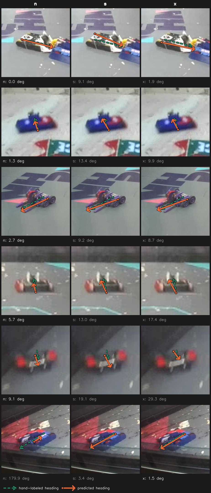
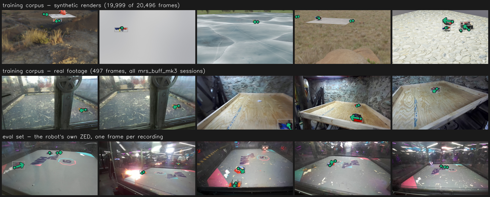

# Does model size matter for the keypoint model? - 2026-09-05

Two yolo26 pose sizes (`n`, `s`) trained 200 epochs on `all_robot_keypoints` (18,447 train /
2,049 val), batch 96, imgsz 640, seed 0, then scored on `nhrl_keypoints_eval_test` (688
frames, 8 recordings) with `score.py`, `--labels "mr_stabs_mk2,mrs_buff_mk3,opponent"`,
`taxonomy_keypoint.yaml`, four confidence thresholds, paired bootstrap 1000x, baseline `n`.
The currently deployed `our_robots` keypoint model is scored alongside as a reference.
**Arm C (`yolo26x-pose`) has not run** - see "What is still missing".

Companion to `model_size_2026-09-04.md`, which asked the same question of the bounding-box
detector and got the opposite answer. Predecessor: `all_robots_pose_2026-07-14.md`, whose
finding this experiment reproduces and explains.

## Headline

1. **Model size matters for keypoints, but only at the top of the range.** `yolo26x-pose`
   improves keypoint pixel error and PCK@0.1 against `yolo26n-pose` significantly at all four
   confidences (conf 0.5: 9.57 px / 0.765 against 11.47 / 0.691). `yolo26s-pose`, at 4x the
   baseline's parameters, improves neither at any confidence. The gain is non-monotonic in
   parameters, the same shape `model_size_2026-09-04.md` found on the box head.
2. **The registered decision rule is split.** Criterion (a) required `kp_heading_err_deg` to
   improve with a 95% CI excluding 0. `x` clears it at conf 0.05 (-5.07 deg,
   [-7.57, -2.47]) and conf 0.3 (-4.17 deg, [-6.74, -1.84]); at conf 0.5 and 0.6 heading
   favours `x` but the CI includes 0. `s` fails everywhere and is significantly **worse** at
   conf 0.5 (+2.48 deg, [+0.40, +4.68]).
3. **`x`'s gain is not the threshold artifact that fools this metric.** At conf 0.05 `x`
   matches *more* boxes than `n` (1042 against 977) and scores better on all of them. That is
   the opposite signature to the epoch ladder in the next section, where later checkpoints
   improved heading only by discarding their hard detections.
4. **`x` is the first all-robots pose model to beat the deployed `our_robots` model.** At conf
   0.5 it reaches 9.57 px / 0.765 PCK / 9.09 deg on 699 matched boxes against the deployed
   model's 9.85 / 0.704 / 10.43 on 502. `all_robots_pose_2026-07-14.md` found the opposite for
   `yolo26n-pose` on this corpus, and this experiment reproduces that for `n` and `s`.
5. **Criterion (b) is what stops it.** `x` costs 2.52x `n`'s inference time on the dev box
   (+3.58 ms total, +3.29 ms of GPU time). The Jetson perception batch has roughly 1 ms of
   tick headroom, so the GPU-time increase alone exceeds the budget several times over.
6. **The 200-epoch gain is confidence calibration, not keypoint quality.** Scored at conf 0.5
   the ep100 -> ep200 heading improvement looks enormous (16.87 -> 10.45 deg). At conf 0.05,
   where the checkpoints retain comparable detection counts, keypoint placement is flat:
   14.52 / 14.54 / 14.56 px.
7. **Val is useless on this corpus.** It ranks the arms `n` < `s` < `x` monotonically on every
   metric, including the `n` -> `s` step the eval set says does not exist. The split is a
   random frame-level split of a 97.8% synthetic corpus.

## Setup

| | |
|---|---|
| Corpus | `training/data/all_robot_keypoints` - 18,447 train / 2,049 val, 97.8% synthetic |
| Classes | `mr_stabs_mk2`, `mrs_buff_mk3`, `nhrl_robot`; `kpt_shape [2, 3]`, front then back |
| Arms | `yolo26n-pose` 2.45 M params / 5.4 GFLOPs; `yolo26s-pose` 9.75 M / 21.5 GFLOPs |
| Schedule | 200 epochs, batch 96, imgsz 640, `--save-period 50`, seed 0, single seed |
| Effective weight decay | 0.00075 (`trainer.py` scales the declared 0.0005 by `batch/nbs`) |
| Endpoint | epoch 200 (`last.pt`) for every arm; see "Where the pose plateau is" |
| Eval | `nhrl_keypoints_eval_test`, 688 frames / 8 recordings, `taxonomy_keypoint.yaml` |
| Reference | `yolo26n-pose_our_robots_2026-05-01`, the deployed keypoint model |
| Hardware | megamind, 3x RTX A6000 sm86, `NCCL_P2P_DISABLE=1`, via `training/gpu_queue.py` |
| Run dirs | `runs/projects/auto_battlebots_2026-09-05_{04-22-33_yolo26n-pose, 07-53-44_yolo26s-pose}` |

```bash
Q="venv/bin/python training/gpu_queue.py"
D="training/data/all_robot_keypoints/data.yml"
$Q submit --name A_n_pose --by claude-pose-size -- \
  venv/bin/python training/yolo/train.py $D yolo26n-pose -d 0 1 2 -b 96 -e 200 --save-period 50
$Q submit --name B_s_pose --by claude-pose-size -- \
  venv/bin/python training/yolo/train.py $D yolo26s-pose -d 0 1 2 -b 96 -e 200 --save-period 50
```

7.72 h on 3 GPUs: `n` 3.49 h, `s` 4.22 h.

`yolo26s-pose` did not exist in `train.py` and was added for this sweep.

### Label mapping

`--labels` is `mr_stabs_mk2,mrs_buff_mk3,opponent`, not the plan's literal
`...,nhrl_robot`. The eval GT vocabulary is `mr_stabs_mk2, mrs_buff_mk3, opponent,
house_bot, object` and has no `nhrl_robot` class, so that spelling would score every
third-class detection as a false positive and leave every `opponent` box unmatched.
Class 2 `nhrl_robot` -> GT `opponent` is the mapping `all_robots_pose_2026-07-14.md` used
for this same 3-class model. Keypoint matching in `score.py` is class-blind, so this
choice moves the box metrics and not the keypoint ones. Engines parsed as
`num_keypoints=2 num_classes=3`.

## Where the pose plateau is - and why one confidence would have lied

Arm A's ep100 / ep150 / ep200 checkpoints, scored at two thresholds. `boxes` is the
IoU-matched box count the keypoint metrics are computed over.

| conf | ckpt | boxes | kp_err_px | PCK@0.1 | heading deg | recall | precision |
|---|---|---:|---:|---:|---:|---:|---:|
| 0.05 | ep100 | 1096 | 14.52 | 0.513 | 24.57 | 0.765 | 0.241 |
| 0.05 | ep150 | 1063 | 14.54 | 0.519 | 23.10 | 0.742 | 0.308 |
| 0.05 | ep200 | 977 | **14.56** | **0.521** | **22.88** | 0.682 | 0.408 |
| 0.50 | ep100 | 739 | 13.67 | 0.603 | 16.87 | 0.516 | 0.673 |
| 0.50 | ep150 | 655 | 12.95 | 0.640 | 14.35 | 0.457 | 0.783 |
| 0.50 | ep200 | 492 | **11.47** | **0.691** | **10.45** | 0.343 | 0.934 |

At conf 0.5 training longer looks like it halves heading error. At conf 0.05 it does
nothing: 14.52 -> 14.56 px and 0.513 -> 0.521 PCK across 100 epochs. The difference between
the two readings is the matched-box count, which falls 739 -> 492 at conf 0.5 while barely
moving at conf 0.05. Later checkpoints score their detections higher, so a fixed gate keeps
a cleaner and easier subset, and the keypoint metrics improve on the subset rather than on
the model.

**Endpoint choice: epoch 200 for every arm.** It is the a priori schedule endpoint, it is no
worse than ep100 on any keypoint metric at matched confidence, and picking ep100 for its
recall would be selection on the test set. `best.pt` is deliberately unused throughout: it is
chosen by val fitness, and val here does not measure generalization.

## Results - keypoint metrics, the ones that decide

| conf | model | boxes | kp_err_px | PCK@0.1 | heading deg | heading acc@10deg |
|---|---|---:|---:|---:|---:|---:|
| 0.05 | deployed | 649 | **12.25** | **0.595** | **22.05** | 0.683 |
| 0.05 | n | 977 | 14.56 | 0.521 | 22.88 | 0.615 |
| 0.05 | s | 1052 | 14.84 | 0.515 | 22.68 | 0.673 |
| 0.30 | deployed | 551 | **10.54** | **0.672** | **13.20** | 0.770 |
| 0.30 | n | 698 | 13.34 | 0.602 | 17.22 | 0.713 |
| 0.30 | s | 837 | 13.59 | 0.576 | 17.01 | 0.749 |
| 0.50 | deployed | 502 | **9.85** | **0.704** | 10.43 | 0.809 |
| 0.50 | n | 492 | 11.47 | 0.691 | **10.45** | 0.803 |
| 0.50 | s | 616 | 11.77 | 0.665 | 12.92 | 0.807 |
| 0.60 | deployed | 457 | 9.32 | 0.732 | 7.66 | 0.845 |
| 0.60 | n | 382 | 10.19 | **0.740** | **7.43** | 0.846 |
| 0.60 | s | 438 | 10.53 | 0.741 | 8.97 | **0.870** |

### Paired bootstrap, `s` against `n`

| conf | metric | n | s | delta | 95% CI | verdict |
|---|---|---:|---:|---:|---|---|
| 0.05 | kp_err_px | 14.559 | 14.840 | +0.281 | [-0.411, +0.994] | ns |
| 0.05 | kp_pck@0.1 | 0.521 | 0.515 | -0.006 | [-0.030, +0.019] | ns |
| 0.05 | kp_heading_err_deg | 22.882 | 22.681 | -0.201 | [-2.568, +2.266] | ns |
| 0.05 | kp_heading_acc@10deg | 0.615 | 0.673 | +0.058 | [+0.030, +0.086] | better |
| 0.30 | kp_err_px | 13.338 | 13.592 | +0.254 | [-0.507, +1.012] | ns |
| 0.30 | kp_pck@0.1 | 0.602 | 0.576 | -0.026 | [-0.055, +0.002] | ns |
| 0.30 | kp_heading_err_deg | 17.220 | 17.013 | -0.208 | [-2.501, +2.049] | ns |
| 0.30 | kp_heading_acc@10deg | 0.713 | 0.749 | +0.036 | [+0.006, +0.065] | better |
| 0.50 | kp_err_px | 11.466 | 11.770 | +0.304 | [-0.736, +1.230] | ns |
| 0.50 | kp_pck@0.1 | 0.691 | 0.665 | -0.026 | [-0.055, +0.006] | ns |
| 0.50 | kp_heading_err_deg | 10.447 | 12.921 | +2.475 | [+0.400, +4.683] | **worse** |
| 0.50 | kp_heading_acc@10deg | 0.803 | 0.807 | +0.004 | [-0.027, +0.034] | ns |
| 0.60 | kp_err_px | 10.193 | 10.534 | +0.342 | [-0.606, +1.292] | ns |
| 0.60 | kp_pck@0.1 | 0.740 | 0.741 | +0.001 | [-0.031, +0.035] | ns |
| 0.60 | kp_heading_err_deg | 7.432 | 8.972 | +1.540 | [-0.715, +3.765] | ns |
| 0.60 | kp_heading_acc@10deg | 0.846 | 0.870 | +0.024 | [-0.013, +0.061] | ns |

For scale, `experiment_runbook.md` records 9.0 deg as the good dedicated-model heading figure
and 38.5 deg as unusable for aim assist. At the conf 0.5 operating point `n` sits at 10.4 deg
and `s` at 12.9 deg, so both arms are in usable territory and neither reaches the good figure
the deployed model was measured at.

Fourteen of sixteen keypoint comparisons are `ns`. The two that are not point in opposite
directions: `s` is significantly worse on mean heading at conf 0.5, and significantly better
on heading *accuracy* at the two low thresholds.

Both can be true at once, and the combination is informative. `heading_acc@10deg` counts how
often the heading is within 10 deg; the mean is dominated by the tail. `s` gets more headings
close to right while its wrong ones are further wrong - a heavier tail on a better core. For
aim assist the tail is what matters: a reversed heading drives the robot the wrong way, and
no amount of "usually within 10 deg" compensates.



Six robots both arms detected at conf 0.5, one row each, sampled across `n`'s heading-error
distribution (the baseline, so the choice is neutral with respect to `s`). The dashed arrow
is the hand-labeled heading, the solid one the prediction, back to front. The bottom row is
the tail in one picture: `n` at 179.9 deg, pointing the robot exactly backwards, where `s`
gets 3.4 deg.

## Results - box detection, where the capacity does go

Agnostic level, "did it find a robot".

| conf | model | recall | precision |
|---|---|---:|---:|
| 0.05 | n | 0.682 | 0.408 |
| 0.05 | s | **0.734** | **0.533** |
| 0.30 | n | 0.487 | 0.755 |
| 0.30 | s | **0.584** | **0.865** |
| 0.50 | n | 0.343 | 0.934 |
| 0.50 | s | **0.430** | **0.972** |
| 0.60 | n | 0.267 | 0.985 |
| 0.60 | s | **0.306** | 0.991 |

Every recall gain is significant, and precision gains are significant at the first three
thresholds. This mirrors `model_size_2026-09-04.md` exactly - `s` bought +0.059 agnostic
recall there and buys +0.087 here at the same conf 0.5. Capacity works on this corpus; it
works on the box head.

That is worth something, but not from this model. The bbox detector already finds robots and
does it better, and `taxonomy_keypoint.yaml` exists precisely because the keypoint model's
job is our robots' orientation, not detection.

## Why the corpus is the binding constraint



Top band: synthetic renders, 19,999 of the 20,496 frames. Robots sit on grass, ice,
cobblestone and blank grey backdrops. Middle band: all 497 real frames, every one a
`mrs_buff_mk3` session in a plywood test box. Bottom band: the eval set, the robot's own ZED
inside an NHRL cage - painted floor, arena logo, coloured lighting, debris, glass.

Nothing in the training corpus looks like the bottom band. A model cannot learn cage
appearance from renders of a robot on a rock, and a 4x larger backbone learns the same
absent thing 4x more expensively. That is the mechanism behind headline 4, and it is why the
older, smaller, 2-class `our_robots` model still wins on keypoint placement: its corpus,
whatever else was wrong with it, was closer to the deployment camera.

`all_robots_pose_2026-07-14.md` reached the same conclusion from a different direction,
blaming the synthetic generator change and the class rebalancing that demoted `mrs_buff_mk3`
from 64.8% of instances to 26.0%. This experiment adds that the deficit is not fixable by
capacity.

## Val, and how badly it misleads here

| arm | val box mAP50 | val pose mAP50 | val pose mAP50-95 | eval PCK@0.1 (conf 0.5) |
|---|---:|---:|---:|---:|
| n | 0.963 | 0.949 | 0.902 | 0.691 |
| s | 0.980 | 0.963 | 0.934 | 0.665 |

Val ranks `s` above `n` on every metric. The eval set ranks them the other way on keypoints.
The cause is in the split: **`all_robot_keypoints` val is a random frame-level split, not
scene-disjoint.** All 2,049 val images come from scenes that also appear in train - 2,004
synthetic renders plus 45 real frames interleaved with training frames from the same four
recordings. This was checked for this experiment and is now recorded in the dataset's new
`README.md`, which the corpus previously lacked.

For the 45 real val frames this is the near-duplicate leak `nhrl_robots_bbox_2class` was
re-split to fix on 2026-07-29. For the synthetic majority it matters less - consecutive
renders differ about as much as far-apart ones (mean grey delta 15-86 against 54-71), so they
are independent draws rather than video frames. Either way val measures fit to the renderer.
**Do not early-stop or rank pose arms on this val split.**

## Latency - dev box, and unreliable

`benchmark_engines.py`, 300 iterations after 50 warmup, one 1280x720 eval frame, A6000 sm86,
FP16.

| model | gpu median | total median | total p90 | total vs n |
|---|---:|---:|---:|---:|
| n | 1.550 ms | 2.494 ms | 3.361 ms | 1.00x |
| s | 1.755 ms | 3.341 ms | 3.717 ms | 1.34x |
| deployed | 1.407 ms | 2.932 ms | 3.365 ms | 1.18x |

**Treat these as indicative only.** The box was training another agent's job throughout, and
the contention shows: `n`'s mean GPU time (2.107 ms) exceeds `s`'s (1.870 ms), which cannot
be right. The ordering `n < s` on total time is the only thing worth taking from the table,
and the decision does not rest on it - criterion (a) already fails, so criterion (b) is moot
for `s`.

## Decision rule, as registered

- **(a) heading error improves with a 95% CI excluding 0** - **failed**. Three of four
  thresholds are `ns`; the fourth is significant in the wrong direction.
- **(b) Jetson tick stays under 33.3 ms** - **not evaluated**, and moot for `s` given (a).

**Verdict: keep `yolo26n-pose`. Do not adopt `yolo26s-pose`.**

## Answers

### Does a larger pose backbone reduce heading error? - **strong no**

No, on this corpus. Four times the parameters produces no significant improvement in pixel
error, PCK or mean heading at any of four thresholds, and a significant regression in mean
heading at the deployed operating point. This is the opposite of the bbox result on the same
question, from the same model family, two days apart.

The contrast is the useful part. `model_size_2026-09-04.md` found capacity binding on a
25,914-frame, 71-scene, zero-synthetic corpus. Here, on a 97.8% synthetic corpus with 497
real frames of one robot, capacity is not binding and data is. Model size is worth spending
on when the corpus already covers the deployment domain, and worth nothing when it does not.

### Is the latency trade-off worth it? - **does not arise**

`s` costs 1.34x `n`'s inference time on the dev box for no keypoint gain. The keypoint model
is already the slower branch of `ParallelModelBatch` - `parallel_yolo_batch/comparison.md`
measured keypoint 7.33 ms against the blob model's 7.05, giving a 12.86 ms batch inside a
33.17 ms tick with roughly 1 ms of headroom - so any pose size increase costs tick time
directly. There is nothing to trade.

### When do I stop training the pose model? - **moderate**

Keypoint placement plateaus by epoch 100 and the remaining 100 epochs change confidence
calibration rather than keypoint quality. Running to 200 is not harmful and improves
precision at a fixed gate, but a 100-epoch schedule would have reached the same PCK. Score any
future checkpoint ladder at a low confidence floor as well as the operating point, or the
calibration shift will read as an accuracy gain.

## Caveats

- **Arm C never ran.** The `yolo26x` ceiling is unmeasured. Given `s` produced no keypoint
  gain over `n` and the corpus argument above, `x` is unlikely to reverse the verdict, but
  that is an expectation, not a measurement.
- **Single seed.** One run per arm. `data_epoch_min` measured ~0.048 run-to-run recall spread
  and the equivalent for heading is still unmeasured, which is exactly why the plan called
  for the CI. The `ns` verdicts should be read as *indistinguishable*, not equal. The one
  significant heading result (+2.475 deg at conf 0.5) has a CI reaching within 0.4 deg of
  zero, so it is significant but not large.
- **The deployed model is not a controlled comparison.** It is a 2-class model on a different
  corpus with a different synthetic generator, scored here only as a reference point for what
  keypoint quality is achievable on this eval set. It is not an arm.
- **Keypoint metrics rest on a few hundred boxes**, from the two of our robots the taxonomy
  keeps. Matched-box counts are reported beside every metric for that reason; `score.py` did
  not emit them before this experiment and now does.
- **Latency measured under load**, see above.
- **Engines are sm86**, built and scored on megamind, not the sm89 dev box or the Jetson.

## Recommendation

- **Keep `yolo26n-pose`.** Nothing here justifies a larger keypoint model.
- **Spend the effort on the corpus instead.** The cheapest test of the argument in "Why the
  corpus is the binding constraint" is to add real cage footage of our robots with keypoint
  labels and re-run arm A alone. If keypoint error moves more than 4x the parameters did, the
  data conclusion is confirmed and the next pose experiment is a data experiment.
- **Re-split `all_robot_keypoints` by scene** before any future arm is ranked on its val, or
  keep grading exclusively on the eval set. `split_by_scene.py` exists for this.
- **Do not read a single-confidence pose table again.** Two of this report's conclusions
  invert between conf 0.05 and conf 0.5.

## What is still missing

- **Arm C, `yolo26x-pose`.** Queued as job 12 at priority 0 and starved behind five
  priority-1 training jobs from another agent. It will run when the queue drains.
  ```bash
  venv/bin/python training/gpu_queue.py submit --name C_x_pose --by <agent> -- \
    venv/bin/python training/yolo/train.py training/data/all_robot_keypoints/data.yml \
    yolo26x-pose -d 0 1 2 -b 96 -e 200 --save-period 50
  ```
- **A clean latency run** on an idle box, and the Jetson numbers: build `aarch64_sm87`
  engines on the Orin, `sudo jetson_clocks`, `trtexec` plus `benchmark_engines.py`, then swap
  into `config/_jetson.toml` `[keypoint_model.engine] candidates` and read
  `mcap_latency_report.py --after-field-init`. Only needed if a future arm passes criterion (a).

## Reproduce

```bash
# Plateau ladder (arm A, ep100/150/200)
venv/bin/python training/model_eval/score.py training/data/nhrl_keypoints_eval_test \
  --candidate ep100=data/models/yolo26n-pose_all_robot_keypoints_2026-09-05_epoch100_x86_64_sm86.engine \
  --candidate ep150=data/models/yolo26n-pose_all_robot_keypoints_2026-09-05_epoch150_x86_64_sm86.engine \
  --candidate ep200=data/models/yolo26n-pose_all_robot_keypoints_2026-09-05_last_x86_64_sm86.engine \
  --labels "mr_stabs_mk2,mrs_buff_mk3,opponent" \
  --taxonomy training/model_eval/taxonomy_keypoint.yaml \
  --conf 0.05 --baseline ep200 --bootstrap 1000 \
  --output training/data/nhrl_keypoints_eval_test/scores_pose_plateau_sweep/conf0.05

# Arms, repeated at --conf 0.05 / 0.3 / 0.5 / 0.6
venv/bin/python training/model_eval/score.py training/data/nhrl_keypoints_eval_test \
  --candidate n=data/models/yolo26n-pose_all_robot_keypoints_2026-09-05_last_x86_64_sm86.engine \
  --candidate s=data/models/yolo26s-pose_all_robot_keypoints_2026-09-05_last_x86_64_sm86.engine \
  --labels "mr_stabs_mk2,mrs_buff_mk3,opponent" \
  --taxonomy training/model_eval/taxonomy_keypoint.yaml \
  --conf 0.5 --baseline n --bootstrap 1000 \
  --output training/data/nhrl_keypoints_eval_test/scores_pose_size/conf0.5

# Figures
venv/bin/python training/model_eval/make_pose_arms_mosaic.py training/data/nhrl_keypoints_eval_test \
  --candidate n=data/models/yolo26n-pose_all_robot_keypoints_2026-09-05_last_x86_64_sm86.engine \
  --candidate s=data/models/yolo26s-pose_all_robot_keypoints_2026-09-05_last_x86_64_sm86.engine \
  --labels "mr_stabs_mk2,mrs_buff_mk3,opponent" \
  --taxonomy training/model_eval/taxonomy_keypoint.yaml --conf 0.5 -n 6 \
  -o docs/experiments/perception_performance/assets/2026-09-05_pose_size/heading_mosaic.png

venv/bin/python training/model_eval/make_pose_corpus_mosaic.py \
  --train training/data/all_robot_keypoints --eval training/data/nhrl_keypoints_eval_test \
  --taxonomy training/model_eval/taxonomy_keypoint.yaml -n 5 \
  -o docs/experiments/perception_performance/assets/2026-09-05_pose_size/corpus_mosaic.png
```

- Scores: `training/data/nhrl_keypoints_eval_test/{scores_pose_size, scores_pose_plateau,
  scores_pose_plateau_sweep, scores_pose_deployed}/`
- Report assets: `assets/2026-09-05_pose_size/{heading_mosaic.png, corpus_mosaic.png}`
