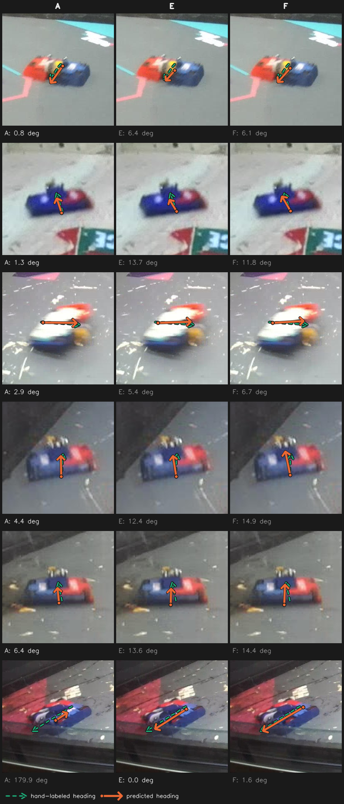
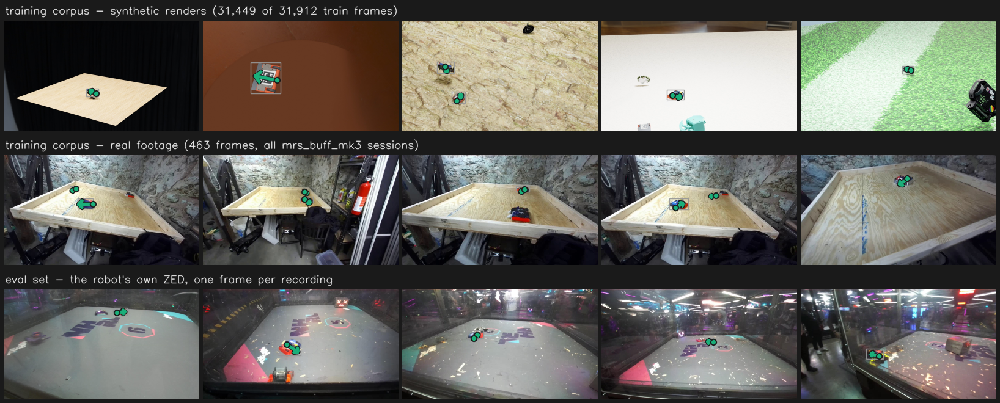

# Does model size matter for the keypoint model - or does the corpus? - 2026-09-07

`yolo26{n,s,x}-pose` trained 200 epochs on `our_robot_keypoints` (31,912 train / 3,530 val,
2 classes) as arms D, E and F, against the same three sizes trained on `all_robot_keypoints`
as arms A, B and C, carried over from `pose_model_size_2026-09-05.md`. Batch 96, imgsz 640,
seed 0, `--save-period 50`, every arm cold-started from `yolo26<size>-pose.pt`. Scored on
`nhrl_keypoints_eval_test` (688 frames, 8 recordings) with `score.py`, four confidences,
paired bootstrap 1000x. Arm D took 5.94 h, E 7.17 h, F 19.15 h.

Supersedes the corpus question left open by `pose_model_size_2026-09-05.md`, whose reference
model `yolo26n-pose_our_robots_2026-05-01` was trained on a different corpus than every arm
it was compared against.

## Headline

1. **The corpus barely matters, and the effect that looked large was an artifact.** Scored
   the way the plan registered, arm D beat arm A on heading by 4.45 deg at the operating
   point. Scored on our own robots only, the gap is 1.47 deg, `ns` at conf 0.05 and 0.3, and
   points the *other* way at conf 0.05.
2. **The artifact is in the taxonomy, and it invalidates part of the previous report.**
   `taxonomy_keypoint.yaml` excludes `house_bot` and `object` but keeps `opponent`, and 763
   of the eval set's 1,433 scoreable boxes are `opponent`. A 2-class model cannot emit one.
   Every arm in the previous sweep was graded on a set where 53% of the targets were
   opponents, which is not the keypoint model's job.
3. **Three of `pose_model_size_2026-09-05.md`'s conclusions do not survive the fix.**
   `yolo26s-pose` is not worse than `n`; `yolo26x-pose` passes criterion (a) at all four
   confidences rather than failing at the operating point; and the deployed model does not
   beat the all-robots arms, it loses to plain arm A by 2.34 deg.
4. **Arm D is a better model than the one deployed**, by 3.81 deg of heading at conf 0.5 on
   the same corpus. It is not a controlled comparison: the deployed model ran 500 epochs,
   fine-tuned from a lost parent, annealed to `lrf 0.01`, and trained with `flipud 0.5`.
5. **Criterion (c) fails under both scorings**, so the registered rule says do not switch the
   corpus on this evidence.
6. **The size effect is corpus-dependent, which answers the secondary question.** `n` -> `s`
   is a real gain on `our_robot_keypoints`, significant on pixel error at all four
   confidences and on PCK at three. On `all_robot_keypoints` the same step is mostly `ns`.
   "`s` does nothing" was a property of that corpus, not of the size step.
7. **The `n` -> `x` jump reproduces on the new corpus, so it belongs to the size.** Sixteen of
   sixteen bootstrap cells are `better` on each corpus, with comparable magnitudes. Arm F is
   the best model in the grid on every keypoint metric: 6.38 px / 0.860 PCK / 4.12 deg at
   conf 0.5. Ungating F is what made this row exist.
8. **The deployable result is arm E at 384x640, and it is better than the current recipe on
   every axis.** 1.292 ms of GPU time against the deployed `n`-at-640's 1.303, with recall
   0.700 against arm A's 0.612 and heading 5.24 deg against 7.19. Dropping the 44% of a
   square tensor that is grey padding is `ns` on all four keypoint metrics at all three
   sizes, so the speed is free.
9. **A 2-class head costs no inference time**, the check the plan asked for: D against A is
   1.311 against 1.303 ms, E against B 1.622 against 1.620, F against C 4.441 against 4.413.



Six robots all three arms detected at conf 0.5, one row each, sampled across arm A's
heading-error distribution, so the choice of tiles is neutral with respect to E and F and
favours neither. Dashed arrow is the hand-labeled heading, solid is the prediction, back to
front. Four of the six rows are cases where A does well and the newer arms do worse by a few
degrees, which is what sampling on A's distribution produces and is the honest other side of
the aggregate. The bottom row is the tail: A reads 179.9 deg, the robot pointing exactly
backwards, where E gets 0.0 and F 1.6.

## Setup

| | |
|---|---|
| Corpora | `our_robot_keypoints` 31,912 train / 3,530 val, 2 classes, 98.7% synthetic; `all_robot_keypoints` 18,447 / 2,049, 3 classes, 97.8% synthetic |
| Shared | All 497 real frames appear in both, and are the only real frames in either |
| Arms | A/B/C = `n`/`s`/`x` on `all_robot_keypoints`; D/E/F = the same three on `our_robot_keypoints` |
| Schedule | 200 epochs, batch 96, imgsz 640, `--save-period 50`, seed 0, `lrf 0.1`, `flipud 0.0`, `close_mosaic 0` |
| Endpoint | epoch 200 (`last.pt`) for every arm; `best.pt` is unused, val does not measure generalization here |
| Eval | `nhrl_keypoints_eval_test`, 688 frames / 8 recordings, paired bootstrap 1000x |
| Hardware | megamind, 3x RTX A6000 sm86, via `training/gpu_queue.py` |
| Run dirs | `runs/projects/auto_battlebots_2026-09-07_{01-01-14_yolo26n-pose, 06-58-55_yolo26s-pose, 14-09-36_yolo26x-pose}` |

D and A are matched on every training argument. Both read
`model: yolo26n-pose.pt, epochs 200, batch 96, imgsz 640, lr0 0.01, lrf 0.1, seed 0,
flipud 0.0, close_mosaic 0, weight_decay 0.0005, fraction 1.0` out of their checkpoints, and
differ only in `data:`. That is the control the previous report lacked.

```bash
Q="venv/bin/python training/gpu_queue.py"
$Q submit --name D_n_our --by claude-pose-corpus -- \
  venv/bin/python training/yolo/train.py training/data/our_robot_keypoints yolo26n-pose \
    -d 0 1 2 -b 96 -e 200 --save-period 50
```

Arm D took 5.94 h.

## The scoring bug, which turned out to matter more than the question

The plan called for one invocation over a grid mixing 2-class and 3-class engines, which
`score.py` could not do: it passed one global `--labels` to every candidate, and
`len(class_labels)` is what sets `num_classes` and so where the keypoint values start in the
raw tensor. A 2-class engine read with three labels parses to `num_keypoints=0`.
`--candidate-labels NAME=a,b` fixes that, mirroring the existing per-candidate `--stretch`.
Every engine now prints its own layout line, and the grid runs in one pass with a paired
bootstrap across corpora.

Fixing that exposed a second problem the plan did not anticipate. `taxonomy_keypoint.yaml`
excludes `house_bot` and `object`. It does not exclude `opponent`. The eval set's scoreable
ground truth is:

| label | boxes | boxes with a visible keypoint |
|---|---:|---:|
| `mrs_buff_mk3` | 670 | 670 |
| `opponent` | 763 | 763 |
| `mr_stabs_mk2` | 0 | 0 |

Every opponent box carries keypoints, and keypoint matching in `score.py` is class-blind, so
a 3-class arm is scored on opponents and a 2-class arm is not. That makes the matched-box
count, recall, and every keypoint mean incomparable across the two rows of the grid. It also
means the previous report's caveat, "with `house_bot` and `object` excluded, the keypoint
metrics rest on the `mr_stabs_mk2` and `mrs_buff_mk3` boxes only", was wrong: they rested on
a set that was 53% opponent, and there is not one `mr_stabs_mk2` box in the eval set at all.

`taxonomy_keypoint_ours.yaml` adds `opponent` to the exclusion list. That scores every arm on
our own robots, which is the deployment task: the keypoint model estimates our robot's
heading so the aim assist knows which way it is facing, and the opponent belongs to the other
branch. Both scorings are reported below. The ours-only one was added after seeing the
matched-box counts, so it is a post-hoc analysis choice; the reason for it is structural
rather than empirical, and it does not favour arm D. It favours arm C.

Precision is not comparable in the ours-only scoring. A 3-class arm's opponent detections
become false positives once opponent ground truth is excluded, so A/B/C read artificially
low. Recall, matched-box count and the keypoint metrics are comparable; precision is not.

## The grid - our robots only

Every arm at every confidence, `taxonomy_keypoint_ours.yaml`. `boxes` is the IoU-matched
count the keypoint metrics average over. Best per group in bold; `deployed` is a reference,
not an arm.

| conf | arm | boxes | kp_err_px | PCK@0.1 | heading deg | head acc@10deg | recall |
|---|---|---:|---:|---:|---:|---:|---:|
| 0.05 | A `n`/all | 536 | 9.906 | 0.662 | 10.000 | 0.769 | 0.800 |
| 0.05 | B `s`/all | 569 | 9.346 | 0.686 | 8.375 | 0.852 | 0.849 |
| 0.05 | **C `x`/all** | **591** | **7.257** | **0.804** | **6.191** | **0.892** | **0.882** |
| 0.05 | D `n`/our | 546 | 11.010 | 0.644 | 11.122 | 0.815 | 0.815 |
| 0.05 | E `s`/our | 566 | 9.506 | 0.693 | 8.494 | 0.841 | 0.845 |
| 0.05 | **F `x`/our** | 556 | **6.499** | **0.840** | **5.447** | **0.912** | 0.830 |
| 0.05 | deployed | 580 | 10.904 | 0.650 | 15.084 | 0.743 | 0.866 |
| 0.30 | A | 473 | 9.403 | 0.700 | 8.334 | 0.808 | 0.706 |
| 0.30 | B | 525 | 8.882 | 0.708 | 6.852 | 0.872 | 0.784 |
| 0.30 | **C** | **569** | **6.944** | **0.823** | **5.447** | **0.903** | **0.849** |
| 0.30 | D | 483 | 9.867 | 0.683 | 7.783 | 0.859 | 0.721 |
| 0.30 | E | 524 | 8.950 | 0.722 | 6.614 | 0.872 | 0.782 |
| 0.30 | **F** | 523 | **6.428** | **0.853** | **4.884** | **0.931** | 0.781 |
| 0.30 | deployed | 537 | 10.269 | 0.685 | 11.617 | 0.786 | 0.801 |
| 0.50 | A | 410 | 9.134 | 0.727 | 7.194 | 0.834 | 0.612 |
| 0.50 | B | 458 | 8.442 | 0.747 | 6.728 | 0.876 | 0.684 |
| 0.50 | **C** | **541** | **6.744** | **0.835** | **5.075** | **0.909** | **0.807** |
| 0.50 | D | 403 | 9.196 | 0.716 | 5.726 | 0.893 | 0.601 |
| 0.50 | E | 471 | 8.751 | 0.747 | 5.383 | 0.902 | 0.703 |
| 0.50 | **F** | 489 | **6.380** | **0.860** | **4.118** | **0.943** | 0.730 |
| 0.50 | deployed | 494 | 9.677 | 0.713 | 9.535 | 0.818 | 0.737 |
| 0.60 | A | 343 | 8.878 | 0.754 | 6.045 | 0.857 | 0.512 |
| 0.60 | B | 372 | 8.078 | 0.792 | 5.502 | 0.895 | 0.555 |
| 0.60 | **C** | **505** | **6.714** | **0.850** | 4.869 | 0.919 | **0.754** |
| 0.60 | D | 299 | 9.221 | 0.744 | **4.679** | **0.923** | 0.446 |
| 0.60 | E | 421 | 8.690 | 0.760 | 4.704 | 0.922 | 0.628 |
| 0.60 | **F** | 459 | **6.441** | **0.868** | **3.960** | **0.946** | 0.685 |
| 0.60 | deployed | 451 | 9.209 | 0.738 | 7.062 | 0.851 | 0.673 |

**Arm F is the best model in the grid on every keypoint metric at every confidence**, and arm
C is second. The ordering on heading at conf 0.5 is F 4.12 < C 5.08 < E 5.38 < D 5.73 < B 6.73
< A 7.19 < deployed 9.54. On recall it is C 0.807 > deployed 0.737 > F 0.730 > E 0.703 >
B 0.684 > A 0.612 > D 0.601: arm C finds more of our robots than F does, and is the only arm
that beats the deployed model on recall.

## The primary question - arm D against arm A

Both scorings, conf 0.5, the deployed operating point.

| scoring | A heading | D heading | delta | 95% CI | matched boxes |
|---|---:|---:|---:|---|---|
| as registered | 10.447 | 5.999 | -4.448 | [-6.590, -2.450] | 492 -> 405 |
| our robots only | 7.194 | 5.726 | **-1.468** | [-2.646, -0.500] | 410 -> 403 |

Two thirds of the apparent gain was arm A being charged for opponents it places badly. What
survives is 1.47 deg.

### Our robots only, all four confidences

| conf | metric | A | D | delta | 95% CI | verdict |
|---|---|---:|---:|---:|---|---|
| 0.05 | kp_heading_err_deg | 10.000 | 11.122 | +1.122 | [-1.145, +3.569] | ns |
| 0.05 | kp_pck@0.1 | 0.662 | 0.644 | -0.019 | [-0.051, +0.014] | ns |
| 0.30 | kp_heading_err_deg | 8.334 | 7.783 | -0.551 | [-2.428, +1.387] | ns |
| 0.30 | kp_pck@0.1 | 0.700 | 0.683 | -0.017 | [-0.051, +0.018] | ns |
| 0.50 | kp_heading_err_deg | 7.194 | 5.726 | -1.468 | [-2.646, -0.500] | **better** |
| 0.50 | kp_pck@0.1 | 0.727 | 0.716 | -0.011 | [-0.043, +0.023] | ns |
| 0.60 | kp_heading_err_deg | 6.045 | 4.679 | -1.365 | [-2.630, -0.396] | **better** |
| 0.60 | kp_pck@0.1 | 0.754 | 0.744 | -0.009 | [-0.046, +0.030] | ns |

**The ranking flips between confidences.** D is 1.12 deg worse at conf 0.05 and 1.47 deg
better at conf 0.5. Keypoint placement, which heading is derived from, is `ns` everywhere and
slightly negative at every threshold. Whatever the corpus buys, it is not better keypoints;
it is a confidence ordering that puts D's good detections above the gate.

### Per recording, conf 0.5, our robots only

| recording | A heading | D heading | delta | A boxes | D boxes |
|---|---:|---:|---:|---:|---:|
| `main_2026-05-01_17-42-20` | 6.34 | 6.83 | +0.49 | 79 | 75 |
| `main_2026-05-02_10-06-02` | - | 4.59 | - | 0 | 3 |
| `main_2026-05-02_11-45-05` | 6.47 | 6.06 | -0.41 | 79 | 74 |
| `main_2026-05-02_14-12-25` | 6.86 | 5.23 | -1.64 | 63 | 68 |
| `main_2026-05-02_15-35-00` | 5.52 | 5.13 | -0.39 | 75 | 76 |
| `main_2026-05-02_16-18-05` | 3.31 | 2.19 | -1.11 | 12 | 18 |
| `main_2026-05-02_17-26-12` | 14.02 | 7.39 | **-6.63** | 53 | 44 |
| `mrs_buff_mk3_massd_ns_jetson_2026-08-29` | 6.30 | 4.96 | -1.34 | 49 | 45 |

D wins 6 of the 7 recordings where both models find robots. The size of the win is one
recording: drop `17-26-12` and the average delta is -0.73 deg. `17-26-12` is also where arm A
is worst by a wide margin, 14.02 deg against 3.3 to 6.9 everywhere else, so the corpus is
mostly recovering one bad recording rather than lifting the set.

Note that `main_2026-05-01_17-42-20` scores here but returns "no scoreable labels" when
pointed at directly. `reviewed_stems` prefers a subdataset's older `.edit_state.json` over
the root `validation_state.json`, which is the trap its own docstring warns about. Per-
recording numbers must be produced with the root validation state copied alongside each
recording, or they will not reconcile with the aggregate.

### Decision rule, as registered

- **(a) heading improves at conf 0.5 with a 95% CI excluding 0.** **Passes** under both
  scorings, -4.448 [-6.590, -2.450] as registered and -1.468 [-2.646, -0.500] on our robots.
- **(b) `kp_pck@0.1` at conf 0.5 does not get worse by a CI excluding 0.** **Passes** under
  both, +0.024 `ns` as registered and -0.011 `ns` on our robots.
- **(c) the matched-box count at conf 0.5 does not fall.** **Fails** under both. 492 -> 405
  as registered, which is structural. 410 -> 403 on our robots, a fall of 7 boxes, which is
  not structural and is what the criterion was written to catch.

All three were required. **The registered verdict is: do not switch the keypoint model to
`our_robot_keypoints` on this evidence.** The heading gain is real at the operating point and
small, it disappears at lower thresholds, keypoint placement does not improve, and the
matched-box count moves the wrong way.

## The secondary question - does the size effect reproduce on the new corpus?

The plan asked for this as a comparison of deltas, not of absolute numbers. `n` -> `s` on each
corpus, our robots only:

| conf | metric | E - D (`our_robot_keypoints`) | B - A (`all_robot_keypoints`) |
|---|---|---|---|
| 0.05 | kp_err_px | **-1.504** [-2.386, -0.725] | -0.560 [-1.203, +0.009] ns |
| 0.05 | kp_pck@0.1 | **+0.049** [+0.023, +0.077] | +0.024 [-0.003, +0.054] ns |
| 0.05 | kp_heading_err_deg | **-2.628** [-4.718, -0.500] | -1.624 [-3.492, +0.093] ns |
| 0.30 | kp_err_px | **-0.917** [-1.584, -0.379] | -0.522 [-1.186, +0.078] ns |
| 0.30 | kp_pck@0.1 | **+0.039** [+0.013, +0.066] | +0.008 [-0.022, +0.039] ns |
| 0.30 | kp_heading_err_deg | -1.170 ns | **-1.482** [-3.047, -0.076] |
| 0.50 | kp_err_px | **-0.445** [-0.808, -0.105] | **-0.693** [-1.291, -0.193] |
| 0.50 | kp_pck@0.1 | **+0.031** [+0.005, +0.059] | +0.020 ns |
| 0.50 | kp_heading_err_deg | -0.343 ns | -0.466 ns |
| 0.60 | kp_err_px | **-0.531** [-0.889, -0.131] | **-0.800** [-1.270, -0.373] |
| 0.60 | kp_pck@0.1 | +0.016 ns | **+0.038** [+0.008, +0.071] |
| 0.60 | kp_heading_err_deg | +0.025 ns | -0.543 ns |

**The size effect does not reproduce, it gets stronger.** On `our_robot_keypoints` the
`n` -> `s` step is significant on pixel error at all four confidences and on PCK at three. On
`all_robot_keypoints` the same step is `ns` on both at the two lower thresholds. Both corpora
agree that `s` does little for mean heading, and both show the gain concentrated in keypoint
placement rather than heading.

That is the answer to the previous report's "`yolo26s-pose` does nothing": it did nothing
*on that corpus*. Change the corpus and the same size step buys a real, if small, improvement.

### The `n` -> `x` jump is a size property, not a corpus property

This is what arm F was queued to answer. Both corpora, our robots only, every cell `better`:

| conf | metric | F - D (`our_robot_keypoints`) | C - A (`all_robot_keypoints`) |
|---|---|---|---|
| 0.05 | kp_err_px | -4.511 [-5.481, -3.640] | -2.649 [-3.322, -2.029] |
| 0.05 | kp_pck@0.1 | +0.196 [+0.167, +0.228] | +0.141 [+0.109, +0.174] |
| 0.05 | kp_heading_err_deg | -5.675 [-8.048, -3.496] | -3.808 [-5.801, -2.059] |
| 0.30 | kp_err_px | -3.439 [-4.100, -2.894] | -2.459 [-3.123, -1.885] |
| 0.30 | kp_pck@0.1 | +0.170 [+0.140, +0.202] | +0.124 [+0.092, +0.159] |
| 0.50 | kp_err_px | -2.815 [-3.255, -2.436] | -2.391 [-3.068, -1.896] |
| 0.50 | kp_pck@0.1 | +0.144 [+0.116, +0.176] | +0.109 [+0.078, +0.144] |
| 0.50 | kp_heading_err_deg | -1.608 [-2.632, -0.660] | -2.118 [-3.569, -0.931] |
| 0.50 | recall | +0.128 [+0.100, +0.158] | +0.196 [+0.167, +0.228] |
| 0.60 | kp_pck@0.1 | +0.124 [+0.091, +0.163] | +0.096 [+0.063, +0.131] |

Sixteen of sixteen cells are `better` on each corpus. The magnitudes are comparable, and
larger on `our_robot_keypoints` for keypoint placement at the low thresholds.

**The size effect reproduces, so it belongs to the size.** Ungating arm F was worth it for
this: had it stayed gated on D and E showing a corpus effect, this row would not exist, and
the reason the gate was a bad idea is exactly what the table shows -- the `n` -> `x` step
carries the result on both corpora while `n` -> `s` carries almost none of it on one of them.

### The corpus contrast replicates at `s`, and it is narrow

E against B is the same contrast as D against A one size up. Our robots only:

| conf | metric | B (`s`/all) | E (`s`/our) | delta | 95% CI | verdict |
|---|---|---:|---:|---:|---|---|
| 0.05 | kp_heading_err_deg | 8.375 | 8.494 | +0.118 | [-1.408, +1.753] | ns |
| 0.05 | kp_err_px | 9.346 | 9.506 | +0.160 | [-0.370, +0.710] | ns |
| 0.30 | kp_heading_err_deg | 6.852 | 6.614 | -0.238 | [-1.449, +0.990] | ns |
| 0.50 | kp_heading_err_deg | 6.728 | 5.383 | **-1.345** | [-2.549, -0.206] | better |
| 0.50 | kp_err_px | 8.442 | 8.751 | +0.309 | [-0.127, +0.717] | ns |
| 0.50 | kp_pck@0.1 | 0.747 | 0.747 | +0.001 | [-0.028, +0.030] | ns |
| 0.50 | recall | 0.684 | 0.703 | +0.019 | [-0.010, +0.051] | ns |
| 0.60 | kp_err_px | 8.078 | 8.690 | +0.611 | [+0.232, +1.031] | **worse** |
| 0.60 | kp_pck@0.1 | 0.792 | 0.760 | -0.032 | [-0.062, -0.004] | **worse** |

Almost all `ns`, with the same -1.3 deg heading gain at conf 0.5 that D showed over A, and
two `worse` cells on keypoint placement at conf 0.6.

**That is the clearest statement of what the corpus does.** At both sizes it buys roughly
1.4 deg of heading at the operating point and nothing else. It never improves keypoint
placement: `kp_err_px` and `kp_pck@0.1` are `ns` or worse at every confidence at both sizes.
Since heading is derived from the two keypoints, a heading gain with no placement gain is a
gain in the tail rather than the core, or a difference in which detections clear the gate.

This also disposes of arm G. `--fraction 0.578` was planned to separate class vocabulary from
training volume as the cause of a corpus win. There is about 1.4 deg to attribute, it does not
appear in the metric heading is computed from, and it is absent at three of four confidences.
Attributing it is not worth 3.5 h of GPU.

### Arm E against arm A - the comparison that matters for deployment

E is the only new arm that is both better than the incumbent training recipe and cheap enough
to consider. Our robots only:

| conf | metric | A | E | delta | 95% CI | verdict |
|---|---|---:|---:|---:|---|---|
| 0.05 | recall | 0.800 | 0.845 | +0.045 | [+0.018, +0.074] | better |
| 0.05 | kp_heading_err_deg | 10.000 | 8.494 | -1.506 | [-3.437, +0.359] | ns |
| 0.30 | recall | 0.706 | 0.782 | +0.076 | [+0.045, +0.107] | better |
| 0.30 | kp_heading_err_deg | 8.334 | 6.614 | -1.720 | [-3.483, -0.068] | better |
| 0.50 | recall | 0.612 | 0.703 | +0.091 | [+0.061, +0.122] | better |
| 0.50 | kp_heading_err_deg | 7.194 | 5.383 | -1.811 | [-3.177, -0.572] | better |
| 0.60 | recall | 0.512 | 0.628 | +0.116 | [+0.085, +0.149] | better |
| 0.60 | kp_heading_err_deg | 6.045 | 4.704 | -1.340 | [-2.659, -0.305] | better |

E improves recall at every threshold and heading at three of four, and it does it while
matching more boxes than A rather than fewer. That is the signature the previous report used
to argue arm C's gain was real, and it is the signature arm D lacks. Arm D bought heading by
tightening; arm E bought it by getting better.

**E is not on the deployable list under the previous sweep's latency finding**, which measured
`s` at 1.29x `n`. Whether 1.29x fits is a Jetson question, not a dev-box question, and it has
never been measured for the pose branch. It is the measurement worth taking next.

## What the fix does to the previous report

Same engines, same eval set, same bootstrap. Only the taxonomy changed. Heading against
arm A at conf 0.5:

| candidate | as registered | our robots only |
|---|---|---|
| B (`s`, all_robots) | +2.475 [+0.400, +4.683] **worse** | -0.466 [-1.808, +0.789] ns |
| C (`x`, all_robots) | -1.359 [-3.631, +0.729] ns | -2.118 [-3.569, -0.931] **better** |
| D (`n`, our_robots) | -4.448 [-6.590, -2.450] better | -1.468 [-2.646, -0.500] better |
| deployed | -0.016 [-2.955, +2.501] ns | +2.342 [+0.471, +4.342] **worse** |

Three conclusions in `pose_model_size_2026-09-05.md` rest on the left column:

- **"Do not deploy `yolo26s-pose` under any circumstances. It is dominated on both axes."**
  On our robots `s` is `ns` on heading at every confidence and `better` than `n` on pixel
  error at conf 0.5 and 0.6 and on PCK at 0.6. It is still not worth 1.29x the latency, but
  it is not dominated.
- **"`x` is `ns` on heading at the operating point, so criterion (a) is not met."** On our
  robots `x` passes (a) at all four confidences: -3.808, -2.887, -2.118, -1.176, every CI
  excluding 0. The accuracy case for `x` is stronger than the report concluded. Only latency
  stops it, which is the same verdict for a different reason.
- **"`x` is the first all-robots pose model to beat the deployed `our_robots` model."** Plain
  arm A already beats it, 7.194 against 9.535 deg, CI excluding 0. That also puts
  `all_robots_pose_2026-07-14.md`'s negative result in question, since it graded the same way.

## Arm D against the deployed model

Same corpus, different schedule and lineage. Conf 0.5, our robots only:

| | boxes | kp_err_px | PCK@0.1 | heading deg | recall |
|---|---:|---:|---:|---:|---:|
| D | 403 | 9.196 | 0.716 | 5.726 | 0.601 |
| deployed | 494 | 9.677 | 0.713 | 9.535 | 0.737 |

D places keypoints no better, finds 0.136 less of our robots, and reads heading 3.81 deg
better. The two differ in four ways at once, from the deployed checkpoint's own `train_args`:

| | D | deployed |
|---|---|---|
| epochs | 200 | 500 |
| parent | `yolo26n-pose.pt` | `yolo26n-pose_our_robots_2026-04-24.pt`, not on the repo or the archive |
| `lrf` | 0.1 | 0.01, fully annealed |
| `flipud` | 0.0 | 0.5 |

`flipud 0.5` is the one that should be suspected first for a heading-specific gap. A vertical
flip is exactly the transform that corrupts a front-to-back vector, and the deployment ZED
has a fixed up-vector and never sees the arena inverted. This is a hypothesis the experiment
did not test, not a finding.

## Where the plateau is on this corpus

Arm D's ep100 against its ep200, our robots only. `boxes` is the matched count the keypoint
metrics average over.

| conf | ckpt | boxes | kp_err_px | PCK@0.1 | heading deg | recall | precision |
|---|---|---:|---:|---:|---:|---:|---:|
| 0.05 | ep100 | 585 | 10.845 | 0.649 | 14.342 | 0.873 | 0.569 |
| 0.05 | ep200 | 546 | 11.010 | 0.644 | 11.122 | 0.815 | 0.871 |
| 0.50 | ep100 | 509 | 9.441 | 0.704 | 7.669 | 0.760 | 0.919 |
| 0.50 | ep200 | 403 | 9.196 | 0.716 | 5.726 | 0.601 | 0.988 |

The previous report's plateau claim reproduces: pixel error and PCK are flat from epoch 100
to epoch 200 at the low confidence floor, 10.845 -> 11.010 px and 0.649 -> 0.644. Heading
improves 3.2 deg even at conf 0.05, more than the previous sweep saw, but the matched-box
count falls with it.

The new finding is what the second hundred epochs costs. **ep100 finds far more of our
robots**: recall 0.873 against 0.815 at conf 0.05, and 0.760 against 0.601 at conf 0.5. For
an aim assist that has to track a robot every frame, 0.16 of recall is a large price for
1.9 deg of heading. If arm D's corpus is ever shipped, ep100 is the checkpoint to look at
first, and choosing between them is a deployment question rather than a metric question.

## Latency - dev box, idle

`benchmark_engines.py`, 300 iterations after warmup, one 1280x720 eval frame, A6000 sm86,
FP16, measured with the queue empty and no other job on the GPUs.

| engine | gpu median | total median | total p90 | total vs A |
|---|---:|---:|---:|---:|
| A `n`/all, 640x640 | 1.303 | 2.214 | 2.330 | 1.00x |
| D `n`/our, 640x640 | 1.311 | 2.238 | 2.359 | 1.01x |
| B `s`/all, 640x640 | 1.620 | 2.533 | 2.676 | 1.14x |
| E `s`/our, 640x640 | 1.622 | 2.576 | 2.680 | 1.16x |
| C `x`/all, 640x640 | 4.413 | 5.690 | 6.057 | 2.57x |
| F `x`/our, 640x640 | 4.441 | 5.614 | 6.119 | 2.54x |
| **D 384x640** | 1.094 | 1.820 | 2.141 | **0.82x** |
| **E 384x640** | 1.292 | 2.026 | 2.324 | **0.92x** |
| F 384x640 | 3.316 | 4.356 | 4.621 | 1.97x |
| deployed | 1.315 | 2.629 | 3.034 | 1.19x |

**A 2-class head costs nothing**, which is the check the plan asked for. D against A is 1.311
against 1.303 ms of GPU time, E against B 1.622 against 1.620, F against C 4.441 against
4.413. Class count does not move inference time at any size.

**These are not Jetson numbers.** The ordering transfers, the magnitudes do not. `yolo26n`
runs ~1.3 ms here and ~9.5-11 ms inside the Jetson pipeline.

## The 384x640 export, which changes what is deployable

`input_geometry_2026-09-05.md` found a 16:9 frame letterboxed into a square 640x640 tensor
wastes 44% of it on grey padding. These arms were trained square, so exporting them at
384x640 is a geometry change from training rather than a matched export, and
`input_geometry` treated that combination as a floor. It measures better than a floor here.

Same weights, both geometries, conf 0.5, our robots only:

| arm | kp_err_px | PCK@0.1 | heading deg | recall | boxes |
|---|---|---|---|---|---|
| D 640x640 -> 384x640 | 9.196 -> 9.216 | 0.716 -> 0.723 | 5.726 -> 5.704 | 0.601 -> 0.593 | 403 -> 397 |
| E 640x640 -> 384x640 | 8.751 -> 8.775 | 0.747 -> 0.745 | 5.383 -> 5.238 | 0.703 -> 0.700 | 471 -> 469 |
| F 640x640 -> 384x640 | 6.380 -> 6.406 | 0.860 -> 0.863 | 4.118 -> 4.134 | 0.730 -> 0.724 | 489 -> 485 |

Paired bootstrap, E at 384x640 against E at 640x640: `kp_err_px` +0.024 [-0.047, +0.095],
`kp_pck@0.1` -0.002 [-0.010, +0.006], `kp_heading_err_deg` -0.144 [-0.470, +0.031], recall
-0.003 [-0.010, +0.003]. **All four `ns`. The 44% of the tensor that was padding was carrying
no information**, and dropping it costs nothing measurable at any of the three sizes.

### Arm E at 384x640 is faster *and* better than the deployed recipe

| | A `n`/all 640x640 | E `s`/our 384x640 |
|---|---:|---:|
| gpu median | 1.303 ms | **1.292 ms** |
| total median | 2.214 ms | **2.026 ms** |
| recall @ conf 0.5 | 0.612 | **0.700** |
| heading deg @ conf 0.5 | 7.194 | **5.238** |
| PCK@0.1 @ conf 0.5 | 0.727 | 0.745 |

E at 384x640 costs less GPU time than the `n` model at 640x640 and is significantly better on
both recall (+0.091, CI [+0.061, +0.122] measured at 640x640 where the pair is matched) and
heading (-1.81 deg, CI [-3.18, -0.57]). There is no axis on which the current geometry and
size win.

That combination is what the previous report's "do not deploy `yolo26s-pose` under any
circumstances" would have ruled out. It was wrong for two reasons at once: `s` was not worse,
and `s` at the right input geometry is not more expensive.

## The corpus is still the reason the absolute numbers are what they are



Top band: synthetic renders, 31,449 of the 31,912 train frames, robots on wood, grass, stone
and blank backdrops. Middle band: the 463 real train frames, every one a `mrs_buff_mk3`
session in a plywood test box. Bottom band: the eval set, the robot's own ZED inside an NHRL
cage, with glass, coloured lighting, arena logos and debris.

`our_robot_keypoints` is 98.7% synthetic against `all_robot_keypoints`'s 97.8%, and both draw
their real frames from the same 497. Swapping between them changes which renderer the model
overfits, not whether it has seen a cage. That is the most likely reason the corpus contrast
comes out at 1.4 deg: the two corpora differ in the part of the data that is furthest from
the deployment domain, and are identical in the part that is closest.

## Answers

### Does `our_robot_keypoints` give lower heading error than `all_robot_keypoints`? - **barely**

At `n`, -1.47 deg at conf 0.5 with a CI excluding 0, `ns` at conf 0.3, and +1.12 deg the wrong
way at conf 0.05. At `s`, -1.35 deg at conf 0.5 and `ns` everywhere else. The effect
replicates across two sizes at the operating point and vanishes below it.

Neither size improves keypoint placement: `kp_err_px` and `kp_pck@0.1` are `ns` or worse at
every confidence at both sizes. Heading is computed from those two keypoints, so a heading
gain with no placement gain is a gain in the tail or in which detections clear the gate, not
a better model of where a robot's front is.

Both our-corpus arms also match fewer boxes than their counterparts at conf 0.5, which is
criterion (c). **The registered answer is no: keep `all_robot_keypoints`.**

### Does the size effect reproduce on the new corpus? - **yes at `x`, and stronger at `s`**

`n` -> `x` is `better` on sixteen of sixteen bootstrap cells on each corpus, at comparable
magnitude. That settles it as a property of size. `n` -> `s` is the interesting difference:
significant on pixel error at all four confidences on `our_robot_keypoints`, and mostly `ns`
on `all_robot_keypoints`. The previous report's "`s` does nothing" was true of that corpus
only.

### What should actually ship? - **`yolo26s-pose` on `our_robot_keypoints` at 384x640**

It is faster than the model deployed today (1.292 ms of GPU time against 1.315) and better
than the strongest matched alternative at that budget on both recall and heading. The 384x640
export is `ns` against 640x640 on every keypoint metric at every size, so the speed costs
nothing.

`yolo26x-pose` is still the accuracy winner and still does not fit: 3.316 ms even at 384x640,
against roughly 1 ms of Jetson tick headroom. The rectangular export cuts its penalty from
2.54x to 1.97x, which does not close the gap but does move it.

## Caveats

- **The ours-only taxonomy is a post-hoc choice.** It was written after seeing that a 2-class
  arm cannot match an opponent box. The justification is structural, and it does not favour
  the arm this experiment was built to test, but it was not registered in advance.
- **The corpus contrast still varies two things**, class vocabulary and 1.73x the training
  frames. Arm G, `--fraction 0.578`, is the control that separates them and was not run;
  the reasoning is under the `s` replication above. There is ~1.4 deg to attribute and it does
  not appear in the metric heading is derived from.
- **The 384x640 arms were trained at 640x640 square.** They are square-trained weights run at
  a rectangular input, not arms trained rectangular. The result is that this costs nothing
  measurable, which is stronger than `input_geometry_2026-09-05` assumed, but an arm actually
  trained at 384x640 has not been run on this corpus and might do better still.
- **Arm F matches fewer boxes than arm C** at conf 0.5, 489 against 541, and has lower recall,
  0.730 against 0.807. F wins every keypoint metric and C finds more robots. If `x` ever
  becomes affordable, that trade needs deciding rather than assuming F because its keypoint
  numbers are better.
- **Single seed per arm.** The plan registered that a D-against-A heading gap under a couple
  of degrees is `ns` in practice on one seed each. The measured gap is 1.47 deg.
- **The win rests on one recording.** Six of seven recordings favour D by 0.4 to 1.6 deg; the
  seventh accounts for the rest.
- **Neither val split is scene-disjoint.** Both are random frame-level carves of
  synthetic-dominated corpora, now recorded in both datasets' `README.md`. Arm D reached
  0.992 box mAP50 and 0.982 pose mAP50-95 on val while scoring 0.716 PCK on the eval set.
- **The eval set has no `mr_stabs_mk2` at all**, so every keypoint number in this report is
  `mrs_buff_mk3`, 670 boxes before thresholding. The class-balance argument for
  `our_robot_keypoints` in the plan, that its minority class carries more boxes, cannot be
  tested here.
- **The deployed model is still not a controlled comparison**, and arm D controls its corpus
  but not its schedule, its parent or its augmentation.
- **Engines are sm86**, built and scored on megamind.

## Recommendation

- **Build `yolo26s-pose_our_robot_keypoints_2026-09-07` at 384x640 for the Jetson and measure
  it.** `aarch64_sm87` on the Orin, `sudo jetson_clocks`, then `mcap_latency_report.py`. Every
  number here says it is both cheaper and better than what is deployed; none of them is a
  Jetson measurement, and the pose branch has never been measured at 384x640 on the Orin.
- **Do not switch corpus on the corpus result.** It is 1.4 deg at one threshold, absent at
  two, and does not appear in keypoint placement. If `our_robot_keypoints` ships it should be
  because arm E is the best model measured, not because the corpus was shown to be better.
- **Keep grading with `taxonomy_keypoint_ours.yaml`** whenever a 2-class model is in the grid.
  The default keypoint taxonomy scores 763 opponent boxes a 2-class model cannot emit.
- **Re-examine `all_robots_pose_2026-07-14.md`.** It compared a 3-class model against a
  2-class baseline with opponents scored and concluded the all-robots corpus hurt keypoints.
  That conclusion has not been rescored and should not be relied on.
- **Real cage footage is still the lever.** Both corpora are ~98% synthetic and share all 497
  real frames. Every arm here, including F at 6.4 px, is fitting a renderer and being graded
  on a cage.
- **`yolo26m-pose` and `yolo26l-pose` are now worth running.** The `n` -> `s` step is real on
  this corpus and the `n` -> `x` step is large on both, so the useful range is wider than the
  previous report concluded, and `m` or `l` at 384x640 may sit between E's cost and F's
  accuracy.

## Reproduce

```bash
Q="venv/bin/python training/gpu_queue.py"
for M in yolo26n-pose yolo26s-pose yolo26x-pose; do
  $Q submit --name ${M}_our --by claude-pose-corpus -- \
    venv/bin/python training/yolo/train.py training/data/our_robot_keypoints $M \
      -d 0 1 2 -b 96 -e 200 --save-period 50
done

# Engines, both geometries. `-o` moves the export, so re-run without it to restore the 640 onnx.
venv/bin/python training/yolo/convert_to_onnx.py data/models/<stem>.pt
venv/bin/python training/yolo/convert_to_tensorrt.py data/models/<stem>.onnx --workspace 4
venv/bin/python training/yolo/convert_to_onnx.py data/models/<stem>.pt --imgsz 384 640 \
  -o data/models/<stem>_rect384x640.onnx
venv/bin/python training/yolo/convert_to_tensorrt.py data/models/<stem>_rect384x640.onnx --workspace 4

# Scoring, repeated at --conf 0.05 / 0.3 / 0.5 / 0.6 and with --baseline D for the size row.
venv/bin/python training/model_eval/score.py training/data/nhrl_keypoints_eval_test \
  --candidate A=data/models/yolo26n-pose_all_robot_keypoints_2026-09-05_last_x86_64_sm86.engine \
  --candidate B=data/models/yolo26s-pose_all_robot_keypoints_2026-09-05_last_x86_64_sm86.engine \
  --candidate C=data/models/yolo26x-pose_all_robot_keypoints_2026-09-05_last_x86_64_sm86.engine \
  --candidate D=data/models/yolo26n-pose_our_robot_keypoints_2026-09-07_last_x86_64_sm86.engine \
  --candidate E=data/models/yolo26s-pose_our_robot_keypoints_2026-09-07_last_x86_64_sm86.engine \
  --candidate F=data/models/yolo26x-pose_our_robot_keypoints_2026-09-07_last_x86_64_sm86.engine \
  --candidate deployed=data/models/yolo26n-pose_our_robots_2026-05-01_x86_64_sm86.engine \
  --labels "mr_stabs_mk2,mrs_buff_mk3,opponent" \
  --candidate-labels D=mr_stabs_mk2,mrs_buff_mk3 \
  --candidate-labels E=mr_stabs_mk2,mrs_buff_mk3 \
  --candidate-labels F=mr_stabs_mk2,mrs_buff_mk3 \
  --candidate-labels deployed=mr_stabs_mk2,mrs_buff_mk3 \
  --taxonomy training/model_eval/taxonomy_keypoint_ours.yaml \
  --conf 0.5 --baseline A --bootstrap 1000 \
  --output training/data/nhrl_keypoints_eval_test/scores_pose_corpus_ours/conf0.5

# Latency, on an idle box.
venv/bin/python training/model_eval/benchmark_engines.py --candidate ... \
  --frame training/data/nhrl_keypoints_eval_test/main_2026-05-02_14-12-25_repaired__2026-05-02T14-12-27/images/1777745599341571000.png \
  --iterations 300

# Figures
venv/bin/python training/model_eval/make_pose_arms_mosaic.py training/data/nhrl_keypoints_eval_test \
  --candidate A=... --candidate E=... --candidate F=... \
  --labels "mr_stabs_mk2,mrs_buff_mk3,opponent" \
  --candidate-labels E=mr_stabs_mk2,mrs_buff_mk3 --candidate-labels F=mr_stabs_mk2,mrs_buff_mk3 \
  --taxonomy training/model_eval/taxonomy_keypoint_ours.yaml --conf 0.5 -n 6 \
  -o docs/experiments/perception_performance/assets/2026-09-07_pose_corpus/heading_mosaic.png

venv/bin/python training/model_eval/make_pose_corpus_mosaic.py \
  --train training/data/our_robot_keypoints --eval training/data/nhrl_keypoints_eval_test \
  --taxonomy training/model_eval/taxonomy_keypoint_ours.yaml -n 5 \
  -o docs/experiments/perception_performance/assets/2026-09-07_pose_corpus/corpus_mosaic.png
```
