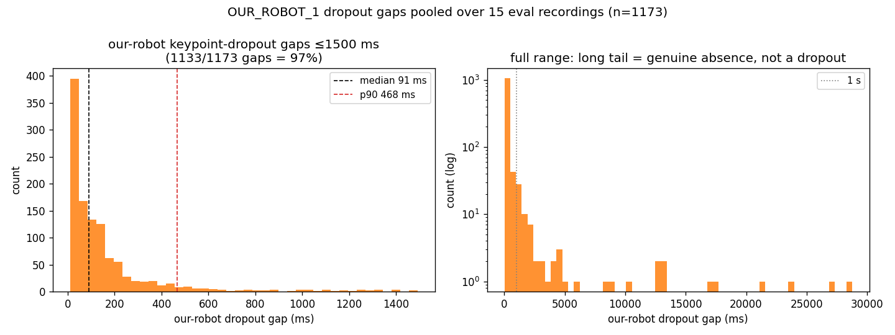

# Robot-filter keypoint-override decay — Tier 0 results (2026-07-23)

Tier 0 of `docs/robot_filter_decay_plan.md`: **bound the decay `hold_window` from the keypoint-dropout
statistics alone**, and decide whether the decay is even worth building. The gate is simple — if our
robot's keypoint gaps are short, holding the "ours" identity across them is cheap and a small fixed
window suffices; if they are long/frequent, the over-hold cost is real and Tier 1 is required.

**Verdict: gaps are short — the decay is cheap.** Median our-robot dropout is 2 frames (~91 ms) and
90% of gaps are ≤ 500 ms. Recommend `hold_window ≈ 300–500 ms` and proceed toward a minimal Tier 2.
The leak-opportunity *rate* (metric 2) is **deferred** — it needs a new in-filter signal (see below).

## Scope of this pass

Per the "Python + data first" decision, this pass delivers the **dropout-gap distribution** (the
decision-gate metric) and the tooling to compute it. It does **not** implement the C++
`our_blob_present_no_keypoint` flag, so the **leak-opportunity rate is not measured here**.

## Data

Source recordings live on `pathfinder`, not this dev machine. Note two deviations from the plan's
assumptions:

- The May-2 `main` fights (real mrs_buff/mr_stabs, with SVOs on pathfinder) **predate the `perception`
  diagnostics** — their `perception` subsection is empty, so `perception_reliability.py` cannot read
  them without a full SVO replay.
- `~/auto-battlebot/training/data/model_eval/` holds extracted image/label datasets, **not** MCAPs;
  the `label_playback` source recordings were deleted after extraction.

The only recordings carrying `perception` diagnostics are the **`auto_battlebot_experiments_eval_smoke_*`**
MCAPs (2026-07-07, post-06-19), downloaded to `data/recordings/` (15 files, ~559 MB). Caveats:

- These are **our-robot-only** runs — opponent live 0% throughout — so opponent metrics are degenerate
  and over-hold-vs-real-opponent cannot be studied here (that is a Tier 1/2 concern).
- Three `eval_smoke_02` runs have our robot essentially **absent** (our_live ≈ 2%); their "gaps" are
  genuine absence, not keypoint dropouts, and they dominate the multi-second tail below.

## Method

Extended `training/model_eval/perception_reliability.py` to report the **our-robot** dropout-gap
distribution alongside the existing opponent one, reusing the same run-length machinery
(`_false_runs`, `Gaps`) over the `our_present_live > 0` mask. Added `our_robot_gaps()`, an our-robot
block in `print_summary`, a third histogram panel + our-robot dropout shading in `save_plot`, and a
`--our-gap-csv` that pools per-gap rows across all input recordings. Run:

```bash
source scripts/activate_python.sh
python training/model_eval/perception_reliability.py \
    data/recordings/auto_battlebot_experiments_eval_smoke_*.mcap \
    --plot out/tier0_our_gaps.png --our-gap-csv out/tier0_our_gaps.csv
```

## Results

Per recording (our-robot dropout gaps; `fr` = frames, `ms` = milliseconds):

| recording | ticks | span s | our_live% | n_gaps | med fr | p90 fr | med ms | p90 ms |
| --- | ---: | ---: | ---: | ---: | ---: | ---: | ---: | ---: |
| eval_smoke_01_09-30-04 | 2402 | 63 | 74.4 | 124 | 3 | 11 | 86 | 292 |
| eval_smoke_01_09-37-21 | 2420 | 64 | 73.2 | 141 | 3 | 9 | 75 | 238 |
| eval_smoke_01_rt_09-43-54 | 6123 | 277 | 83.1 | 227 | 2 | 10 | 93 | 467 |
| eval_smoke_02_09-34-42 | 1525 | 38 | 1.9 | 13 | 31 | 372 | 702 | 8961 |
| eval_smoke_02_09-38-27 | 1510 | 38 | 2.1 | 14 | 43 | 181 | 1062 | 4339 |
| eval_smoke_02_rt_09-48-34 | 6160 | 206 | 3.8 | 53 | 9 | 397 | 297 | 13211 |
| eval_smoke_03_09-35-22 | 642 | 16 | 79.4 | 28 | 3 | 9 | 65 | 226 |
| eval_smoke_03_09-39-06 | 633 | 16 | 81.4 | 19 | 5 | 14 | 118 | 356 |
| eval_smoke_03_rt_09-41-43 | 2728 | 91 | 83.6 | 58 | 2 | 21 | 69 | 696 |
| eval_smoke_04_09-35-41 | 2093 | 52 | 82.6 | 72 | 3 | 11 | 74 | 268 |
| eval_smoke_04_09-39-24 | 2085 | 52 | 82.5 | 72 | 3 | 12 | 79 | 277 |
| eval_smoke_04_rt_09-52-02 | 8317 | 278 | 89.5 | 165 | 2 | 12 | 71 | 372 |
| eval_smoke_05_09-36-35 | 1741 | 44 | 81.4 | 43 | 3 | 18 | 76 | 452 |
| eval_smoke_05_09-40-18 | 1712 | 43 | 81.1 | 42 | 2 | 20 | 66 | 493 |
| eval_smoke_05_rt_09-56-42 | 7153 | 239 | 85.3 | 102 | 2 | 28 | 69 | 946 |

Pooled over all 15 recordings (**n = 1173 gaps**, ~47k ticks, ~1500 s), excluding nothing:

| percentile | frames | ms |
| --- | ---: | ---: |
| p50 | 2 | 91 |
| p75 | 6 | 188 |
| p90 | 16 | 468 |
| p95 | 34 | 1116 |
| p99 | 255 | 8514 |
| max | 864 | 28755 |

Coverage: **57.5%** of gaps are ≤ 3 frames (~≤ 125 ms), **90.4%** are ≤ 500 ms, and only **5.6%**
exceed 1 s (2.6% exceed 2 s). The multi-second tail (p99 = 8.5 s) comes almost entirely from the three
`eval_smoke_02` runs where our robot is absent — i.e. genuine departure, not a keypoint dropout.



Our-robot validity is **73–90%** on the runs where the robot is actually present.

## Decision-gate read

Gaps are short: the mass of the distribution is a few frames, and 90% close within 500 ms. This is
exactly the regime the plan calls "cheap" — a small fixed `hold_window` bridges the common keypoint
dropouts, while the multi-second tail is genuine absence that the decay must **not** try to hold (that
is the over-hold risk). A window around **p90 ≈ 470 ms**, or a slightly more conservative **~300 ms**,
suppresses the vast majority of leak opportunities without reaching into the absence tail.

Per the plan's gate: *gaps mostly ≤ a few frames → decay is cheap; set `hold_window` ≈ p90 gap and
proceed toward a minimal Tier 2* (behind a flag, default off, after Tier 1 confirms no over-hold
surprise). A full Tier 1 sweep is not strictly required by the gap statistics, but it is still the
cheap way to pick the exact knee and — importantly — to measure the over-hold cost against a **real
opponent**, which these opponent-free recordings cannot show.

## Deferred / next steps

- **Leak-opportunity rate (Tier 0 metric 2).** Not measured. It needs a per-tick
  `our_blob_present_no_keypoint` signal, computable only inside
  `RobotFrontBackSimpleFilter::merge_blob_detections`, where the blob detections and this frame's
  `keypoint_measurements` coincide — the runner has no access to that decision. Add the flag to the
  filter (surface it in the `perception` diagnostics), rebuild, replay, and extend
  `perception_reliability.py` to read it.
- **Representative fight data.** These recordings are our-robot-only. To measure over-hold against a
  real opponent, replay the May-2 mrs_buff/mr_stabs SVOs (on pathfinder) through the current stack to
  regenerate diagnostics-carrying MCAPs, or capture new fights.
- **Keypoint-recall cross-check (metric 3).** Run `training/model_eval/score.py` on
  `training/data/nhrl_keypoints_eval_test` to separate detection misses from association misses.
