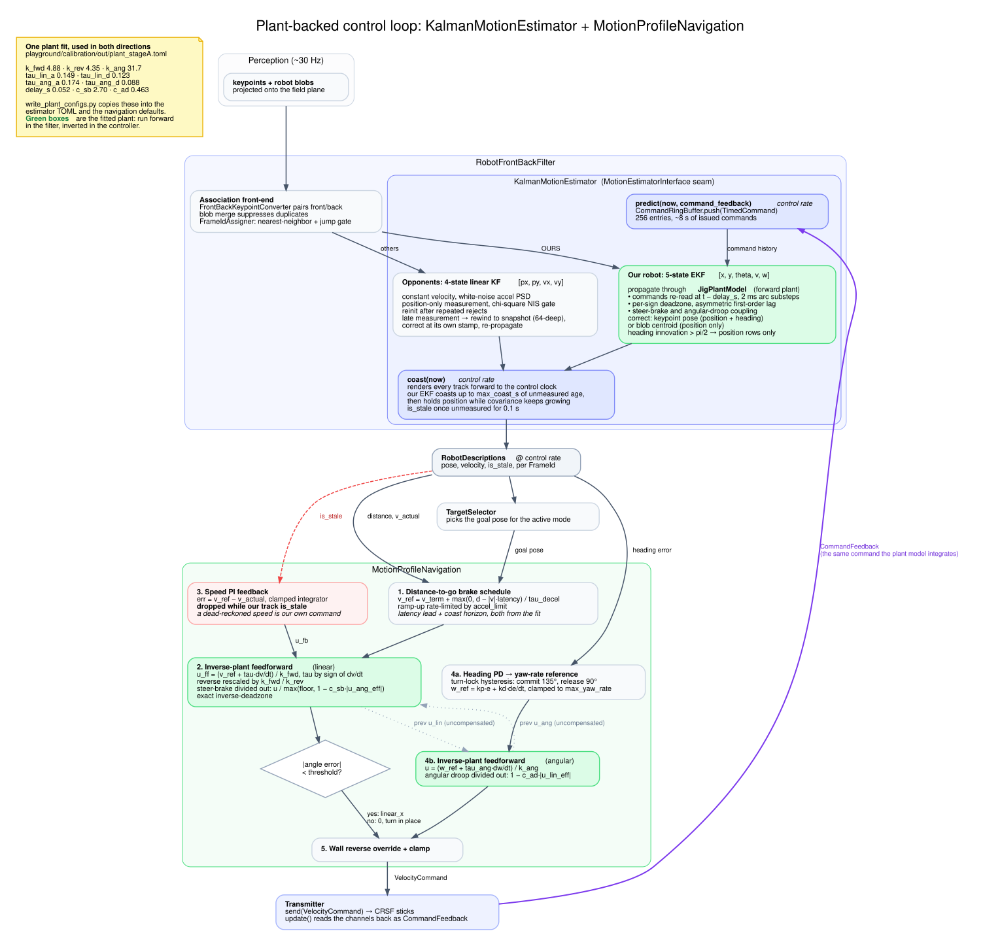

# Plant-backed control loop

`KalmanMotionEstimator` and `MotionProfileNavigation` are two halves of one loop. The
estimator runs the fitted drivetrain model forward to answer "where is our robot now";
the navigation runs the same model backward to answer "what command produces the speed I
want". Both read their numbers from the same jig fit, so a refit moves the estimator and
the controller together.



Regenerate the SVG after editing `diagrams/plant_backed_control.dot`:

```bash
./docs/generate_diagrams.sh   # needs graphviz (dot)
```

## Call pattern

`ControlLoop::run_cycle` runs at control rate, driven by `ThreadedControlLoop` (or
`SteppedControlLoop` in sim); perception arrives at about 30 Hz. The two are not in
lockstep, and the split matters:

1. `pump_input()` calls `transmitter_->update()`, which reads the RC channels back as
   `CommandFeedback`.
2. `robot_filter_->predict(now, command_feedback)`, every tick. Inside the estimator this
   pushes a `TimedCommand` into `CommandRingBuffer` and then calls `coast(now)`.
3. `robot_filter_->correct(...)`, only when a new perception frame landed. This runs the
   association front-end and then `MotionEstimatorInterface::update`.
4. `target_selector_->get_target(...)` picks the goal pose.
5. `navigation_->update(...)` returns a `VelocityCommand`.
6. `transmitter_->send(command)`, which is what step 1 reads back on the next tick.

## Estimator: the plant run forward

`KalmanMotionEstimator` (`src/robot_filter/kalman_motion_estimator.cpp`) sits behind the
`MotionEstimatorInterface` seam, so it swaps the state estimation strategy without
touching association.

### Opponents

Four-state linear Kalman filter, `[px, py, vx, vy]` in the field frame, constant-velocity
model with continuous white-noise acceleration. Measurements are position-only and pass a
chi-square innovation gate; `reinit_after_rejects` consecutive rejects reinitialize the
track, on the theory that a consistent reject means the world moved, not the measurement.

Perception latency puts a measurement stamp behind the control clock. Rather than folding
it in at the current state (which biases against the direction of motion), the track
rewinds to the newest of 64 snapshots at or before the measurement stamp, corrects there,
and lets the next `coast()` re-propagate.

### Our robot

Two modes, selected by `our_robot_mode`:

- `DEAD_RECKONING` integrates the last commanded velocity directly, matching
  `RobotTemporalMotionFilter`.
- `EKF` runs a five-state EKF `[x, y, theta, v, w]` propagated by `JigPlantModel`, which
  re-reads the command history at `t - delay_s` and integrates exact arcs in 2 ms
  substeps through per-sign deadzones, asymmetric first-order lag, and the steer-brake and
  angular-droop coupling terms.

Keypoint measurements correct position and heading; blob centroids correct position only.
A heading innovation past pi/2 also falls back to the position rows, because the
front/back keypoint converter can flip a robot and folding a flipped heading in would spin
the whole state.

### coast()

`coast(now)` renders every track forward to the control clock on a copy, so the emitted
state moves between perception frames instead of freezing at the last `correct()`. Our
EKF coasts up to `max_coast_s` of unmeasured age and then holds position while covariance
keeps growing. A track reads `is_stale` once it has gone 0.1 s unmeasured, which is three
frame periods at 30 Hz: normal between-frame coasting stays fresh, a real dropout does not.

## Navigation: the same plant inverted

`MotionProfileNavigation` (`src/navigation/motion_profile_navigation.cpp`) drives to the
goal and arrives at a commanded terminal velocity without overrunning. The terminal
velocity is per behavior mode, because the driver's switch decides what the mission is:
`attack_terminal_speed_fraction` ships at `1.0` so the robot drives through the opponent at full
speed, and `run_away_terminal_speed_fraction` ships at `0.0` so it arrives stopped at the safe
point. Both are a fraction of the plant's `k_fwd`, clamped to `[0, 1]`, so a refit
rescales them. A mode flip resets the trajectory
state, since the goal and the terminal speed both change at once and carrying the old
reference across would feed the feedforward a `dv/dt` step the plant never asked for.

1. **Distance-to-go brake schedule.** On a first-order plant the residual travel after
   commanding `v_term` is about `v*(tau_decel + latency)`, so the reference speed is
   capped at `v_term + max(0, d - |v|*latency) / tau_decel`. The brake point comes out of
   the measured plant instead of a hand-tuned brake distance. Ramp-up is rate-limited by
   `accel_limit`.
2. **Inverse-plant feedforward.** `u_ff = (v_ref + tau*dv/dt) / k_fwd`, with `tau`
   selected by the sign of `dv/dt` so a falling reference actually commands the brake.
   A negative command is rescaled by `k_fwd / k_rev` because reverse is the weaker
   direction. Then the steer-brake loss is divided out and the deadzone inverted exactly.
3. **Speed PI feedback** on `v_ref - v_actual`, with a clamped integrator. This is dropped
   while our track is `is_stale`: a dead-reckoned speed is a function of this controller's
   own command, so closing a loop on it is not feedback. The last measured speed is held
   through the stale stretch so the latency lead keeps working.
4. **Angular channel, same shape.** Turn-lock hysteresis (commit at 135 degrees, release
   at 90) stops the shortest-turn sign from dithering near 180. A PD on heading produces a
   yaw-rate reference, which goes through the same inverse-plant feedforward with the
   regime-appropriate yaw time constant.

Linear command only opens up once the heading error is inside `angle_threshold`;
otherwise the robot turns in place and the linear state is bled so it does not lunge when
the gate opens.

### The two coupling compensations are mutually recursive

The steer-brake term reads the turn command and the droop term reads the linear command.
Each is driven by the previous tick's **uncompensated** counterpart, which breaks the
loop. Feeding the compensated values back instead has a loop gain above 1 and saturates
both channels within a few ticks.

## One fit, two consumers

The fitted numbers live in `playground/calibration/out/plant_stageA.toml` (sessions
2026-08-19 through 2026-08-23, model M4). One C++-side copy carries them: the top-level
`[plant]` table in `config/_common.toml`, parsed into `PlantConfiguration`
(`include/plant/config.hpp`) and handed to both consumers after their own sections parse.
The estimator builds a `JigPlantModel` from it; the controller inverts the same fields for
its brake schedule and feedforward. Neither has C++ defaults, so a config with no `[plant]`
is a load error rather than a subsystem running on zeros.

`playground/calibration/write_plant_configs.py` rewrites the numeric literals in
`simulation/sim_mrs_buff_mk3.toml` and `config/_common.toml` in place, so the hand-written
notes next to each number survive. `--check` reports drift without changing anything.

Which term does what on each side:

| Fit parameter | Estimator | Navigation |
| --- | --- | --- |
| `k_fwd` 4.88002 | forward gain | divisor mapping reference speed to command |
| `k_rev` 4.3546 | reverse gain | reverse-gain rescale |
| `k_ang` 31.7062 | yaw gain | divisor mapping yaw-rate reference to command |
| `tau_lin_a` 0.14921 | spin-up lag | feedforward of `dv/dt` |
| `tau_lin_d` 0.123461 | coast lag | brake horizon, with `delay_s` |
| `tau_ang_a` 0.173867 | yaw spin-up lag | yaw feedforward, rising |
| `tau_ang_d` 0.0878998 | yaw coast lag | yaw feedforward, falling |
| `delay_s` 0.0522094 | transport delay | latency lead in the brake schedule |
| `c_sb` 2.70197 | steer-brake loss | divided back out of the forward command |
| `c_ad` 0.463423 | angular droop | only when `compensate_angular_droop` is true |

The one deliberate asymmetry is `c_ad`. The estimator models the droop because the plant
has it. The controller reads the same coefficient but ships with
`navigation.compensate_angular_droop = false`, because compensating made the controller
worse: on the 90-degree turning approach, enabling it moved terminal error from 0.008 m to
0.067 m and time-to-goal from 1.10 s to 2.83 s. Compensating buys faster heading
convergence by commanding a harder turn, and the steer-brake term charges forward speed
for exactly that. The heading loop is closed-loop already and gets there without the help.
The coefficient is measured; the compensation is a choice, which is why the switch is a
bool rather than a second copy of the number.

## Where each piece is selected

- `[plant]` in `config/_common.toml`, the shared fit both subsystems read.
- `[robot_filter.motion_estimator] type = "KalmanMotionEstimator"`, `our_robot_mode = "EKF"`
  in `config/_common.toml`.
- `[navigation] type = "MotionProfileNavigation"` in `config/_common.toml`, so every
  profile gets it by default. Mr Stabs Mk2 has no jig fit and pins `PursuitNavigation` in
  its own profiles; setting `type` there makes the merge replace the whole section, so
  those profiles spell out every pursuit field rather than inheriting any.

## Next steps

- Field-test `MotionProfileNavigation` against `PursuitNavigation` on hardware; the deltas
  so far are from sim (`docs/experiments/control_improvement/stage4_sim_report.md`).
- Pass the plant fit's acceptance criteria so production configs can move our robot off
  dead reckoning onto the EKF arm.
