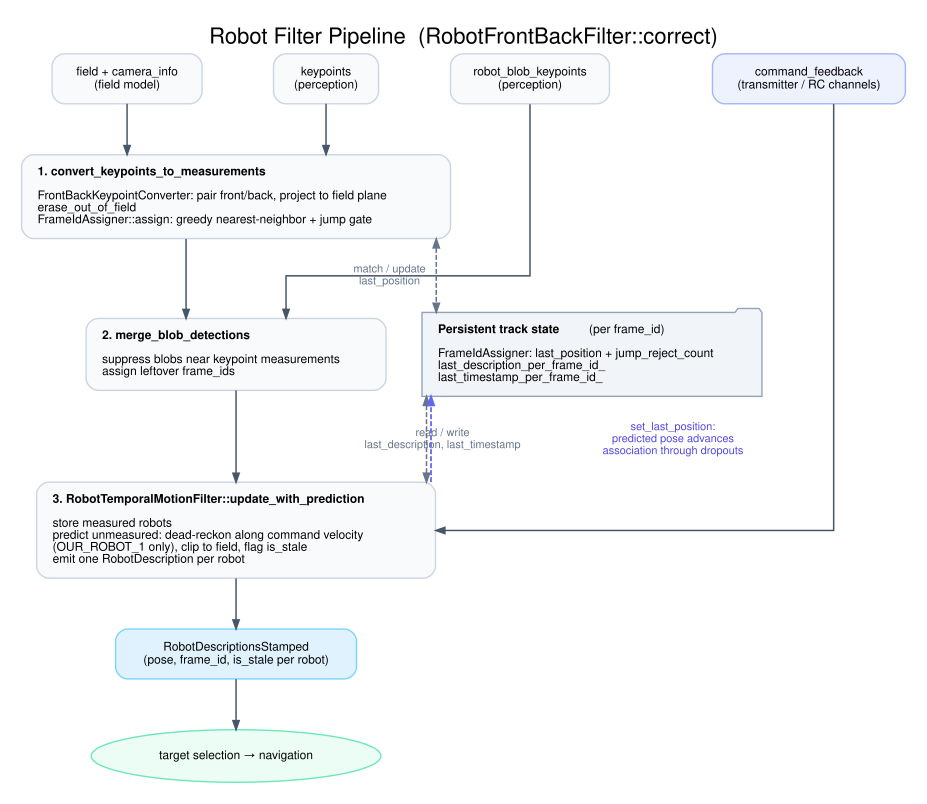

# Robot filter pipeline

The robot filter turns per-frame perception output into stable, identified robot tracks for
navigation. The active implementation is `RobotFrontBackFilter`
(`src/robot_filter/robot_front_back_filter.cpp`), selected by `[robot_filter] type` in the
TOML config.

It runs on two clocks. `correct()` runs once per perception frame with new detections.
`predict()` runs every control-loop tick, at 250 Hz, and advances tracks between frames.
Both are called from `src/control_loop/control_loop.cpp`.

How `predict()` propagates is a swappable `MotionEstimatorInterface`, chosen by
`[robot_filter.motion_estimator] type`. `DeadReckoningMotionEstimator` coasts along the
last commanded velocity and only moves our robot, which is the only one with command
feedback. `KalmanMotionEstimator` is what `config/_common.toml` selects; it coasts
opponents too, from their estimated velocity.



Regenerate the SVG after editing `diagrams/robot_filter.dot`:

```bash
./docs/generate_diagrams.sh   # needs graphviz (dot)
```

## Inputs

- `keypoints`: front/back keypoints per detected robot, from the keypoint model.
- `robot_blob_keypoints`: segmentation blob detections, a fallback when keypoints are missing.
- `field + camera_info`: the field transform and intrinsics used to project pixels onto the field plane.
- `command_feedback`: the velocity command currently driving OUR_ROBOT_1, read back from the transmitter
  (live RC channels on hardware). Only our robot has feedback, so only our robot gets predicted.

## Stages

1. **`convert_keypoints_to_measurements`** pairs front/back keypoints per label
   (`FrontBackKeypointConverter`), projects them onto the field plane, drops out-of-field detections,
   then assigns each measurement to a `FrameId` with `FrameIdAssigner::assign`. Assignment is greedy
   nearest-neighbor against each track's last position, with a `max_jump_distance` gate that rejects
   implausible jumps (and force-accepts after `max_consecutive_jump_rejects` to recover from a bad lock).

2. **`merge_blob_detections`** adds blob detections, suppressing any that fall near an existing keypoint
   measurement so the same robot is not counted twice, and assigns leftover frame_ids.

3. **`RobotTemporalMotionFilter::update_with_prediction`** stores the measured robots, then for any
   tracked robot that was not measured this frame and has command feedback (OUR_ROBOT_1), dead-reckons
   its pose forward along the commanded velocity, clips it to the field, and flags it `is_stale`. It
   emits one `RobotDescription` per tracked robot, measured or predicted.

## Persistent state

Three per-`FrameId` maps survive across frames:

- `FrameIdAssigner::last_position_per_frame_id_` (plus jump-reject counters): drives data association.
- `last_description_per_frame_id_`: the last full pose of each tracked robot.
- `last_timestamp_per_frame_id_`: the last time each robot appeared in the output, used only to compute
  the `dt` for dead-reckoning.

## Why prediction is load-bearing

The output `velocity` field is unused downstream (target selection and navigation read pose only). The
load-bearing path is the position prediction (indigo loop in the diagram): during a detection dropout it
both gives navigation an extrapolated pose instead of a frozen one, and advances the association
`last_position` (`set_last_position`) so the reappearing detection still matches inside the jump gate.
This helps the common short dropouts and drifts on rare long ones. The playback A/B that
measured it lived in `playground/control_stage0/`, retired in `9246cc64`; see
`docs/experiments/control_improvement/control_stage0_retired.md`.
